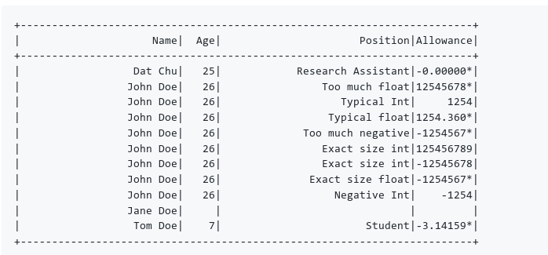

#BPrinter

[Website](https://github.com/dattanchu/bprinter)

# License 

MIT License

Copyright (c) 2017 Dat Chu

Permission is hereby granted, free of charge, to any person obtaining a copy of this software and associated documentation files (the "Software"), to deal in the Software without restriction, including without limitation the rights to use, copy, modify, merge, publish, distribute, sublicense, and/or sell copies of the Software, and to permit persons to whom the Software is
furnished to do so, subject to the following conditions:

The above copyright notice and this permission notice shall be included in all copies or substantial portions of the Software.

THE SOFTWARE IS PROVIDED "AS IS", WITHOUT WARRANTY OF ANY KIND, EXPRESS OR IMPLIED, INCLUDING BUT NOT LIMITED TO THE WARRANTIES OF MERCHANTABILITY, FITNESS FOR A PARTICULAR PURPOSE AND NONINFRINGEMENT. IN NO EVENT SHALL THE AUTHORS OR COPYRIGHT HOLDERS BE LIABLE FOR ANY CLAIM, DAMAGES OR OTHER
LIABILITY, WHETHER IN AN ACTION OF CONTRACT, TORT OR OTHERWISE, ARISING FROM, OUT OF OR IN CONNECTION WITH THE SOFTWARE OR THE USE OR OTHER DEALINGS IN THE SOFTWARE.

# About

*BPrinter* is a pretty printer for **C++** to be used with command line application (or for outputting to string/log). It only uses standard **C++ **(and Boost Karma, see **FAQ**) and is meant to be easy-to-use.

As long as your object can be serialized with `std::ostream`, you are good to go. The first class available in *BPrinter* is the TablePrinter class. The `TablePrinter` class is a class for pretty printing a two-dimensional table.

The usage is straight forward.

~~~c
#include <bprinter/table_printer.h>

TablePrinter tp(&std::cout);
tp.AddColumn("Name", 25);
tp.AddColumn("Age", 5);
tp.AddColumn("Position", 30);
tp.AddColumn("Allowance", 9);

tp.PrintHeader();
tp << "Dat Chu" << 25 << "Research Assistant" << -0.00000000001337;
tp << "John Doe" << 26 << "Too much float" << 125456789.123456789;
tp << "John Doe" << 26 << "Typical Int" << 1254;
tp << "John Doe" << 26 << "Typical float" << 1254.36;
tp << "John Doe" << 26 << "Too much negative" << -125456789.123456789;
tp << "John Doe" << 26 << "Exact size int" << 125456789;
tp << "John Doe" << 26 << "Exact size int" << -12545678;
tp << "John Doe" << 26 << "Exact size float" << -1254567.8;
tp << "John Doe" << 26 << "Negative Int" << -1254;
tp << "Jane Doe" << bprinter::endl();
tp << "Tom Doe" << 7 << "Student" << -M_PI;
tp.PrintFooter();
~~~

 

#FAQ

##What does B stand for?

*BPrinter* supposes to mean *Betty Printer*, intended as a pun to *Pretty Printer *classes found in other languages.

##Will you add support for other types of printing?

Sure. If you want something pretty printed (tree, annotation of equation, ...), let me know.

##Can I use this in my project?

Yup. It is **BSD**. Do with it whatever you like. Drop me a line if you find it useful.

##I don't use Boost and I don't intend to. How can I still use bprinter?

When you compile BPrinter, there is a CMake option: `USE_BOOST_KARMA`, uncheck this option (on by default) will remove the usage of `Boost.Karma` in *BPrinter*. However, you should consider using some parts of *Boost*. It is a good package.