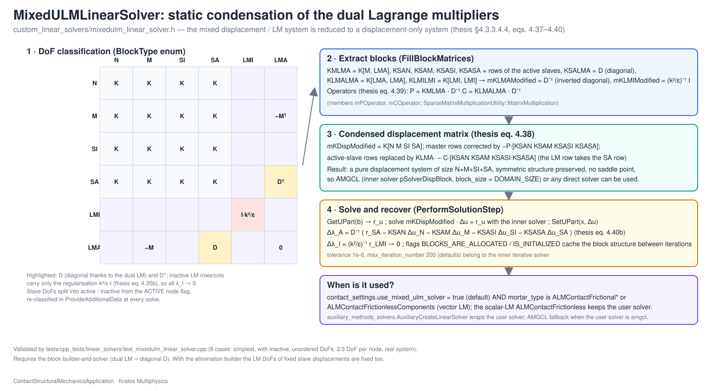

# Linear solvers

## `MixedULMLinearSolver` (`mixedulm_linear_solver.h`)

Header-only `IterativeSolver` for the mixed displacement / Lagrange-multiplier (U–LM) systems produced by the dual-multiplier mortar conditions. Because the dual shape functions make the mortar matrix $\mathbf{D}$ diagonal, the multiplier block can be condensed statically (thesis §4.3.3.4.4, eqs. 4.37–4.40) and the system solved as a pure displacement problem with any inner solver.



1. **Classification** (`ProvideAdditionalData`): every DoF is tagged with `BlockType` = `OTHER`, `MASTER`, `SLAVE_INACTIVE`, `SLAVE_ACTIVE`, `LM_INACTIVE` or `LM_ACTIVE` from the `ACTIVE` flag of its node.
2. **Blocks** (`FillBlockMatrices`): $\mathbf{K}_{M\,LM_A}$, $\mathbf{K}_{S_A N}$, $\mathbf{K}_{S_A M}$, $\mathbf{K}_{S_A S_I}$, $\mathbf{K}_{S_A S_A}$, the diagonal $\mathbf{D} = \mathbf{K}_{S_A LM_A}$ (inverted trivially), $\mathbf{K}_{LM_A LM_A}$; operators $\mathbf{P} = \mathbf{K}_{M\,LM_A}\mathbf{D}^{-1}$ and $\mathbf{C} = \mathbf{K}_{LM_A LM_A}\mathbf{D}^{-1}$ (thesis eq. 4.39).
3. **Condensed matrix**: `mKDispModified`, the displacement block with the master rows corrected by $-\mathbf{P}[\mathbf{K}_{S_A\cdot}]$ and the active-slave rows replaced by $\mathbf{K}_{LM_A\cdot} - \mathbf{C}[\mathbf{K}_{S_A\cdot}]$ (thesis eq. 4.38).
4. **Solve** (`PerformSolutionStep`): the inner solver (`pSolverDispBlock`) solves the displacement block; the active multipliers are recovered as $\Delta\boldsymbol\lambda_A = \mathbf{D}^{-1}(\mathbf{r}_{S_A} - \mathbf{K}_{S_A\cdot}\Delta\mathbf{u})$ (eq. 4.40b) and the inactive ones are zero.

```json
{
    "solver_type"          : "mixed_ulm_linear_solver",
    "tolerance"            : 1.0e-6,
    "max_iteration_number" : 200,
    "echo_level"           : 0
}
```

The Python solvers wrap the user linear solver in a `MixedULMLinearSolver` when `contact_settings.use_mixed_ulm_solver` is true (default) **and** the formulation uses a vector multiplier (`mortar_type` `ALMContactFrictional*` or `ALMContactFrictionlessComponents`); an AMGCL configuration with `block_size = DOMAIN_SIZE` is the fallback inner solver (`auxiliary_methods_solvers.AuxiliaryCreateLinearSolver`). Python name: `MixedULMLinearSolver`; constructors `(LinearSolver)`, `(LinearSolver, tolerance, max_iterations)` and `(LinearSolver, Parameters)`.

Tests: `tests/cpp_tests/linear_solvers/test_mixedulm_linear_solver.cpp` (8 cases: simplest, with inactive DoFs, unordered DoFs, 2 and 3 DoFs per node, real system).

Full documentation: [Builder-and-solvers and linear solvers](https://kratosmultiphysics.github.io/Kratos/pages/Applications/Contact_Structural_Mechanics_Application/Implementation/Builder_And_Solvers_And_Linear_Solvers.html) ([source](../../../docs/pages/Applications/Contact_Structural_Mechanics_Application/Implementation/Builder_And_Solvers_And_Linear_Solvers.md)).
