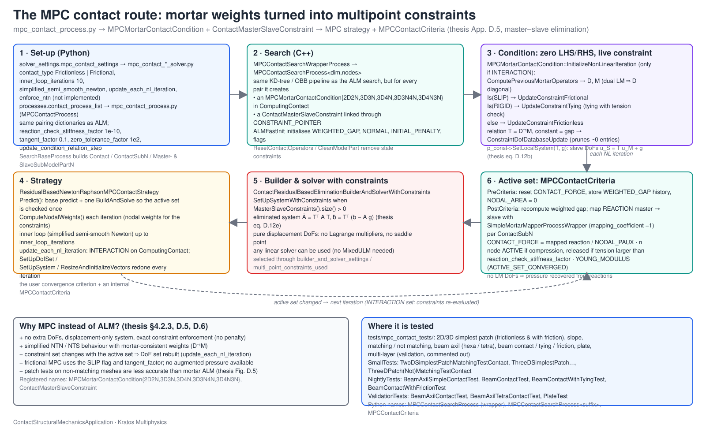

# Master–slave constraints

## `ContactMasterSlaveConstraint` (`contact_master_slave_constraint.h/.cpp`)

A `LinearMasterSlaveConstraint` used by the **MPC contact route**: instead of Lagrange-multiplier DoFs, the mortar weights are turned into a linear relation between the slave and master displacements,

$$ \mathbf{u}_{\mathcal{S}} = \mathbf{T}\,\mathbf{u}_{\mathcal{M}} + \mathbf{g}, \qquad \mathbf{T} = \mathbf{D}^{-1}\mathbf{M}, $$

and eliminated by the builder-and-solver (master–slave elimination, thesis Appendix D.5).

- Registered as `ContactMasterSlaveConstraint`; constructors `(Id)`, `(Id, master DoFs, slave DoFs, relation matrix, constant vector)` and `(Id, master node, master variable, slave node, slave variable, weight, constant)`, with matching `Create` overloads.
- One constraint is created per slave–master pair by `MPCContactSearchProcess` and attached to its `MPCMortarContactCondition` through the variable `CONSTRAINT_POINTER`.
- Every non-linear iteration the condition recomputes $\mathbf{D}$, $\mathbf{M}$ and calls `SetLocalSystem(T, g)`: `UpdateConstraintFrictionless` (default), `UpdateConstraintFrictional` (condition flag `SLIP`) or `UpdateConstraintTying` (flag `RIGID`, tying with tension check); `ConstraintDofDatabaseUpdate` prunes near-zero entries and rebuilds the DoF lists.
- `FinalizeNonLinearIteration` is overridden with an empty body; the activity of the constraint is decided by `MPCContactCriteria` from the reactions mapped onto the slave side (`REACTION_CHECK_STIFFNESS_FACTOR`).
- Solved with `ResidualBasedNewtonRaphsonMPCContactStrategy` and `ContactResidualBasedEliminationBuilderAndSolverWithConstraints`; driven from Python by `mpc_contact_process.py` and the `mpc_contact_*_solver.py` solvers (`solver_settings.mpc_contact_settings`).

Full documentation: [Frictional laws and MPC constraint](https://kratosmultiphysics.github.io/Kratos/pages/Applications/Contact_Structural_Mechanics_Application/Implementation/Frictional_Laws_And_MPC_Constraint.html) ([source](../../../docs/pages/Applications/Contact_Structural_Mechanics_Application/Implementation/Frictional_Laws_And_MPC_Constraint.md)) and [constrained optimisation methods](../../../docs/pages/Applications/Contact_Structural_Mechanics_Application/Theory/Constrained_Optimisation_Methods.md) (thesis App. D.5).
