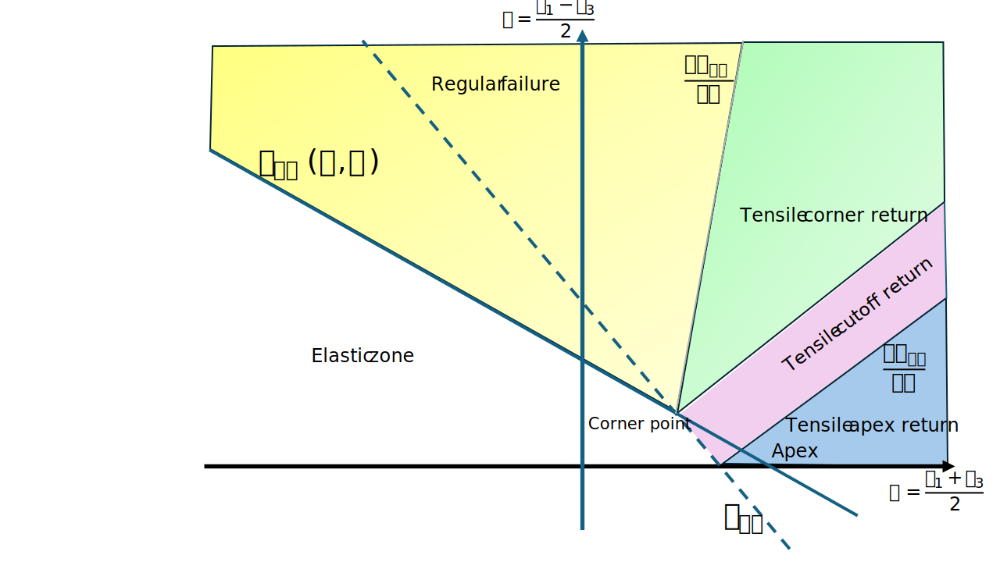

# Constitutive laws


## Incremental linear elastic interface law

This constitutive law for an interface element linearly relates increments of tractions $\Delta \tau$ to increments of relative displacement $\Delta \Delta u$.
Relative displacement for interface element is the differential motion between the two sides of the interface. As a
consequence the relative displacement has unit of length $[\mathrm{L}]$ and the stiffness has unit of force over cubic length $[\mathrm{F/L^3}]$.

### Relative displacement and traction
In 2D plane strain $y$ is the opening/closing direction of the interface, while differential motion in the tangential direction
gives shear. Similar to the continuum, the normal behavior is placed first in the relative displacement and traction vectors. The shear behavior
follows after the normal motion or traction in these vectors.

$$ \Delta u = \begin{bmatrix} \Delta u_y \\ \Delta u_x \end{bmatrix} $$

$$ \tau = \begin{bmatrix} \tau_{yy} \\ \tau_{xy} \end{bmatrix} $$

Where:
* $\Delta u_y$: Relative displacement in the $y$-direction (normal to the interface).
* $\Delta u_x$: Relative displacement in the $x$-direction (tangential to the interface).
* $\tau_{yy}$: Traction in the $y$-direction (normal to the interface).
* $\tau_{xy}$: Shear traction in the $x$-direction (tangential to the interface).

### 2D Elastic constitutive tensor

The elastic behavior of the interface is characterized by the 2D elastic constitutive tensor $C$, which relates the traction and relative displacement vectors. The constitutive tensor in 2D is expressed as:

$$ C = \begin{bmatrix} C_{yy} & 0     \\
                       0     & C_{xy} \end{bmatrix}$$

Where:
* $C$: Represents the 2D elastic constitutive tensor.
* $C_{yy}$: Represents the `INTERFACE_NORMAL_STIFFNESS`, which characterizes the stiffness in the normal direction.
* $C_{xy}$: Represents the `INTERFACE_SHEAR_STIFFNESS`, which characterizes the stiffness in the tangential direction.

Both stiffness values have dimension $\mathrm{F/L^3}$.

### Incremental relation

The relation between the traction and the relative displacement for a given time increment is given by the following incremental equation:

$$ \tau_{t + \Delta t} = \tau_t + C \cdot \Delta \Delta u $$

Where:
* $\tau_{t + \Delta t}$: The traction at the updated time $t + \Delta t$.
* $\tau_t$: The traction at the current time $t$.
* $C$: The elastic constitutive tensor.
* $\Delta \Delta u$: The incremental relative displacement vector.


## Mohr-Coulomb with tensile cutoff

The Mohr-Coulomb failure criterion is defined as:

```math
    F_{mc}(\sigma) = \frac{\sigma_1 - \sigma_3}{2} + \frac{\sigma_1 + \sigma_3}{2} \sin⁡{\phi} - c \cos⁡{\phi} = 0
```

where:

- $`\sigma_1`$ = maximum principal stress component
- $`\sigma_3`$ = minimum principal stress component
- $`c`$ = cohesion
- $`\phi`$ = Internal friction angle.

This criterion represents a linear envelope in the Mohr stress space, approximating the shear strength of a material under different stress states.

Since the Mohr-Coulomb criterion primarily accounts for shear failure, it does not limit tensile stresses. In geomechanical applications, materials such as rocks and soils have a limited tensile strength . A tensile cutoff is imposed as:

```math
    F_{tc}(\sigma) = \sigma_1 - t_c = 0
```

where $t_c$ is the tensile strength. If $`\sigma_1`$ exceeds $`t_c`$, failure occurs regardless of the shear strength condition.

Combination of these two, it yiels to the following figure:




### Implementation

To incorporate the Mohr-Coulomb model with tensile cutoff in numerical simulations, the following steps are followed:

1. Calculate the trial stress by: 

```math
    \boldsymbol{\sigma}^{trial} = \boldsymbol{\sigma}^0 + \boldsymbol{\mathrm{C}} \Delta \boldsymbol{\epsilon}
```

2. Extract the principal stresses $`\sigma_1 \ge \sigma_2 \ge \sigma_3`$ for the calculated trial stress, and calculate the rotation matrix.

3. Calculate the values of $`F_{MC}`$ and $`F_{tC}`$ for the calculated principal stresses.

4. Evaluate the condition and mapping
  - If the trial stress falls in the elastic zone, it stays unchanged. No mapping is applied.
  - If the trial stress falls in the tensile apex return zone. The trial stress then needs to be mapped back to the apex.
  - If the trial stress falls in the tensile cutoff zone. The trial stress then needs to be mapped back to the tension cutoff line.
  - If it falls in the tensile corner return zone, then it needs to be mapped to the corner point.
  - In the case of regular failure zone, then it is mapped back to the Mohr-Coulomb curve along the normal direction of flow function. The flow function is defined by
  
```math
    G(\sigma) = \frac{\sigma_1 - \sigma_3}{2} + \frac{\sigma_1 + \sigma_3}{2} \sin⁡{\psi}
```
  where $`\psi`$ is the dilatancy angle.

5. If after mapping, the condidition $`\sigma_1 \ge \sigma_2 \ge \sigma_3`$ is not valid, rearrang the principal stresses and repeat the process, namely go to point 3.

6. Rotate the mapped stress vector back, by appying the rotation matrix.

### Detailed formulations

For detailed formulations, see [here](documentation_data/Mohr-Coulomb-with-tension_cutoff-formulations.pdf)

