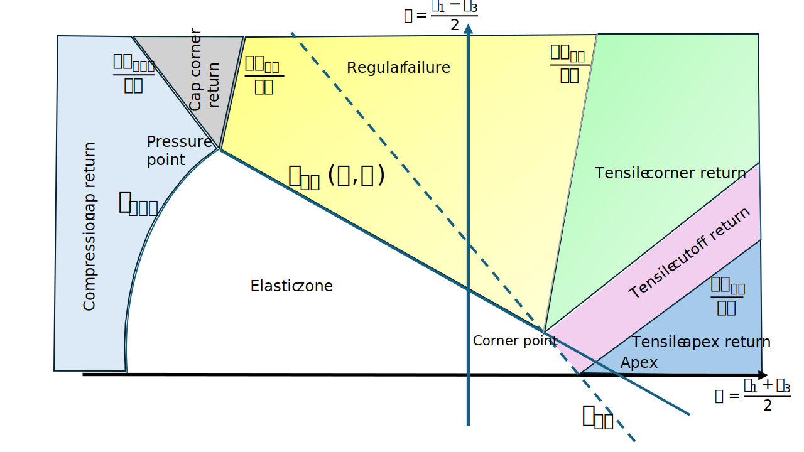

### Compression cap hardening

The standard Mohr–Coulomb yield surface characterizes shear failure in geomaterials by relating the shear stress $\tau$ on a potential failure plane to the corresponding normal stress $\sigma$. While suitable for frictional materials, the standard Mohr-Coulomb envelope lacks a mechanism to limit the admissible stress space under high compressive pressure. As a result, the standard Mohr-Coulomb model cannot represent the compaction, crushing, and plastic volumetric hardening that occur in soils and rocks under high confining stresses.

To address this limitation, a compression cap is introduced. The cap provides a smooth closure of the yield surface in the high-compression regime. Here we describe the combined Mohr-Coulomb and cap yield surfaces.

### Mohr–Coulomb yield surface

In the $`(\sigma, \tau)`$ stress space, the Mohr-Coulmb yiel surface is expressed as:

```math
    F_{MC}(\sigma, \tau) = \tau + \sigma \sin⁡{\phi} - c \cos⁡{\phi} = 0
```
where:

- $`\sigma`$ = normal stress component
- $`\tau`$ = shear stress component
- $`c`$ = cohesion of material
- $`\phi`$ = Internal friction angle

In stress-invariant form, the MC yield function is typically written as:

```math
    F_{MC}(p, q) = q - \frac{6 \sin{\phi}}{3 - \sin{\phi}} p - \frac{6 c \cos⁡{\phi}}{3 - \sin{\phi}}
```
where:

- $`p = \frac{1}{3} tr(\sigma)`$ is the mean effective stress
- $`q = \sqrt{\frac{3}{2}\tau:\tau}`$ is the norm of diviotoric stress tensor $`\tau`$.

This defines a hexagonal pyramid in principal stress space, but is shown as a straight line in the $`(\sigma, \tau)`$ Mohr plane.

### Compression cap concept
At high confining pressures, real geomaterials exhibit compaction and crushing rather than unlimited strength. The Mohr-Coulomb envelope alone allows unbounded compressive stresses. A cap yield surface introduces a limit to admissible volumetric compression and establishes a mechanism for volumetric plastic deformation.

In stress-invariant space, the cap is defined as an ellipse (or a smooth rounded surface) closing the Mohr-Coulomb yield surface in the compressive regime.

### Cap yield surface
A common choice is an elliptical cap:

```math
    F_{cap}(p, q) = \left( \frac{q}{X} \right)^2 + p^2 - p_c^2
```
where:

- $`p_c`$ = cap position (preconsolidation pressure),
- $`X`$ = cap size parameter

The cap intersects the MC surface at a transition point to ensure the overall yield surface is convex. 

```math
    p_c = p_{c0} + H \epsilon^p
```
where:
- $`p_{c0}`$ = the initial cap position
- $`H`$ = the hardening modulus
- $`\epsilon^p`$ = the plastic volumetric strain


### Combined Mohr–Coulomb + cap yield surface

The figure below shows a typical Mohr–Coulomb yield surface extended with tension cutoff and compression cap yield surfaces. In $(\sigma, \tau)$ coordinates:



Here, we need to convert the compression cap yield surface from $(p, q)$ coordinates to $(\sigma, \tau)$ coordinates. The conversion is to be followed ...

### Compression cap in $(\siga, \tau)$ coordinates
...


### Plastic Potential for the compression cap

For the cap branch, plastic deformation is primarily volumetric (compaction), and the plastic potential is usually taken to be associated. The flow function is then:

```math
    G_{cap} \left(p, q \right) = F_{cap} \left(p, q \right)
```
The derivative of the flow function is the:

```math
    \frac{\partial G_{cap}}{\partial \sigma} = \frac{2 q}{X^2} \frac{\partial q}{\partial \sigma} + 2 p \frac{\partial p}{\partial \sigma}
```