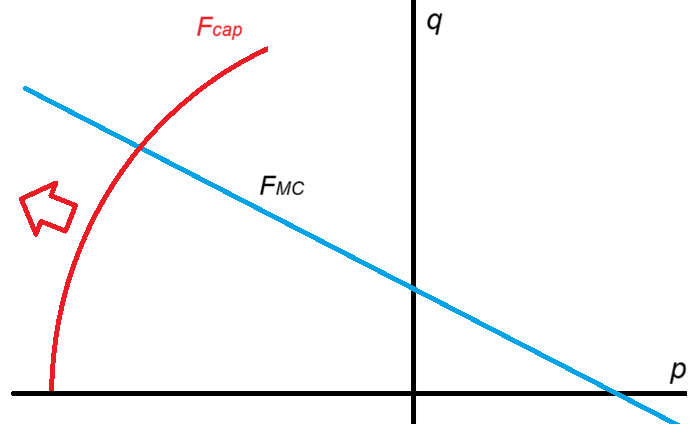

### Cap concept in constitutive models

The Mohr–Coulomb yield criterion is commonly used to describe shear failure in geomaterials. It relates the shear stress on a potential failure plane to the corresponding normal stress and is well suited for representing frictional behavior at moderate stress levels.

However, when materials such as soils or rocks are subjected to high compressive (confining) stresses, additional physical mechanisms become important. These include pore collapse, grain crushing, and irreversible volumetric compaction. The standard Mohr–Coulomb yield surface does not impose an upper limit on compressive stresses and therefore cannot represent these phenomena.

To overcome this limitation, a compression cap is introduced. The compression cap closes the yield surface in the high‑compression regime, thereby restricting the admissible stress space and enabling the model to represent compaction‑dominated plastic deformation. In this formulation, shear failure is still governed by the Mohr–Coulomb criterion, while compressive yielding is controlled by the cap.

Once a compression cap is introduced, it is possible to allow its position to evolve with plastic volumetric strain. This evolution, commonly referred to as cap hardening or softening, enables the model to capture material densification or degradation under continued loading. In the present documentation, the cap is first introduced as a geometric closure of the yield surface, after which optional hardening and softening mechanisms are discussed as a separate modeling choice.

In the Figure below, we have shown the contours of the cap within the Mohr-Coulomb model. This cap is a radial yield surface that joins the shear yield surface and results in a smooth closure of the yield surface in the high-compression regime. Here we describe the combined Mohr-Coulomb and cap yield surfaces.

### Mohr–Coulomb yield surface

In the $`(\sigma, \tau)`$ stress space, the Mohr-Coulomb yield surface is expressed as:

```math
    F_{MC}(\sigma, \tau) = \tau + \sigma \sin⁡{\phi} - c \cos⁡{\phi} = 0
```
where:

- $`\sigma`$ = normal stress
- $`\tau`$ = shear stress
- $`c`$ = cohesion
- $`\phi`$ = friction angle

In stress-invariant form $`(p, q)`$ stress space, the MC yield function is typically written as:

```math
    F_{MC}(p, q) = q + \frac{6 \sin{\phi}}{3 - \sin{\phi}} p - \frac{6 c \cos⁡{\phi}}{3 - \sin{\phi}}
```
where:

- $`p = \frac{1}{3} tr(\sigma)`$ is the mean effective stress
- $`q = \sqrt{\frac{3}{2}\sigma':\sigma'}`$ is the norm of deviatoric stress tensor, where $`\sigma' = \sigma - p`$.


### Compression cap concept
A cap yield surface introduces a limit to admissible volumetric compression and establishes a mechanism for volumetric plastic deformation. The shape of a cap yield surface depends on the stress space that is used. In this case the $'p-q'$ stress-invariant stress-space is used where the cap is defined as an ellipse of which the Mohr-Coulomb yield surface encloses the compressive regime (limit) (Reason for using p,q should be stated here). In mathematical form, an elliptical cap can be defined as:

```math
    F_{cap}(p, q) = \left( \frac{q}{X} \right)^2 + p^2 - p_c^2
```
where:

- $`p_c`$ = preconsolidation pressure,
- $`X`$ = cap size parameter. This defines the cap size and the elliptic shape of the cap.

The cap intersects the MC surface. A linear hardening relation for the cap position can be written as: 

```math
    p_c = p_{c0} + H \epsilon^p
```
where:
- $`p_{c0}`$ = the initial cap position
- $`H`$ = the hardening modulus
- $`\epsilon^p`$ = the plastic volumetric strain

As plastic volumetric compression increases, the cap translates toward higher compressive stresses, thereby expanding the admissible stress space. This mechanism allows the model to represent irreversible compaction and strengthening under high confining pressure.



### Combined Mohr–Coulomb + cap yield surface

The figure below shows a typical Mohr–Coulomb yield surface extended with tension cutoff and compression cap yield surfaces. In $(\sigma, \tau)$ coordinates:


Here, we need to convert the compression cap yield surface from $(p, q)$ coordinates to $(\sigma, \tau)$ coordinates. The conversion is given in Appendix A.


### Plastic potential for the compression cap

For the cap branch, plastic deformation is primarily volumetric (compaction), and the plastic potential is usually taken to be associated. The flow function is then:

```math
    G_{cap} \left(p, q \right) = F_{cap} \left(p, q \right)
```
The derivative of the flow function is:

```math
    \frac{\partial G_{cap}}{\partial \sigma} = \frac{2 q}{X^2} \frac{\partial q}{\partial \sigma} + 2 p \frac{\partial p}{\partial \sigma}
```

It gives:

```math
    \frac{\partial G_{cap}}{\partial \sigma_i} = \frac{1}{3} \frac{\partial G_{cap}}{\partial p} + \frac{3}{2 q} \frac{\partial G_{cap}}{\partial q} \left(\sigma_i - p \right)
```

### Cap corner point

The point where the compression cap yield surface intersects the Mohr-Coulomb yield surface is called the cap corner point. This point can be calculated by solving the Coulomb yield surface for $q$:

```math
    q = - \frac{6 \sin{\phi}}{3 - \sin{\phi}} p + \frac{6 c \cos⁡{\phi}}{3 - \sin{\phi}}
```

then subsituting in the cap yield surface, it leads to the following equation:

```math
    A p_{corner}^2 + B p_{corner} + C = 0
```

Where,

```math
    A = 1 + \frac{1}{X^2} \left( \frac{6  \sin{\phi}}{3 - \sin{\phi}} \right) ^2
```
```math
    B = -\frac{72}{X^2} \frac{c \sin{\phi} \cos{\phi}}{\left( 3 - \sin{\phi} \right)^2}
```
```math
    C = \frac{1}{X^2} \left( \frac{6 c \cos{\phi}}{3 - \sin{\phi}} \right)^2 - p_c^2
```

A second order polynomial equation needs to be solved, and the minimum root needs to be selected,

```math
    p_{corner} = \frac{ -B - \sqrt{B^2 - 4 A C}}{2A}
```
then
```math
    q_{corner} = -\frac{6  \sin{\phi}}{3 - \sin{\phi}} p + \frac{6 c \cos{\phi}}{3 - \sin{\phi}}
```

### Return mapping from cap compression zone
The cap compression zone is the region where the trial principal stresses are,
1. Outside the compression cap yield surface
```math
    \frac{q^2}{X^2} + p^2 - p_c^2 > 0
```
2. Under the line which passes from the cap corner point and in the direction normal to the flow function of the cap yield surface. 
```math
    q - q_{corner} - \left( G_{cap,p}/G_{cap,q} \right) (p - p_{corner}) < 0
```

Then the trial principal stresses need to be mapped to the cap yield surface by:
```math
    \sigma = \sigma^{trial} + \lambda D \frac{\partial G_{cap}}{\partial \sigma}
```

where $D$ is the elestic tensor.

### Return mapping from cap corner zone
The cap compression zone is the region where the trial $\left(p, q \right)$ stress invariants are created by the following two lines,

1. above the line which passes from the cap corner point and in the direction normal to the cap flow function $G_{cap}$. 
```math
    q - q_{corner} - \left( G_{cap,p}/G_{cap,q} \right) (p - p_{corner}) > 0
```

2. Under the line which passes from the cap corner point and in the direction normal to the Coulomb flow function $G_{MC}$. 
```math
    q - q_{corner} - \left( G_{MC,p}/G_{MC,q} \right) (p - p_{corner}) < 0
```

Then the trial principal stresses need to be mapped to the cap yield surface and Coulomb yield surface by:
```math
    \sigma = \sigma^{trial} + \lambda_{MC} C \frac{\partial G_{MC}}{\partial \sigma}
    + \lambda_{cap} C \frac{\partial G_{cap}}{\partial \sigma}
```

Substuting these trial stresses in the compression cap and Coulomb yield surfaces, leads to two equations and two unknowns.
```math
    c_1 \lambda_{MC} + c_2 \lambda_{cap} = c_3
```
```math
    c_4 \lambda_{MC}^2 + c_5 \lambda_{cap}^2 + c_6 \lambda_{MC} + c_7 \lambda_{cap}
    + c_8 \lambda_{MC} \lambda_{cap} = c_9
```

Combining those two equations, it leads to a second order polynomial equation for $\lambda_{cap}$.

```math
    A \lambda_{cap}^2 + B \lambda_{cap} + C = 0
```

where,


```math
    c_0 = \frac{6 \sin{\phi}}{3 - \sin{\phi}}
```
```math
    \left[ p_{MC}^{cor}, q_{MC}^{cor} \right]^T = C G_{MC}
```
```math
    \left[ p_{cap}^{cor}, q_{cap}^{cor} \right]^T = C G_{cap}
```
```math
    c_1 = q_{MC}^{cor} + c_0 p_{MC}^{cor}
```
```math
    c_2 = q_{cap}^{cor} + c_0 p_{cap}^{cor}
```
```math
    c_3 = -F_{MC} \left( \sigma^{trial} \right)
```
```math
    c_4 = q_{MC}^{cor^2} / X^2 + p_{MC}^{cor^2}
```
```math
    c_5 = q_{cap}^{cor^2} / X^2 + p_{cap}^{cor^2}
```
```math
    c_6 = 2 \left( q^{trial} q_{MC}^{cor} / X^2 + p^{trial} p_{MC}^{cor} \right)
```
```math
    c_7 = 2 \left( q^{trial} q_{cap}^{cor} / X^2 + p^{trial} p_{cap}^{cor} \right)
```
```math
    c_8 = 2 \left( q_{MC}^{cor} q_{cap}^{cor} / X^2 + p_{MC}^{cor} p_{cap}^{cor} \right)
```
```math
    c_9 = -F_{cap} \left( \sigma^{trial} \right)
```

```math
    A = \frac{c_2}{c_1} \left( \frac{c_2 c_4}{c_1} - c_8 \right) + c_5
```
```math
    B = \frac{1}{c_1} \left( -2 \frac{c_2 c_3 c_4}{c_1} - c_2 c_6 + c_3 c_8 \right) + c_7
```
```math
    C = \frac{c_3}{c_1} \left( \frac{c_3 c_4}{c_1} + c_6 \right) - c_9
```
    
Then, solving the second order polynomial, it gives 
```math
    \lambda_{cap} = \frac{-B + \sqrt{B^2 - 4 A C}}{2A}
```
```math
    \lambda_{MC} = \frac{c_3 - c_2  \lambda_{cap}}{c_1}
```

### Plastic multiplier for compression cap
The plastic multiplier above, $\lambda_{cap}$ needs to be calculated. The mapping is,
```math
    \sigma = \sigma^{trial} + \lambda_{cap} C \frac{\partial G_{cap}}{\partial \sigma}
```

Now, by considering the cap yield surface function, and extracting $p$ and $q$ in the form of $\sigma$'s,
```math
    \frac{1}{2 X^2} \left[ \left( \sigma_1 - \sigma_2 \right)^2 + \left( \sigma_2 - \sigma_3 \right)^2 + \left( \sigma_3 - \sigma_1 \right)^2 \right] + \frac{1}{9} \left( \sigma_1 + \sigma_2 + \sigma_3 \right)^2 - p_c^2 = 0
```
We define the following vectors,
```math
    \sigma_{diff} = \left[\sigma_1 - \sigma_2 \; , \; \sigma_2 - \sigma_3 \; , \; \sigma_3 - \sigma_1 \right]^T
```
```math
    \sigma_{diff}^{cor} = \left[\sigma_1^{cor} - \sigma_2^{cor} \; , \; \sigma_2^{cor} - \sigma_3^{cor} \; , \; \sigma_3^{cor} - \sigma_1^{cor} \right]^T
```

where
```math
    \sigma^{cor} = C \frac{\partial G_{cap}}{\partial \sigma}
```

Subsituting the stresses with the mapped stresses, we get the following relations.

```math
    A = \frac{\sigma_{diff}^{cor} \cdot \sigma_{diff}^{cor}}{2 X^2} + \frac{1}{9} \left( \sum_{i=1}^3{\sigma_i^{cor}} \right)^2
```
```math
    B = \frac{\sigma_{diff} \cdot \sigma_{diff}^{cor}}{X^2} + \frac{2}{9} \sum_{i=1}^3{\sigma_i} \sum_{i=1}^3{\sigma_i^{cor}}
```
```math
    C = F_{cap} \left( \sigma^{trial} \right)
```

the solution of this equation, gives:

```math
    \lambda_{cap} = \frac{-B + \sqrt{B^2 - 4 A C}}{2A}
```

### Appendix A

Here, the compression cap yield surface is converted from stress‑invariant coordinates $(p,q)$ to the stress components $(\sigma, \tau)$ acting on a plane. 

The stress invariants are defined as:
```math
    p = \frac{1}{3} \left( \sigma_1 + \sigma_2 + \sigma_3 \right)
```
```math
    q = \sqrt{\frac{1}{2} \left[ (\sigma_1 - \sigma_2)^2 + (\sigma_2 - \sigma_3)^2 + (\sigma_3 - \sigma_1)^2 \right]}
```
For triaxial stress states relevant to the compression ($\sigma_2 = \sigma_3$) cap, the invariants reduce to:

```math
    p = \frac{1}{3} \left( \sigma_1 + 2 \sigma_3 \right)
```
```math
    q = \sigma_1 - \sigma_3
```

The normal stress $\sigma$ and shear stress $\tau$ acting on a plane can be expressed in terms of the principal stresses as

```math
    \sigma = \frac{\sigma_1 + \sigma_3}{2}
```
```math
    \tau = \frac{\sigma_1 - \sigma_3}{2}
```

Combining these expressions yields the direct mapping between $(p, q)$ and $(\sigma, \tau)$:
```math
    \sigma = p - \frac{1}{6} q
```

```math
    \tau = \frac{1}{2} q
```
