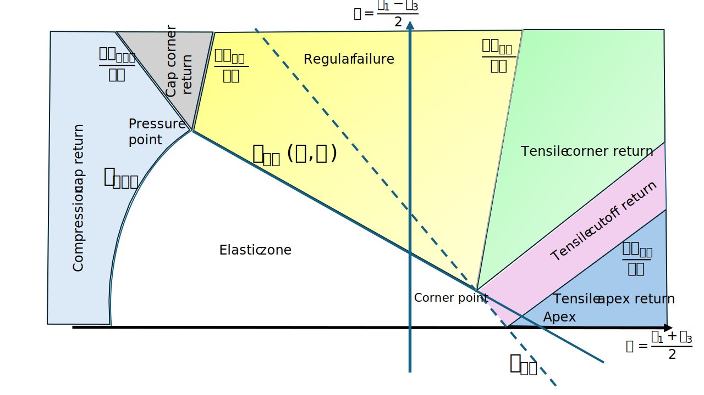

### Compression cap hardening

The standard Mohr–Coulomb yield surface characterizes shear failure in geomaterials by relating the shear stress $\tau$ on a potential failure plane to the corresponding normal stress $\sigma$. While suitable for frictional materials, the standard Mohr-Coulomb envelope lacks a mechanism to limit the admissible stress space under high compressive pressure. As a result, the standard Mohr-Coulomb model cannot represent the compaction, crushing, and plastic volumetric hardening that occur in soils and rocks under high confining stresses.

To address this limitation, a compression cap is introduced. The cap provides a smooth closure of the yield surface in the high-compression regime. Here we describe the combined Mohr-Coulomb and cap yield surfaces.

### Mohr–Coulomb yield surface

In the $`(\sigma, \tau)`$ stress space, the Mohr-Coulomb yield surface is expressed as:

```math
    F_{MC}(\sigma, \tau) = \tau + \sigma \sin⁡{\phi} - c \cos⁡{\phi} = 0
```
where:

- $`\sigma`$ = normal stress component
- $`\tau`$ = shear stress component
- $`c`$ = cohesion of material
- $`\phi`$ = friction angle

In stress-invariant form, the MC yield function is typically written as:

```math
    F_{MC}(p, q) = q + \frac{6 \sin{\phi}}{3 - \sin{\phi}} p - \frac{6 c \cos⁡{\phi}}{3 - \sin{\phi}}
```
where:

- $`p = \frac{1}{3} tr(\sigma)`$ is the mean effective stress
- $`q = \sqrt{\frac{3}{2}\sigma':\sigma'}`$ is the norm of deviatoric stress tensor, where $`\sigma' = \sigma - p`$.

This defines a hexagonal pyramid in principal stress space, but is shown as a straight line in the $`(\sigma, \tau)`$ stress space.

### Compression cap concept
At high confining pressures, real geomaterials exhibit compaction and crushing rather than unlimited strength. The Mohr-Coulomb envelope alone allows unbounded compressive stresses. A cap yield surface introduces a limit to admissible volumetric compression and establishes a mechanism for volumetric plastic deformation.

In $`p-q`$ stress-invariant space, the cap is defined as an ellipse (or a smooth rounded surface) closing the Mohr-Coulomb yield surface in the compressive regime.

### Cap yield surface
An elliptical cap can be defined as:

```math
    F_{cap}(p, q) = \left( \frac{q}{X} \right)^2 + p^2 - p_c^2
```
where:

- $`p_c`$ = cap position (preconsolidation pressure),
- $`X`$ = cap size parameter

The cap intersects the MC surface. A linear hardening relation for the cap position can be written as: 

```math
    p_c = p_{c0} + H \epsilon^p
```
where:
- $`p_{c0}`$ = the initial cap position
- $`H`$ = the hardening modulus
- $`\epsilon^p`$ = the plastic volumetric strain


### Combined Mohr–Coulomb + cap yield surface

The figure below shows a typical Mohr–Coulomb yield surface extended with tension cutoff and compression cap yield surfaces. In $(\sigma, \tau)$ coordinates:



Here, we need to convert the compression cap yield surface from $(p, q)$ coordinates to $(\sigma, \tau)$ coordinates. The conversion is to be followed ...


### Plastic potential for the compression cap

For the cap branch, plastic deformation is primarily volumetric (compaction), and the plastic potential is usually taken to be associated. The flow function is then:

```math
    G_{cap} \left(p, q \right) = F_{cap} \left(p, q \right)
```
The derivative of the flow function is:

```math
    \frac{\partial G_{cap}}{\partial \sigma} = \frac{2 q}{X^2} \frac{\partial q}{\partial \sigma} + 2 p \frac{\partial p}{\partial \sigma}
```

or

```math
    \frac{\partial G_{cap}}{\partial \sigma_i} = \frac{1}{3} \frac{\partial G_{cap}}{\partial p} + \frac{3}{2 q} \frac{\partial G_{cap}}{\partial q} \left(\sigma_i - p \right)
```

### Cap corner point

The point where the compression cap yield surface intersects the Mohr-Coulomb yield surface is called the cap corner point. This point can be calculated by solving the Coulomb yield surface for $q$:

```math
    q = - \frac{6 \sin{\phi}}{3 - \sin{\phi}} p + \frac{6 c \cos⁡{\phi}}{3 - \sin{\phi}}
```

then subsituting in the cap yield surface, it leads to the following equation:

```math
    A p_{corner}^2 + B p_{corner} + C = 0
```

Where,

```math
    A = 1 + b_1 a_2^2
```
```math
    B = -2 b_1 a_2 c_2
```
```math
    C = b_1 c_2^2 - c_1
```

```math
    b_1 = 1 / X^2
```
```math
    c_1 = p_c^2
```
```math
    a_2 = \frac{6  \sin{\phi}}{3 - \sin{\phi}}
```
```math
    c_2 = \frac{6 c \cos{\phi}}{3 - \sin{\phi}}
```

A second order polynomial equation needs to be solved, and the minimum root needs to be selected,

```math
    p_{corner} = \frac{ -B - \sqrt{B^2 - 4 A C}}{2A}
```
then
```math
    q_{corner} = -a_2 p + c_2
```

### Return mapping from cap compression zone
The cap compression zone is the rigion where the trial principal stresses are,
1. Outside the compression cap yield surface
```math
    \frac{q^2}{X^2} + p^2 - p_c^2 > 0
```
2. Under the line which passes from the cap corner point and in the direction normal to the flow function of the cap yield surface. 
```math
    q - q_{corner} - \left( G_{cap,p}/G_{cap,q} \right) (p - p_{corner}) < 0
```

Then the trial principal stresses need to be mapped to the cap yield surface by:
```math
    \sigma = \sigma^{trial} + \lambda C \frac{\partial G_{cap}}{\partial \sigma}
```

### Return mapping from cap corner zone
The cap compression zone is the region where the trial principal stresses are,

1. above the line which passes from the cap corner point and in the direction normal to the cap flow function $G_{cap}$. 
```math
    q - q_{corner} - \left( G_{cap,p}/G_{cap,q} \right) (p - p_{corner}) > 0
```

2. Under the line which passes from the cap corner point and in the direction normal to the Coulomb flow function $G_{MC}$. 
```math
    q - q_{corner} - \left( G_{MC,p}/G_{MC,q} \right) (p - p_{corner}) < 0
```

Then the trial principal stresses need to be mapped to the cap yield surface and Coulomb yield surface by:
```math
    \sigma = \sigma^{trial} + \lambda_{MC} C \frac{\partial G_{MC}}{\partial \sigma}
    + \lambda_{cap} C \frac{\partial G_{cap}}{\partial \sigma}
```

Substuting this trial stresses in compression cap and Coulomb yield surfaces, it leads to two equations and two unknowns.
```math
    c_1 \lambda_{MC} + c_2 \lambda_{cap} = c_3
```
```math
    c_4 \lambda_{MC}^2 + c_5 \lambda_{cap}^2 + c_6 \lambda_{MC} + c_7 \lambda_{cap}
    + c_8 \lambda_{MC} \lambda_{cap} = c_9
```

Combining those two equations, it leads to a second order polynomial equation for $\lambda_{cap}$.

```math
    A \lambda_{cap}^2 + B \lambda_{cap} + C = 0
```

where,


```math
    c_0 = \frac{6 \sin{\phi}}{3 - \sin{\phi}}
```
```math
    \left[ p_{MC}^{cor}, q_{MC}^{cor} \right]^T = C G_{MC}
```
```math
    \left[ p_{cap}^{cor}, q_{cap}^{cor} \right]^T = C G_{cap}
```
```math
    c_1 = q_{MC}^{cor} + c_0 p_{MC}^{cor}
```
```math
    c_2 = q_{cap}^{cor} + c_0 p_{cap}^{cor}
```
```math
    c_3 = -F_{MC} \left( \sigma^{trial} \right)
```
```math
    c_4 = q_{MC}^{cor^2} / X^2 + p_{MC}^{cor^2}
```
```math
    c_5 = q_{cap}^{cor^2} / X^2 + p_{cap}^{cor^2}
```
```math
    c_6 = 2 \left( q^{trial} q_{MC}^{cor} / X^2 + p^{trial} p_{MC}^{cor} \right)
```
```math
    c_7 = 2 \left( q^{trial} q_{cap}^{cor} / X^2 + p^{trial} p_{cap}^{cor} \right)
```
```math
    c_8 = 2 \left( q_{MC}^{cor} q_{cap}^{cor} / X^2 + p_{MC}^{cor} p_{cap}^{cor} \right)
```
```math
    c_9 = -F_{cap} \left( \sigma^{trial} \right)
```

```math
    A = \frac{c_2}{c_1} \left( \frac{c_2 c_4}{c_1} - c_8 \right) + c_5
```
```math
    B = \frac{1}{c_1} \left( -2 \frac{c_2 c_3 c_4}{c_1} - c_2 c_6 + c_3 c_8 \right) + c_7
```
```math
    C = \frac{c_3}{c_1} \left( \frac{c_3 c_4}{c_1} + c_6 \right) - c_9
```
    
Then, solving the second order polynomial, it gives 
```math
    \lambda_{cap} = \frac{-B + \sqrt{B^2 - 4 A C}}{2A}
```
```math
    \lambda_{MC} = \frac{c_3 - c_2  \lambda_{cap}}{c_1}
```

### Plastic multiplier for compression cap
The plastic multiplier above, $\lambda_{cap}$ needs to be calculated. The mapping is,
```math
    \sigma = \sigma^{trial} + \lambda_{cap} C \frac{\partial G_{cap}}{\partial \sigma}
```

Now, by considering the cap yield surface function, and extracting $p$ and $q$ in the form of $\sigma$'s,
```math
    \frac{1}{2 X^2} \left[ \left( \sigma_1 - \sigma_2 \right)^2 + \left( \sigma_2 - \sigma_3 \right)^2 + \left( \sigma_3 - \sigma_1 \right)^2 \right] + \frac{1}{9} \left( \sigma_1 + \sigma_2 + \sigma_3 \right)^2 - p_c^2 = 0
```
We define the following vectors,
```math
    \Delta \sigma = \left[\sigma_1 - \sigma_2 \; , \; \sigma_2 - \sigma_3 \; , \; \sigma_3 - \sigma_1 \right]^T
```
```math
    \Delta \sigma^{cor} = \left[\sigma_1^{cor} - \sigma_2^{cor} \; , \; \sigma_2^{cor} - \sigma_3^{cor} \; , \; \sigma_3^{cor} - \sigma_1^{cor} \right]^T
```

where
```math
    \sigma^{cor} = \lambda_{cap} C \frac{\partial G_{cap}}{\partial \sigma}
```

Subsituting the stresses with the mapped stresses, we get the following relations.

```math
    A = \frac{\Delta \sigma^{cor} \cdot \Delta \sigma^{cor}}{2 X^2} + \frac{1}{9} \left( \sum_{i=1}^3{\sigma_i^{cor}} \right)^2
```
```math
    B = \frac{ \Delta \sigma \cdot \Delta \sigma^{cor}}{X^2} + \frac{2}{9}  
        \sum_{i=1}^3{\sigma_i} \sum_{i=1}^3{\sigma_i^{cor}}
```
```math
    C = F_{cap} \left( \sigma^{trial} \right)
```

the solution of this equation, gives:

 ```math
    \lambda_{cap} = \frac{-B + \sqrt{B^2 - 4 A C}}{2A}
```

