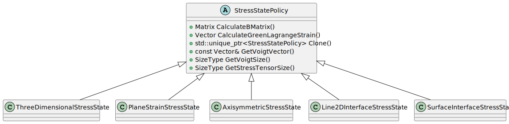

# Policies

## Introduction

In our element structure, the strategy-pattern (also known as policy-pattern), is used to gain control and
configurability for the element functionality. This is done by encapsulating the behavior in an interface and using a
pointer to the interface in the element. The behavior can then be changed by changing the pointer to a different
implementation of the interface. This is a powerful tool for creating flexible and reusable code. For more information
about the strategy-pattern, the reader is referred to the book written by 'the Gang of four' on the topic
of [design patterns](#bibliography).

Currently, the following policies are implemented (still under development):

1. The [StressStatePolicy](#stressstatepolicy) - this is used to calculate several stress-related properties depending
   on the configuration. There are three flavours: `ThreeDimensionalStressState`, `PlaneStrainStressState` and `AxisymmetricStressState`.

## StressStatePolicy

The stress state policy is used to easily configure elements to have a specific stress state. The responsibility of the
stress state is to convert strain tensors to [strain vectors](#strain-vectors), define the strain-displacement relation
by filling the [B-matrix](#b-matrix) and calculate the [integration coefficient](#integration-coefficient).

There are three different
stress state implementations:

1. `ThreeDimensionalStressState`
2. `PlaneStrainStressState`
3. `AxisymmetricStressState`

They all derive from the same interface (`StressStatePolicy`) and can be used interchangeably to calculate the B-matrix,
the integration coefficient and the Green Lagrange Strain vector. See the following schematic for the structure of the
stress state policies:



For simple code examples of the functionalities described in the next sections, we refer to the unit tests for [3D](../tests/cpp_tests/test_three_dimensional_stress_state.cpp), [plane strain](../tests/cpp_tests/test_plane_strain_stress_state.cpp) and [axisymmetric](../tests/cpp_tests/test_axisymmetric_stress_state.cpp) stress states.

### Strain vectors

For the different stress states, the strain vector is created by performing a conversion of the strain tensor, which is defined as:
```math
\boldsymbol{\epsilon} = \begin{bmatrix} \epsilon_{xx} & \epsilon_{xy} & \epsilon_{xz} \\
                        \epsilon_{yx} & \epsilon_{yy} & \epsilon_{yz} \\
                        \epsilon_{zx} & \epsilon_{zy} & \epsilon_{zz} \end{bmatrix}
```
Note that the strain tensor is symmetric, meaning that $\epsilon_{ij} = \epsilon_{ji}$. The strain tensor can be calculated using different methods, like Green Lagrange or Hencky Strain. This calculation is delegated to the `StressStrainUtilities`. However, the conversion to strain vectors depends on the type of stress state. Therefore, that conversion is defined in these policies and are described below. 

For the 3D stress state, the strain vector is defined as:
```math
\vec{\epsilon} = \begin{bmatrix} \epsilon_{xx} \\
                                 \epsilon_{yy} \\
                                 \epsilon_{zz} \\
                                 \epsilon_{xy} \\
                                 \epsilon_{yz} \\
                                 \epsilon_{xz} \end{bmatrix}
```

For the plane strain stress state, it is defined as:
```math
\vec{\epsilon} = \begin{bmatrix} \epsilon_{xx} \\
                                 \epsilon_{yy} \\
                                 0 \\
                                 \epsilon_{xy} \end{bmatrix}
```

Lastly, for the axisymmetric stress state, it is defined as:
```math
\vec{\epsilon} = \begin{bmatrix} \epsilon_{xx} \\
                                 \epsilon_{yy} \\
                                 u_r/r \\
                                 \epsilon_{xy} \end{bmatrix}
```
Where $u_r$ is the radial displacement and $r$ is the radial coordinate (in our geomechanics code base, the radial coordinate is equal to $x$). 

### B-matrix
The B-matrix is used to relate strains and displacements. Therefore, its elements are filled with the spatial gradients of the shape functions ($N$).

For a 3D element consisting of 4 nodes, the gradient looks like:
```math
\nabla{N} =
\begin{bmatrix}
\partial N_1/\partial x & \partial N_1/\partial y & \partial N_1/\partial z\\
\partial N_2/\partial x & \partial N_2/\partial y & \partial N_2/\partial z\\
\partial N_3/\partial x & \partial N_3/\partial y & \partial N_3/\partial z\\
\partial N_4/\partial x & \partial N_4/\partial y & \partial N_4/\partial z
\end{bmatrix}
```
Resulting in the following B-matrix:
```math
B =
\begin{bmatrix}
\partial N_1/\partial x & 0 & 0 & && & \partial N_4/\partial x & 0 & 0 \\
0 & \partial N_1/\partial y & 0 & && & 0 & \partial N_4/\partial y & 0\\
0 & 0 & \partial N_1/\partial z & &\dots& & 0 & 0 & \partial N_4/\partial z\\
\partial N_1/\partial y & \partial N_1/\partial x & 0 & && & \partial N_4/\partial y & \partial N_4/\partial x & 0 \\
0 & \partial N_1/\partial z & \partial N_1/\partial y & && & 0 & \partial N_4/\partial z & \partial N_4/\partial y \\
\partial N_1/\partial z & 0 & \partial N_1/\partial x & && & \partial N_4/\partial z & 0 & \partial N_4/\partial x
\end{bmatrix}
```
Where the first three columns are for the first node, the next three columns for the second node and so on for the number of nodes in the element.

For a 2D element consisting of three nodes, the gradient looks like:
```math
\nabla{N} =
\begin{bmatrix}
\partial N_1/\partial x & \partial N_1/\partial y \\
\partial N_2/\partial x & \partial N_2/\partial y \\
\partial N_3/\partial x & \partial N_3/\partial y
\end{bmatrix}
```
Where the rows depict the different nodes in the element (i.e. $N_i$ is the shape function for node $i$). For the plane strain case, this would result in the following B-matrix:
```math
B =
\begin{bmatrix}
\partial N_1/\partial x & 0 & \partial N_2/\partial x & 0 & \partial N_3/\partial x & 0 \\
0 & \partial N_1/\partial y & 0 & \partial N_2/\partial y & 0 & \partial N_3/\partial y\\
0 & 0 & 0 & 0 & 0 & 0\\
\partial N_1/\partial y & \partial N_1/\partial x & \partial N_2/\partial y & \partial N_2/\partial x & \partial N_3/\partial y & \partial N_3/\partial x
\end{bmatrix}
```
For the axisymmetric stress state, this would result in the following B-matrix:
```math
B =
\begin{bmatrix}
\partial N_1/\partial x & 0 & \partial N_2/\partial x & 0 & \partial N_3/\partial x & 0 \\
0 & \partial N_1/\partial y & 0 & \partial N_2/\partial y & 0 & \partial N_3/\partial y\\
N_1 / r & 0 & N_2 / r & 0 & N_3 / r & 0\\
\partial N_1/\partial y & \partial N_1/\partial x & \partial N_2/\partial y & \partial N_2/\partial x & \partial N_3/\partial y & \partial N_3/\partial x
\end{bmatrix}
```
Note that in our geomechanics code base, the radial coordinate $r$ is equal to $x$.

### Integration coefficient

The integration coefficient (or integration volume) depends on the integration weight ($w_i$) and the determinant of the Jacobian ($J$). In case of the 3D stress state, the integration volume is calculated as:
$$V_i = w_i \det{(J)}$$

##
Since $w_i$ is the volume in isoparametric coordinates. For the plane strain stress state, $w_i$ is the area in isoparametric coordinates. However, since the thickness is by definition 1, the integration coefficient can be calculated using the same equation.

Also for the axisymmetric stress state, $w_i$ is defined as the isoparametric area. To convert this to a volume, the area is multiplied with the axisymmetric circumference:
$$V_i = 2\pi r w_i \det{(J)}$$

## Bibliography
Gamma, E., Helm, R., Johnson, R., & Vlissides, J. (1994). _Design Patterns: Elements of Reusable Object-Oriented Software._
