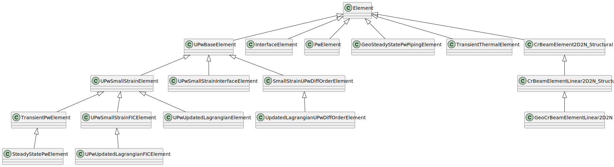

# Element hierarchy

The complete element hierarchy is shown in the following uml diagram:



Note that this structure is under construction and will be updated such that the hierarchy is conceptually more consistent with the general idea of class inheritance structures.


# U-Pw Continuum Elements

For simulating soil behavior, the geomechanics application offers continuum elements that take into account the displacement field ($u$) as well as the pore water pressure field ($p_w$). In fact, the two fields can be coupled.

Depending on your needs, you may opt for either so-called "diff order" elements or "non-diff order" elements. The former implies that the order of the interpolation polynomials that will be used for the pore water pressure field is one less than the order of the interpolation polynomials of the displacement field. The latter, on the other hand, assumes one and the same order for the interpolation polynomials of both fields.

Regardless of the above distinction, the application orders the degrees of freedom (DOFs) in the same way. The first part relates to the displacement DOFs (grouped per node), followed by a second part that contains the pore water pressure DOFs. For instance, assuming a 6-noded triangular diff order element, the DOFs are ordered as follows:

$$ u_{x,1}, u_{y,1}, u_{x,2}, u_{y,2}, \dots, u_{x,6}, u_{y,6}, p_1, p_2, p_3 $$

where the directions of the displacements are denoted by a suffix (here either $x$ or $y$), and the node number is also added as a suffix. Note that in this case, there are only three pore water pressure DOFs (due to the diff order nature of the element). For a non-diff order quadratic element the above list of DOFs is appended by $p_4$, $p_5$, and $p_6$.

The governing equations for the U-Pw continuum elements in matrix form are:

$$ \begin{bmatrix} M & 0 \\
0 & 0 \end{bmatrix} \begin{bmatrix} \ddot{u} \\
\ddot{p} \end{bmatrix}  +
\begin{bmatrix} D & 0 \\
Q^T & C \end{bmatrix} \begin{bmatrix} \dot{u} \\
\dot{p} \end{bmatrix}  +
\begin{bmatrix} K & -Q \\
0 & H \end{bmatrix} \begin{bmatrix} u \\
p \end{bmatrix} =
\begin{bmatrix} f_u \\
f_p \end{bmatrix} $$

where the degrees of freedom are displacement $u$ and water pressure $p_w$, their time derivatives velocity $\dot{u}$ and time gradient of pressure $\dot{p}$ and double time derivatives acceleration $\ddot{u}$ and $\ddot{p}$.
$M$ is the mass matrix, $D$ the damping matrix, $Q$ the coupling matrix, $C$ the compressibility matrix, $K$ the stiffness matrix
and $H$ the permeability matrix. $f_u$ are forces on boundary and body and $f_p$ are fluxes on boundary and body.

# Pw Elements
Conservation of mass for saturated soil

```math
\left( \alpha + n \beta \right) \rho^w \frac{\partial p}{\partial t} + \rho^w \frac{\partial q_i}{\partial x_i} = 0 \quad \quad \text{on} \quad \Omega
```

where

- $n$				= porosity $\mathrm{\left[ - \right]}$
- $p$				= pressure $\mathrm{\left[ FL^{-2} \right]}$
- $t$				= time $\mathrm{\left[ T \right]}$
- $x$				= global coordinates $\mathrm{\left[ L \right]}$
- $q_i$				= specific discharge $\mathrm{\left[ LT^{-1} \right]}$
- $\alpha$			= $\left( Biot - n \right) / K_{solid}$, solid skeleton compressibility $\mathrm{\left[ L^2 F^{-1} \right]}$
- $\beta$			= $1 / K_{fluid}$, liquid phase compressibility $\mathrm{\left[ L^2 F^{-1} \right]}$
- $\rho^w$			= fluid density $\mathrm{\left[ M L^{-3} \right]}$
- $\Omega$			= flow domain $\mathrm{\left[ L^2 \right]}$
- $K_{solid}$		= bulk modulus of soil $\mathrm{\left[ F L^{-2} \right]}$
- $K_{fluid}$		= bulk modulus of water $\mathrm{\left[ F L^{-2} \right]}$
- $Biot$			= Biot coefficient $\mathrm{\left[ - \right]}$
Darcy's law

```math
q = -\frac{K_{ij}}{\mu} \left( \frac{\partial p}{\partial x_j} - \rho^w g_j \right)
```

- $g_j$				= gravitational acceleration $\mathrm{\left[ L T^{-2} \right]}$
- $K_{ij}$			= intrinsic permeability $\mathrm{\left[ L^2 \right]}$
- $\mu$				= dynamic viscosity $\mathrm{\left[ F T L^{-2} \right]}$

Richard's equation for partly saturated soil

```math
\left[ \left( \alpha + n \beta \right) \rho^w S + n \rho^w \frac{dS}{dP} \right] \frac{\partial p}{\partial t} = \frac{\partial}{\partial x_i} \left[ \frac{\rho^w k_r K_{ij}}{\mu} \left( \frac{\partial p}{\partial x_j} - \rho^w g_j \right) \right]  \quad \quad \text{on} \quad \Omega
```

- $k_r$				= relative permeability $\mathrm{\left[ - \right]}$
- $S$				= saturation $\mathrm{\left[ - \right]}$

In Biot’s poroelasticity, the Biot coefficient is:

$$ Biot=1 - \frac{K}{K_{solid}} $$

where
- $K$ 			= drained bulk modulus of the skeleton $\mathrm{\left[ F L^{-2} \right]}$

$$ K = \frac{1}{3} \frac{E}{1 - 2 \nu} $$

- $\nu$			= Poisson's ratio $\mathrm{\left[ - \right]}$
- $E$			= Young's modulus of skeleton $\mathrm{\left[ F L^{-2} \right]}$

As mentioned above, the solid skeleton compressibility is:

$$ \alpha = \frac{Biot - n}{K_{solid}}  $$

And the liquid phase compressibility:

$$ \beta =\frac{1}{K_{fluid}} $$

However, Biot coefficient can be a user defined value. In this case, a value calculated with above equations is replaced with the user value.

For most soils and even many rocks, the Biot coefficient is very close to 1. Since mineral grains are much stiffer than the porous frame.

When it’s not close to 1?
- In very stiff, low-porosity rocks (e.g., crystalline granite)
- In cemented or heavily compacted materials
  Here, $K$ can be a significant fraction of $K_{solid}$, making α noticeably less than 1, sometimes 0.6–0.8.

The governing equations in matrix form for the Pw elements are:
```math
\boldsymbol{C} \dot{p} + \boldsymbol{H} p = \boldsymbol{f_p}
```

where the degree of freedom is water pressure $p_w$, their time gradient of pressure. $\boldsymbol{C}$ the compressibility matrix and $\boldsymbol{H}$ the permeability matrix. Considering $\boldsymbol{N}$ as shape function,

```math
\boldsymbol{C} = \int_{\Omega} \left[ \left( \alpha + n \beta \right) \rho^w S + n \rho^w \frac{dS}{dP} \right] \boldsymbol{N}^T \boldsymbol{N} d \Omega
```

```math
\boldsymbol{H} = \int_{\Omega} \left( \frac{\rho^w k_r}{\mu} \right) \nabla \boldsymbol{N}^T \boldsymbol{K} \nabla \boldsymbol{N} d \Omega
```

```math
\boldsymbol{f_p} = \int_{\Omega} \left( \frac{\rho^w k_r}{\mu} \right) \nabla \boldsymbol{N}^T \boldsymbol{K} \rho^w \boldsymbol{g} d \Omega + B.C.
```


# Pressure Filter Line Element
For laminar flow along the axis of the well and uniformly distributed storage over the length of the well bore (Diersch, 2014)

```math
\pi R^2 \left( \frac{1}{l_w} + \rho_0 g \beta \right) \frac{\partial h}{\partial t} - \pi R^2 K_w \frac{\partial}{\partial y} \left[ f_{\mu} \left( \frac{\partial h}{\partial y} + \chi e \right)\right] = -Q_w \delta \left( y - y_w \right)
```

where

```math
K_w = \frac{R^2 \rho_0 g}{8 \mu_0} \quad \quad \quad \quad f_u = \frac{\mu_0}{\mu} \quad \quad \quad \quad \chi = \frac{\rho - \rho_0}{\rho_0} \quad \quad \quad \quad h = \frac{p}{\rho_0 g} + y
```

- $Q_w$				= pumping rate sink $\mathrm{\left[ L^3 T^{-1} \right]}$
- $t$				= time $\mathrm{\left[ T \right]}$
- $y$				= vertical coordinate $\mathrm{\left[ L \right]}$
- $y_w$				= location of the discharge point $\mathrm{\left[ L \right]}$
- $h$				= hydraulic head in the well $\mathrm{\left[ L \right]}$
- $l_w$				= total length of liquid filled well bore $\mathrm{\left[ L \right]}$
- $R$				= radius of the well casing $\mathrm{\left[ L \right]}$
- $K_w$				= Hagen-Poiseuille permeability $\mathrm{\left[ L \right]}$
- $\delta$			= Dirichlet delta function $\mathrm{\left[ - \right]}$
- $\beta$			= compressibility of the liquid $\mathrm{\left[ L^2 F^{-1} \right]}$
- $f_{\mu}$			= viscosity relation function of liquid $\mathrm{\left[ - \right]}$
- $\chi$			= buoyancy coefficient $\mathrm{\left[ - \right]}$
- $e$				= gravitational unit vector $\mathrm{\left[ - \right]}$
- $g$				= gravitational acceleration $\mathrm{\left[ L T^{-2} \right]}$
- $\rho_0$			= reference density of the fluid $\mathrm{\left[ M L^{-3} \right]}$
- $\mu_0$			= reference viscosity of the fluid $\mathrm{\left[ F T L^{-2} \right]}$
- $p$				= liquid pressure $\mathrm{\left[ FL^{-2} \right]}$

reformulated in pressure and preserving mass

```math
\rho^w \left( \frac{1}{\rho^w g l_w} + \beta \right) \frac{\partial p}{\partial t} - \rho^w \frac{\partial}{\partial y} \left[ \frac{R^2}{8 \mu} \left( \frac{\partial p}{\partial y} - \rho^w g \right)\right] = -\frac{\rho^w Q_w}{\pi R^2}
```

The one dimensional pressure equation with $\alpha = 1$ and $n = 1$ captures the well flow equation.

```math
\rho^w \beta^* \frac{\partial p}{\partial t} - \frac{\partial}{\partial y} \left[ \frac{\rho^w K^*}{\mu} \left( \frac{\partial p}{\partial y} - \rho^w g \right) \right] = - \rho^w Q^*_w
```
where the intrinsic permeability and boundary condition are given by

```math
\beta^* = \frac{1}{\rho^w g l_w} + \beta \quad \quad \quad \quad K^* = \frac{R^2}{8} \quad \quad \quad \quad Q^*_w = \frac{Q_w}{\pi R^2}
```


## Steady State Pw Line Piping Element
To function together with the geo_mechanics_newton_raphson_erosion_process_strategy, a line Pw element with
permeability $k$ depending on the erosion pipe opening PIPE_HEIGHT $a$ is available. Steady state, so the $\dot{p}$ term is omitted from the above equation.

$$k = \frac{a^3}{12}$$

$$ H = \int (\nabla N)^T k \nabla N dV $$


# Transient Thermal Element

## Introduction
The calculation of geothermal processes relies on a profound understanding of heat transport mechanisms within the Earth's subsurface. Central to this understanding is the heat transport equation. In this context, the heat transport equation becomes a linchpin for designing sustainable and efficient geothermal systems.

## Governing Equations
The primary governing equation for heat transport in geothermal applications is the heat convection-conduction equation, which describes how heat flows through a porous medium. 

$$ \left(n S \rho^w c^w + (1- n) \rho^s c^s \right) \frac{\partial T}{\partial t} = -\rho^w c^w q_i \frac{\partial T}{\partial x_i} + \frac{\partial}{\partial x_i} \left( D_{ij} \frac{\partial T}{\partial x_j} \right) \qquad \text{on} \quad \Omega $$

where,

- $c^w$		= specific heat capacity liquid phase $\mathrm{[J/kg ^{\circ}C]}$
- $c^s$		= specific heat capacity solid phase  $\mathrm{[J/kg ^{\circ}C]}$
- $D_{ij}$	= hydrodynamic thermal dispersion  $\mathrm{[W/m ^{\circ}C]}$
- $T$		= temperature  $\mathrm{[ ^{\circ}C]}$
- $\rho^s$	= density solid phase $\mathrm{[kg/m^3]}$ 
- $\rho^w$	= water density $\mathrm{[kg/m^3]}$ 
- $q$		= specific discharge $\mathrm{[m/s]}$ 
- $S$		= degree of saturation $\mathrm{[-]}$
- $n$		= porosity $\mathrm{[-]}$

The hydrodynamic thermal dispersion is defined as:

$$ D_{ij}= nS \lambda^w \delta_{ij} + \left(1-n\right) \lambda_{ij}^s + c^w \rho^w \left( (\alpha_l - \alpha_t) \frac{q_i q_j}{q} + \delta_{ij} \alpha_t q \right) $$

where

- $\alpha_l$	= longitudinal dispersivity $\mathrm{[m]}$
- $\alpha_t$	= transverse dispersivity $\mathrm{[m]}$
- $\delta_{ij}$	= Kronecker delta $\mathrm{[-]}$
- $\lambda^w$	= thermal conductivity water $\mathrm{[W/m ^{\circ}C]}$
- $\lambda^s$	= thermal conductivity solid matrix $\mathrm{[W/m ^{\circ}C]}$

In the absence of ground water flow, these equations are simplified to,

$$ \left(n S \rho^w c^w + (1- n) \rho^s c^s \right) \frac{\partial T}{\partial t} = \frac{\partial}{\partial x_i} \left( D_{ij} \frac{\partial T}{\partial x_j} \right) \qquad \text{on} \quad \Omega $$

$$ D_{ij}= nS \lambda^w \delta_{ij} + \left(1-n\right) \lambda_{ij}^s $$

## Boundary Conditions

### Dirichlet Boundary Condition
$$ T = \overline T \qquad \text{on} \quad \Gamma_{1}^T $$

where $\overline T$ $\mathrm{\left[ ^{\circ}C \right]}$ is a prescribed temperature 

### Neumann Boundary Condition
$$ D_{ij} \frac{\partial T}{\partial x_j} n_i = \overline{f} \qquad \text{on} \quad \Gamma_{2}^T $$

where $\overline f$ $\mathrm{\left[ W/m^2 \right]}$ is a prescribed conductive heat flux.

### Robin Boundary Condition
$$ D_{ij} \frac{\partial T}{\partial x_j} n_i = \overline{g} -  \rho^w c^w q_n T \qquad \text{on} \quad \Gamma_{3}^T $$

where $\overline g$ $\mathrm{\left[ W/m^2 \right]}$ is a prescribed convective-conductive heat flux and $q_n$ is the specific discharge $\mathrm{\left[ m/s \right]}$ at the boundary.


## Derived Properties

The density of the porous media $\rho$ $\mathrm{\left[ kg/m^3 \right]}$ is calculated as,

$$ \rho = n S \rho^w + \left( 1 - n \right) \rho^s $$

And the heat capacity of the porous media $C$ $\mathrm{\left[ J/m^{3 \circ}C \right]}$ is:

$$ C = n S \rho^w c^w + \left( 1 - n \right) \rho^s c^s $$

The thermal conductivity of the porous media $\lambda$ $\mathrm{\left[ W/m ^{\circ}C \right]}$

$$ \lambda = n S \lambda^w + \left( 1 - n \right) \lambda^s $$

dynamic viscosity  $\mu$ $[\mathrm {Pas}$] of pure water as a function of temperature is given by:

$$ \mu = 2.4318 \cdot 10^{-5} \cdot 10^{{247.8} / {\left(T+133.0\right)}} $$

density of water $\rho^w$ $[\mathrm {kg/m^3}]$ is a function of temperature and Diersch (2014) proposes a sixth order Taylor expansion which is approximated here by:

$$ \rho^w = 9.998396 \cdot 10^2 + 6.764771  \cdot 10^{-2} \cdot T - 8.993699  \cdot 10^{-3} \cdot T^2 + 9.143518 \cdot 10^{-5} \cdot T^3 - 8.907391 \cdot 10^{-7} \cdot T^4 + 5.291959  \cdot 10^{-9} \cdot T^5 - 1.359813  \cdot 10^{-11} \cdot T^6 $$

**Note**: the dependency of water density and viscosity to temperature is user defined and the user can turn this feature on or off in the JSON file.

**Note**: Please be aware that these equations are purely emperical and they require a specific set of units. The Temperature needs to be in $\mathrm{^{\circ}C}$, length in $\mathrm{m}$, time is $\mathrm{s}$, and mass in $\mathrm{kg}$.

## Finite Element Formulation

Kratos solves the equations based on an incremental method. In the frame of Generalized Newmark method (GN11), the fully implicit incremental temperature formulation read as,

$$ \left(\frac{1}{\theta \Delta t} \boldsymbol{S} + \boldsymbol{A} + \boldsymbol{H} + \boldsymbol{W}^l  \right) \boldsymbol{\Delta T} = \left( \frac{1}{\theta} - 1 \right) \boldsymbol{S} \frac{dT^n}{dt} - \left(\boldsymbol{A} + \boldsymbol{H} + \boldsymbol{W}^l \right) \boldsymbol{T}^{n} + \left( \boldsymbol{V} + \boldsymbol{W}^r \right) $$

with $\theta = 1$ this formulation leads to backward Euler formulation. It reads,

$$ \left(\frac{1}{\Delta t} \boldsymbol{S} + \boldsymbol{A} + \boldsymbol{H} + \boldsymbol{W}^l  \right) \boldsymbol{\Delta T} = - \left(\boldsymbol{A} + \boldsymbol{H} + \boldsymbol{W}^l \right) \boldsymbol{T}^{n} + \left( \boldsymbol{V} + \boldsymbol{W}^r \right) $$

Note: the user can choose either Newmark or backward Euler from the JSON file. 

***Compressibility matrix***

$$ \boldsymbol{S} = \int_{\Omega^e} \left( n S \rho^w c^w + \left(1-n\right) \rho^s c^s \right)^{n+1} \boldsymbol{N}^T  \boldsymbol{N} d \Omega $$

***Convectivity matrix***

$$ \boldsymbol{A} = \int_{\Omega^e} \left(\rho^w c^w\right)^{n+1}  \boldsymbol{N}^T \boldsymbol{q}^{T,n+1} \boldsymbol{\nabla N}   d \Omega $$

***Conductivity matrix***

$$ \boldsymbol{H} = \int_{\Omega^e} \boldsymbol{\nabla N}^T \boldsymbol{D}^{n+1} \boldsymbol{\nabla N} d \Omega $$

***Neumann condition (conductive boundary)***

$$ \boldsymbol{V} = \int_{\Gamma_2^{ep}}  f^{n+1} \boldsymbol{N}^T  d \Gamma $$

***Robin condition (convective boundary)***

$$ \boldsymbol{W^r} = \int_{\Gamma_3^{ep}}  g^{n+1} \boldsymbol{N}^T  d \Gamma $$

$$ \boldsymbol{W^l} = \int_{\Gamma_3^{ep}}  \left( \rho^w c^w q_n \right)^{n+1} \boldsymbol{N}^T \boldsymbol{I} d \Gamma $$

where

- $\Delta t$		= time step $\mathrm{\left[s \right]}$
- $\Delta T$		= temperature increment $T^{n+1} - T^n$ $\mathrm{\left[^\circ C \right]}$
- $\boldsymbol N$	= shape function array $\mathrm{\left[ - \right]}$
- $\theta$			= a coefficient in Newmark time integration $\mathrm{\left[ - \right]}$
- $\Omega$			= domain region
- $\Gamma$			= boundary region

The superscripts $^l$ and $^r$ for Robin boundary condition indicate the left hands side (matrix) and right hand side (vector), respectively. The superscripts $^e$ and $^{ep}$ for $\Omega$ and $\Gamma$ indicate values in the element volume and perpendicular to element boundaries, respectively.  


## Bibliography
Diersch, H.-J. G., 2014. FEFLOW; Finite Element Modeling of Flow, Mass and Heat Transport in Porous and Fractured Media. Springer.
