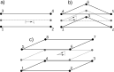

# Custom Geometries
Geometries are responsible for calculating several geometric properties, such as the normal vector, shape function values at a given position and the (inverse/determinant of the) Jacobian. This folder contains custom geometries that are used in the GeoMechanicsApplication.

## Interface Geometry
The Interface Geometry is a custom geometry that can be used to define a line or a plane interface between two different domains. 

The geometry is defined by two lines or planes, one on each side of the interface. The two sides of the interface connect to other model parts. Most calculations are performed on the 'mid-geometry', which is defined by the midpoints of the two lines/planes. The midpoints are calculated for each node pair by taking the average position. The mid-geometries are depicted as the grey lines in the figures below. This means, that if a certain property is queried at a certain position on the interface, the call is forwarded to the underlying mid-geometry.

At this point, the following interfaces are supported
- 2+2 and 3+3 line interface geometries, based on the [2D2Line](../../../kratos/geometries/line_2d_2.h) and [2D3Line](../../../kratos/geometries/line_2d_3.h) geometries respectively.
- 3+3 and 6+6 triangular plane interface geometries, based on the [Triangle3D3](../../../kratos/geometries/triangle_3d_3.h) and [Triangle3D6](../../../kratos/geometries/triangle_3d_6.h) geometries respectively.
- 4+4 and 8+8 quadrilateral plane interface geometries, based on the [Quadrilateral3D4](../../../kratos/geometries/quadrilateral_3d_4.h) and [Quadrilateral3D8](../../../kratos/geometries/quadrilateral_3d_8.h) geometries respectively.

The node numbering of the interface geometries follows the same ordering as the underlying geometries, which are documented in their previously mentioned respective classes. The linear versions of the interface geometries are schematically depicted in the figure below: 2+2 line (a), 3+3 triangular plane (b) and 4+4 quadrilateral plane (c). As mentioned above, the mid-geometry is shown in grey.

The interfaces based on quadratic lines/planes (3+3 lines and 6+6 and 8+8 planes) follow the same logic for the node numbering. 
For example, the 3+3 line interface geometry has the following node numbering for its six nodes:

One thing to note, is that this interface geometry does not implement functions from the Geometry base class which are related to the integration scheme. That is because most of the time, interface geometries are used with a Lobatto integration scheme, which is not supported by the Geometry base class.

Any interface geometry has two sides, called edges for line interfaces and faces for planar interfaces. The first edge/face coincides with the first side (i.e. bottom side in the above figures) of the geometry. The ordering of the nodes of the first edge/face is identical to the one of the first side. For the 3+3 line interface geometry this means the list of node IDs equals [1, 2, 3]. The second edge/face references the nodes of the second side (i.e. top side in the above figures) of the line interface geometry. However, this edge/face has opposite orientation compared to the side, and therefore a node numbering according to the opposite direction. With respect to the node numbering of the side, this implies that the for lines, the end nodes will be swapped and any high-order nodes are reversed. For instance, for the 3+3 line interface geometry the second edge's nodes are ordered as follows: [5, 4, 6];