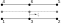

# Custom Geometries
Geometries are responsible for calculating several geometric properties, such as the normal vector, shape function values at a given position and the (inverse/determinant of the) Jacobian. This folder contains custom geometries that are used in the GeoMechanicsApplication.

## Line Interface Geometry
The Line Interface Geometry is a custom geometry that can be used to define a line interface between two different domains. 

The geometry is defined by two lines, one on each side of the interface. The two sides of the interface connect to other model parts. Most calculations are performed on the 'midline', which is defined by the midpoints of the two lines. They are depicted as the grey lines in the figures below. This means, that if a certain property is queried at a certain position on the interface, the call is forwarded to the underlying midline geometry.

At this point, the 2+2 and 3+3 line interface geometries are implemented, which depend on the [2D2Line](../../../kratos/geometries/line_2d_2.h) and [2D3Line](../../../kratos/geometries/line_2d_3.h) geometries respectively.
When creating The 2+2 line interface geometry (by inputting 4 nodes), the following node numbering is used:

Similarly, the 3+3 line interface geometry has the following node numbering for its six nodes:

One thing to note, is that this line interface geometry does not implement functions from the Geometry base class which are related to the integration scheme. That is because most of the time, interface geometries are used with a Lobatto integration scheme, which is not supported by the Geometry base class.

Any line interface geometry has two edges. The first edge coincides with the first side (i.e. bottom side in the above figures) of the geometry. The ordering of the first edge's nodes is identical to the one of the first side. For the 3+3 line interface geometry this means the list of node IDs equals [1, 2, 3]. The second edge references the nodes of the second side (i.e. top side in the above figures) of the line interface geometry. However, this edge has opposite orientation compared to the side, and therefore a node numbering according to the opposite direction. With respect to the node numbering of the side, this implies that the end nodes will be swapped and any high-order nodes are reversed. For instance, for the 3+3 line interface geometry the second edge's nodes are ordered as follows: [5, 4, 6];