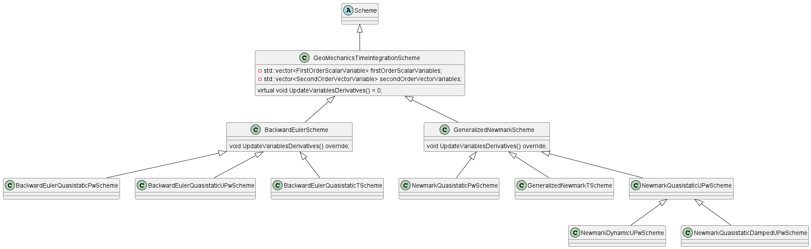

# Geomechanics Time Integration Schemes

## Introduction
The `Scheme` class in Kratos is used to create time integration schemes. It is an abstract class, for which Geomechanics has implemented a number of flavors, subdivided in the Backward Euler and the Generalized Newmark families.

## Code Structure
The bulk of the functionality is in the `GeoMechanicsTimeIntegrationScheme` class. It contains two lists of variables that are used in the time integration schemes. A list of first order scalar variables (such as water pressure or temperature) and a list of second order vector variables (such as displacements or rotations). For the first order time derivatives, only the first time derivative is taken into account, while for the second order time derivatives, both the first and the second time derivatives are considered. 

Updating the time derivatives is done in the following three functions:
- `UpdateScalarTimeDerivative`
- `UpdateVectorFirstTimeDerivative`
- `UpdateVectorSecondTimeDerivative`

These functions are purely virtual in the `GeoMechanicsTimeIntegrationScheme` class, and are implemented in the derived classes for the Backward Euler and Generalized Newmark time integration methods. The same holds for the `SetTimeFactors` function. For the specific equations, see sections [Backward Euler](#backward-euler) and [Generalized Newmark](#generalized-newmark).

The child classes which actually specify which variables are used in the time integration scheme (e.g. the `BackwardEulerUPwScheme` or the `GeneralizedNewmarkTScheme), only fill the lists of first/second order variables. 

The exceptions are the `NewmarkQuasistaticUPwScheme`, which has functionality for nodal smoothing (this should be moved to another location) and the damped and dynamic UPw schemes. More info on these can be found in the [Dynamic and damped schemes](#dynamic-and-damped-schemes) section. 

## Backward Euler
The most straight-forward scheme type is called Backward Euler. The functionality described in this section can be found in the `BackwardEulerScheme` class. The first and second time derivatives are simply calculated by dividing the difference in their integrated variables by the time step. This results in the following equations for the scalar and vector derivatives. 

First order scalar derivatives, in `UpdateScalarTimeDerivative`:
$$\dot{x}\_{current} = (x\_{current} - x\_{previous} ) / \Delta t$$

Second time derivative for vector variables in `UpdateVectorSecondTimeDerivative`:
$$\ddot{x}\_{current} = (\dot{x}\_{current} - \dot{x}\_{previous} ) / \Delta t$$

First time derivative for vector variables in `UpdateVectorFirstTimeDerivative`:
$$\dot{x}\_{current} = (x\_{current} - x\_{previous} ) / \Delta t$$

In these equations $\dot{x}$ and $\ddot{x} are the first time derivative and second time derivatives of variable $x$, respectively. The subscript $current$ refers to the current time step, while $previous$ refers to the previous time step. The magnitude of the time step is denoted by $\Delta t$.

## Generalized Newmark
A bit more involved are the Generalized Newmark schemes. This includes more parameters to tweak and has a more complex set of equations. The functionality described in this section can be found in the `GeneralizedNewmarkScheme` class. This results in the following three equations for updating the scalar and vector derivatives.

First time derivative for scalar variables in `UpdateScalarTimeDerivative`:
$$\dot{x}\_{current} = \frac{x\_{current} - x\_{previous} - (1 - \theta) \Delta t \dot{x}\_{previous}}{\theta \Delta t}$$

First time derivative for vector variables in `UpdateVectorFirstTimeDerivative`:
$$\dot{x}\_{current} = \dot{x}\_{previous} + (1 - \gamma)\Delta t \ddot{x}\_{previous} + \gamma \Delta t \ddot{x}\_{current}$$

Second time derivative for vector variables in `UpdateVectorSecondTimeDerivative`:
$$\ddot{x}\_{current} = \frac{x\_{current} - x\_{previous} - \Delta t \dot{x}\_{previous} - (0.5 - \beta)(\Delta t)^{2}\ddot{x}\_{previous}}{\beta(\Delta t)^{2}}$$

For these functions, identically to the Backward Euler scheme, $\ddot{x}$ and $\dot{x}$ refer to the first and second derivatives of $x$, while subscripts $current$ and $previous$ refer to the current/previous time steps. The magnitude of the time step is denoted by $\Delta t$. The parameters $\theta$, $\gamma$ and $\beta$ are the parameters of the Generalized Newmark scheme, and should all be larger than 0. 

## Dynamic and damped schemes
To be investigated in further detail.
