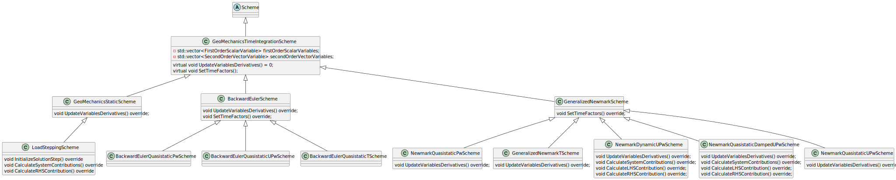

# Geomechanics Time Integration Schemes

## Introduction

The `Scheme` class in Kratos is used to create time integration schemes. It is a base class, for which Geomechanics
has implemented a number of flavors, subdivided in the Backward Euler and the Generalized Newmark families.

## Code Structure

The bulk of the functionality is implemented in the `GeoMechanicsTimeIntegrationScheme` class. It contains two lists of
variables that are used in the time integration schemes. A list of first order scalar variables (such as water pressure
or temperature) and a list of second order vector variables (such as displacements or rotations). For the first order
time derivatives, only the first time derivative is taken into account, while for the second order time derivatives,
both the first and the second time derivatives are considered. These lists are filled in the constructor by derived
classes that specify which variables are used in the time integration scheme.

The functions that the `GeoMechanicsTimeIntegrationScheme` class implements are mostly dictated by the `Scheme`
interface and include functionality like checking if all variables are allocated in the modelpart, getting _DofLists,
EquationIds_ and calling different flavors of the Initialize/Finalize/CalculateSystemContributions functions on elements
and conditions.

It also has a general `Update` step, which calls the `UpdateVariablesDerivatives` function. This is a purely virtual
function that has to be implemented by the derived classes. This is because the actual updating of the derivatives,
defines a time integration scheme. The derived classes then use the lists of variables to update the derivatives. In our
structure (see the class diagram), only the `BackwardEulerScheme` and the `GeneralizedNewmarkScheme` classes implement
this function. Similarly the `SetTimeFactors` function, updates the delta time, but also the time coefficients, for
which the overrides are found in the derived classes. For the specific equations, see
sections [Backward Euler](#backward-euler) and [Generalized Newmark](#generalized-newmark).

_Class structure of the schemes generated using the SchemeStructure.puml file with PlantUML. Note that the class diagram
is simplified and only shows the functions that need emphasis._

The child classes which actually specify which variables are used in the time integration scheme (e.g.
the `BackwardEulerUPwScheme` or the `GeneralizedNewmarkTScheme`), only fill the lists of first/second order variables.

The exceptions are the `NewmarkQuasistaticUPwScheme`, which has functionality for nodal smoothing (this should be moved
to another location) and the damped and dynamic UPw schemes. More info on these can be found in
the [Dynamic and damped schemes](#dynamic-and-damped-schemes) section.

## Backward Euler

The most straight-forward scheme type is called Backward Euler. The functionality described in this section can be found
in the `BackwardEulerScheme` class. The first and second time derivatives are simply calculated by dividing the
difference in their integrated variables by the time step. This results in the following equations for the scalar and
vector derivatives.

First order scalar derivatives, in `UpdateScalarTimeDerivative`:
$$\dot{x}\_{t + \Delta t} = (x\_{t + \Delta t} - x\_{t} ) / \Delta t$$

First time derivative for vector variables in `UpdateVectorFirstTimeDerivative`:
$$\dot{x}\_{t + \Delta t} = (x\_{t + \Delta t} - x\_{t} ) / \Delta t$$

Second time derivative for vector variables in `UpdateVectorSecondTimeDerivative`:
$$\ddot{x}\_{t + \Delta t} = (\dot{x}\_{t + \Delta t} - \dot{x}\_{t} ) / \Delta t$$

The order of calculating the first and second time derivatives is important, since $\ddot{x}\_{t+\Delta t}$ depends on
$\dot{x}\_{t + \Delta t}$.

In these equations $\dot{x}$ and $\ddot{x}$ are the first time derivative and second time derivatives of variable $x$,
respectively. The subscript $t + \Delta t$ refers to the end of the current time step, while the subscript $t$ refers to
the start. The magnitude of the time step is denoted by $\Delta t$.

The time factors are set in the `SetTimeFactors` function, which sets the coefficient for both the vector and scalar
variables to $1/(\Delta t)$.

## Generalized Newmark

A bit more involved are the Generalized Newmark schemes. This includes more parameters to tweak and has a more complex
set of equations. The functionality described in this section can be found in the `GeneralizedNewmarkScheme` class. This
results in the following three equations for updating the scalar and vector derivatives.

First time derivative for scalar variables in `UpdateScalarTimeDerivative`, known as GN11:
$$\dot{x}\_{t + \Delta t} = \frac{x\_{t + \Delta t} - x\_{t} - (1 - \theta) \Delta t \dot{x}\_{t}}{\theta \Delta t}$$

Second time derivative for vector variables in `UpdateVectorSecondTimeDerivative`, known as GN22:
$$\ddot{x}\_{t + \Delta t} = \frac{x\_{t + \Delta t} - x\_{t} - \Delta t \dot{x}\_{t} - (0.5 - \beta)(\Delta t)
^{2}\ddot{x}\_{t}}{\beta(\Delta t)^{2}}$$

First time derivative for vector variables in `UpdateVectorFirstTimeDerivative`, known as GN22:
$$\dot{x}\_{t + \Delta t} = \dot{x}\_{t} + (1 - \gamma)\Delta t \ddot{x}\_{t} + \gamma \Delta t \ddot{x}\_{t + \Delta
t}$$

Note that the order here is the other reversed with respect to the Backward Euler scheme. This is because
$\ddot{x}\_{t + \Delta t}$ is used in the equation for $\dot{x}\_{t + \Delta t}$.

For these functions, identically to the Backward Euler scheme, $\ddot{x}$ and $\dot{x}$ refer to the first and second
derivatives of $x$, while subscripts $t + \Delta t$ and $t$ refer to the end and start of the current time step. The
magnitude of the time step is denoted by $\Delta t$. The parameters $\theta$, $\gamma$ and $\beta$ are the parameters of
the Generalized Newmark scheme, with the following conditions: $0\le\theta\le 1$, and $0\le\gamma\le 1$ and
$0\le\beta\le 0.5$.

For setting the time factors (done in the `SetTimeFactors` override), the following equations are used. For the scalar
variables, the time coefficient is set to $1/(\theta\Delta t)$, while for the vector variables, the time coefficients
are set to $\gamma / (\beta \Delta t)$.

## Dynamic, damped and quasistatic Generalized Newmark schemes

The dynamic, damped and quasistatic schemes are all Generalized Newmark schemes (as seen in the class diagrams). For the
vector variables part (displacements and/or rotations) they take different parts of the equation of motion into account:
- Quasistatic: displacements/rotations related matrices and vectors only
- Damped: as quasistatic + velocity/angular velocity related matrices and vectors
- Dynamics: as damped + inertia (acceleration/angular acceleration) related matrices and vectors

Therefore, the functionality `UpdateVariablesDerivatives`, `CalculateSystemContributions`, `CalculateRHSContribution`
and `CalculateLHSContribution` are overridden and add extra terms to the system matrix and right hand side vector for
the dynamic/damped schemes.

One more anomaly is the `Predict` function, currently found in the `NewmarkDynamicUPwScheme` class. This functionality
should have its counterparts in the other classes derived from `GeneralizedNewmarkScheme` class.

## Incremental Newmark linear elastic U scheme

The Incremental Newmark linear elastic U scheme uses a different formulation for the Newmark time integration. This 
scheme is only to be used together with the `ResidualBasedBlockBuilderAndSolverLinearElasticDynamic` builder and solver.
And the `GeoMechanicNewtonRaphsonStrategyLinearElasticDynamic` strategy. This strategy relies on the fact that
the left hand side matrix is constant throughout the time integration. Furthermore, internal forces are not calculated
every iteration. In this scheme, actions are only performed on conditions; required actions on elements are performed 
within the `ResidualBasedBlockBuilderAndSolverLinearElasticDynamic` builder and solver and within the 
`GeoMechanicNewtonRaphsonStrategyLinearElasticDynamic` strategy. Furthermore, solution step values are updated within
the `GeoMechanicNewtonRaphsonStrategyLinearElasticDynamic` strategy.

The Incremental equilibrium equation which is solved in the `GeoMechanicNewtonRaphsonStrategyLinearElasticDynamic` 
strategy is given by:

$$\left\{ \frac{1}{\beta \Delta t^2} [M] + \frac{\gamma}{\beta \Delta t} [C] + [K] \right\} \{\Delta u\} = 
\{\Delta R(u(t_{k+1}))\} + [M] \left\{ \frac{1}{\beta \Delta t} \dot{u}(t_k) + \frac{1}{2 \beta} \ddot{u}(t_k) \right\} + 
[C] \left\{ \frac{\gamma}{\beta} \dot{u}(t_k) + \Delta t \left( \frac{\gamma}{2 \beta} - 1 \right) \ddot{u}(t_k) 
\right\} $$

where $[M]$, $[C]$ and $[K]$ are the mass, damping and stiffness matrices, respectively. $\{\Delta u\}$ is the
incremental displacement vector, $\{\Delta R\}$ is the incremental residual vector, $\dot{u}(t_k)$ is the velocity 
vector at the beginning of the time step, $\ddot{u}(t_k)$ is the acceleration vector at the beginning of the time step, 
$\beta$ is the Newmark parameter, $\gamma$ is the Newmark parameter, $\Delta t$ is the time step size.

The displacement vector is than updated as follows:

$$ u(t_{k+1}) = u(t_k) + \Delta u $$

The velocity and acceleration vectors are updated as follows:

$$\Delta \dot{u} = \frac{\gamma}{\beta \Delta t} \Delta u - \frac{\gamma}{\beta} \dot{u}(t_k) + 
\left( 1 - \frac{\gamma}{2 \beta} \right) \Delta t \ddot{u}(t_k) $$

$$\Delta \ddot{u} = \frac{1}{\beta \Delta t^2} \Delta u - \frac{1}{\beta \Delta t} \dot{u}(t_k) - 
\frac{1}{2 \beta} \ddot{u}(t_k) $$

$$\dot{u}(t_{k+1}) = \dot{u}(t_k) + \Delta \dot{u} $$

$$\ddot{u}(t_{k+1}) = \ddot{u}(t_k) + \Delta \ddot{u} $$

