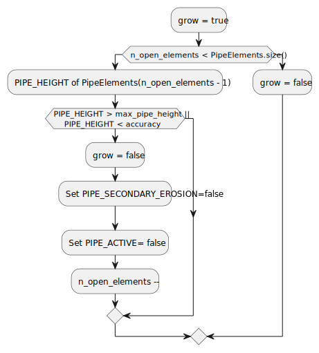

# GeoMechanicsNewtonRaphsonErosionProcessStrategy class.

This class implements a Newton-Raphson process for the backward erosion piping. The physics of the piping process is
described in

1. van Beek M. Backward erosion piping,initiation and progression. TUDelft PhD. Thesis, 2015.
2. Technisch rapport Zandmeevoerende wellen. Technische Adviescommissie
   voor de Waterkeringen, Delft, The Netherlands, 1999.

## Algorithm

The algorithm is implemented in the FinalizeSolutionStep function that loops over all piping elements until the erosion
growth is finished or all piping elements are checked.

### FinalizeSolutionStep function

This function calls other functions that are described below.

### GetPipingElements function

This function returns a list of all piping elements. To create the list, all elements are checked for  
PIPE_START_ELEMENT property that holds Id of the piping starting element.
Then elements on the list are sorted based on X-coordinate of the element begin.
The current limitation is the following. The starting piping element has to have minimum or maximum value of the X
coordinate. This is needed to find a direction for the piping growth.

### InitialiseNumActivePipeElements function

It checks the list of the elements and returns a number of elements with PIPE_ACTIVE property At the beginning the
number is zero.

### CalculateMaxPipeHeight function

It calculates a maximum diameter using CalculateParticleDiameter function then multiplies it by a magic factor of 100 to
get the height value.

### CalculateParticleDiameter

In case of PIPE_MODIFIED_D, the function returns

$$ diameter = factor \Bigg(\frac{D_{70}}{factor}\Bigg)^{0.4}$$

otherwise, $$diameter = D_{70}$$

where \
$D_{70}$ is the particle diameter of 70%-quantile of the grain size distribution by weight [m],\
factor = $2.08\times 10^{-4}$ [m].

### check_pipe_equilibrium function

This function performs an iterative process towards certain equilibrium values of the pipe heights. For each iteration
the modelling is performed. Then a pipe height is corrected by a given increment for each open piping element. The
maximum number of iterations is the user input, "max_piping_iterations".

### Recalculate function

This function performs the modeling using prescribed GeoMechanicsNewtonRaphsonStrategy class.

### CalculateEquilibriumPipeHeight function

This is a function from SteadyStatePwPipingElement. It calculates the equilibrium pipe height as

$$F \frac{\pi }{3} D_p \Big(\frac{\rho_s}{\rho_w} - 1\Big) \eta
\frac{\sin(\theta + \alpha)}{\cos(\theta)  \frac{dh}{dx}}$$

where $F$ is the model factor,\
$D_p$ is the particle diameter calculated with CalculateParticleDiameter function,\
$\rho_s$ is the solid density,\
$\rho_w$ is the water density,\
$\eta$ is the packing coefficient,\
$\theta$ is the angle of repose or bedding angle,\
$\alpha$ is the slope of the pipe,\
$\frac{dh}{dx}$ is the head gradient obtained with CalculateHeadGradient function,\
Currently, the pipe is assumed horizontal $\alpha = 0$.

### check_status_tip_element function

This function checks the open piping elements and if their height is larger than a maximum value of the pipe height or
too small then the function changes the pipe properties: PIPE_EROSION and PIPE_ACTIVE to false. In this case the
function sets grow parameter as false. As well the grow is set to false if all piping elements are open.

### save_or_reset_pipe_heights function

This function sets values of PREV_PIPE_HEIGHT and PIPE_HEIGHT parameters based on 'grow' input value. If grow is equal
to true which means the piping is growing then PREV_PIPE_HEIGHT value is assigned to PIPE_HEIGHT value. If grow is false
then PIPE_HEIGHT value is assigned to the PREV_PIPE_HEIGHT value.

### Interaction with Interface classes.

SteadyStatePwPipingElement class sets JointWidth equal to PIPE_HEIGHT to call functions from Interface classes. 

