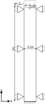
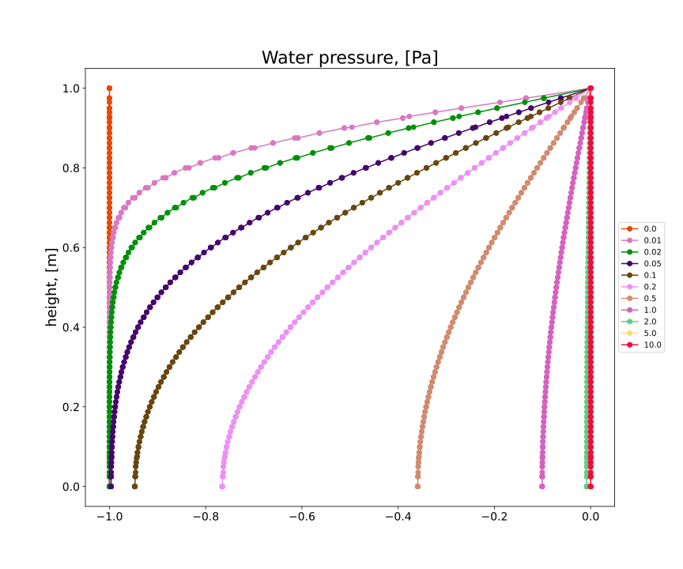
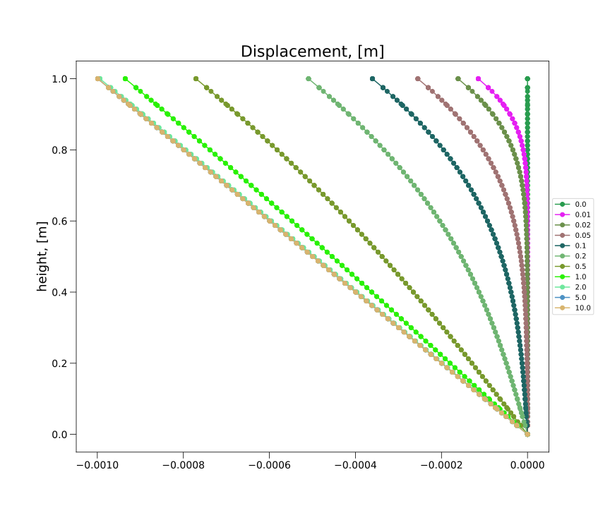

# 1D Consolidation

This test verifies that in a column of triangular plane strain elements, consolidation follows the solution given by Terzaghi in 1923.

## Setup

This test consists of 78 6-noded elements (using the SmallStrainUPwDiffOrderElement2D6N class) of $b \times h = 0.1 \times 1.0 \mathrm{[m]}$. A
schematic representation can be found in the figure below:

All nodes on the sides have fixed horizontal displacements. The bottom nodes have fixed displacement in both the horizontal and the vertical
direction. At the top of the column a vertical compressive line load with a magnitude of $q=1.0 \mathrm{[N/m]}$ is applied. This load is kept constant during the whole analysis time. Note that gravity is absent in this computation, the top load generates the excess pore pressure. In the first stage no Dirichlet boundaries for the water pressure D.O.F. are given, such that all water is contained within the column. In all later stages, the water pressure (p) on the top of the column is specified to be 0.0 [Pa]. This creates an outflow boundary at the top.

The material is described using:
-   A linear elastic plane strain model (LinearElasticPlaneStrain2DLaw)
-   A Young's modulus $E = 1.0E3 \mathrm{[Pa]}$ with Poisson's ratio $\nu = 0.0 \mathrm{[-]}$.
-   The soil and water density are specified, but irrelevant due to the absence of gravity. The porosity is $n=0.3$.
These material properties of the dry soil give a compression modulus $K = E / (3(1-2\nu)) = 3.33E2 \mathrm{[Pa]}$ and a shear modulus $G = E / (2( 1 + \nu )) = 5.0E2 \mathrm{[Pa]}$.
-   The dynamic viscosity of water is given as $\mu = 1.0E-6 \mathrm{[Pa \cdot s]}$ and the intrinsic permeability of the soil as $\kappa = 1.17982E-15 \mathrm{[m^2]}$
-   The bulk modulus of water $K_w = 2.0E9 \mathrm{[Pa]}$

The differential equation for the 1D consolidation column under constant load as presented by Verruijt (2001) is :

$$ \frac{\partial p}{\partial t} = c_v \frac{\partial^2 p}{\partial y^2} $$

where the consolidation coefficient:

$$ c_v = \frac{\kappa}{\mu ( \frac{1}{K + 4G/3} + \frac{n}{K_w})}$$

The analytical solution for pore pressure is given by Terzaghi:

$$ p = \frac{4 p_0}{\pi} \sum_{j=1}^{\infty} \frac{(-1)^{j-1}}{2j-1} cos((2j-1) \frac{\pi y}{2 h}) exp(-(2j-1)^2 \frac{\pi^2 c_v t}{4 h^2}) $$

The degree of consolidation is defined as
$$U=\frac{\Delta h - \Delta h_0}{\Delta h_\infty - \Delta h_0}$$, where 

the deformation immediately after the application of the load
$\Delta h_0=m_v h q\frac{n\beta}{m_v+n\beta}$, 

the final deformation $\Delta h_\infty=m_v h q$, 

the compressibility coefficient $m_v=\frac{1}{K + 4G/3}$, 

the compressibility of the water $\beta=1\over K_w$.

Using the analytical solution for the pore pressure, the degree of consolidation is the following

$$U=1-\frac{8}{\pi^2} \sum_{j=1}^{\infty} \frac{1}{(2j-1)^2} exp(-(2j-1)^2 \frac{\pi^2 c_v t}{4 h^2})$$

Analysis stages are chosen such that at the end times of the stages and the corresponding dimensionless time parameter $\frac{c_v t}{h^2}$ follows the pattern of the table below.

| $t \mathrm{[s]}$ | $\frac{c_v t}{h^2}$ |
|------------------|---------------------|
| 0.0              | 0.0                 |
| 8640.0           | 0.01                |
| 17280.0          | 0.02                |
| 43200.0          | 0.05                |
| 86400.0          | 0.1                 |
| 172800.0         | 0.2                 |
| 432000.0         | 0.5                 |
| 864000.0         | 1.0                 |
| 1728000.0        | 2.0                 |
| 4320000.0        | 5.0                 |
| 8640000.0        | 10.0                |

## Solution

The following pictures show water pressure and displacement for each value of the dimensionless time parameter.

## Assertions

The test asserts that at the end of each stage 
-  the vertical distribution of pressure matches the given Terzaghi solution at all nodes,
-  the total deformation of the sample matches the analytical solution.

## Bibliography
Verruijt, A., 2001. [Soil Mechanics](https://ocw.tudelft.nl/wp-content/uploads/SoilMechBook.pdf). Delft University of Technology.
