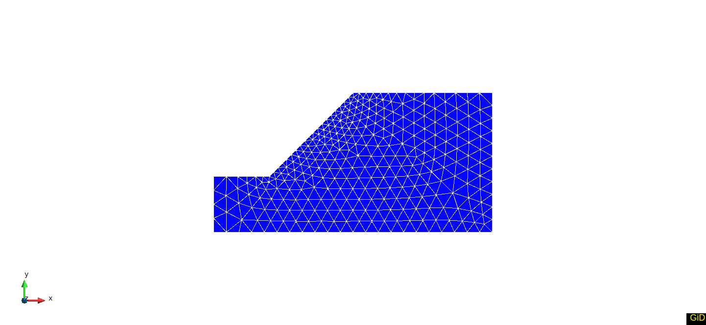
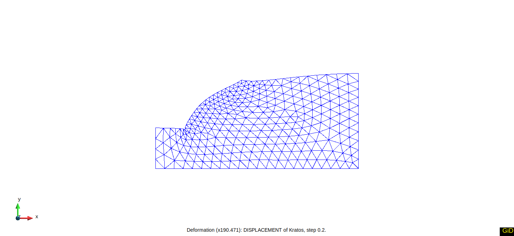

# $c-\phi$ reduction process

$c-\phi$ reduction process is tested here. This test allows one to perform a real 2D computation. 
However, the end time is decreased and tollerances are increased to perform just a few steps. 
This is done to have enough data to verify the implemented process and do not over-spend CPU resources. 

## Setup
This test consists of 553 6-noded elements (using the UPwSmallStrainElement2D6N class). These elements are shown in the figure below:

Constraints are applied 
- on the bottom nodes that are fixed completly and 
- on the vertical boundaries on the left and right sides of the domain that are allowed to move in the vertical direction only. 

The gravitation acts down in the vertical direction. 

The material is described using:

-  Young’s modulus 14.0 $MPa$
-  Poisson’s ratio 0.3
-  Unit weight 20 $kN/m^3$
-  Cohesion 10 $kPa$
-  Friction angle 35.0 deg
 
The computation is done in two stages. The first stage is a settlement due to the gravitation. 
The second stage is done only for two time steps. 

## Assertions

The test asserts movement in horizontal direction at three nodes, which are chosen because their movement is larger than for majority of nodes. 

The figure below shows the calculated deformation.

