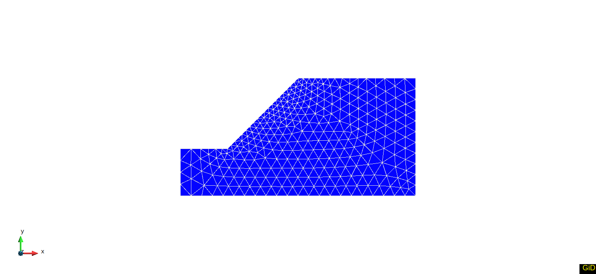
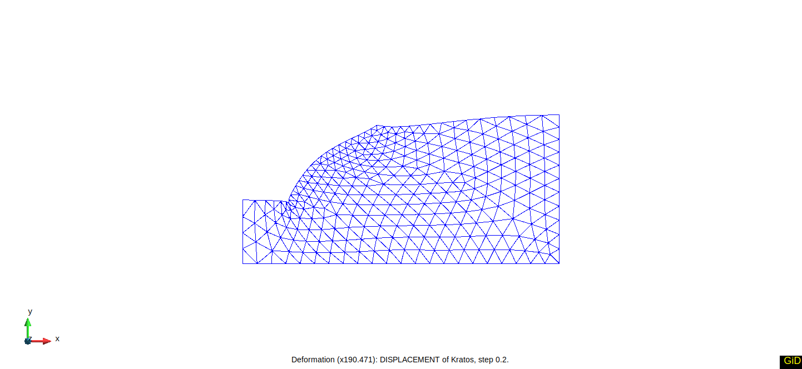

# $c-\phi$ reduction process

The $c-\phi$ reduction process is tested here. This test allows one to perform a real 2D computation. 
However, the end time is decreased and tolerances are increased to perform just a few steps. 
This is done to have enough data to verify the implemented process and to not over-spend CPU resources. 

## Setup
This test consists of 553 6-noded elements (using the UPwSmallStrainElement2D6N class). These elements are shown in the figure below:

The test is performed with the following conditions:

- Constraints:
    - The bottom nodes are fixed in both the X and Y direction,
    - The nodes on left and right vertical boundaries are fixed in the X direction. 
- Conditions:
    - A gravitational force is applied in Y direction.

The computation is done in two stages. The first stage is a settlement due to the gravitation and it uses K0 procedure.
The second stage is the $c-\phi$ reduction process and it is done for two steps. The figure below shows the calculated deformation.

Different material properties are used at the first and second stages. 

The material at the first stage is described using:

-  Young’s modulus: 14.0 $MPa$,
-  Poisson’s ratio: 0.3,
-  Density of the solid soil: 2038.7 $kg/m^3$,
-  Friction angle: 35.0 $\degree$.

The friction angle is used to calculate the "K0_VALUE_XX" and "K0_VALUE_ZZ" using the formula for $K_0^{nc}$ as documented in the [$K_0$ procedure process](https://github.com/KratosMultiphysics/Kratos/blob/master/applications/GeoMechanicsApplication/custom_processes/README.md#K_0-procedure-process).

For the second stage, two distinct implementations of the Mohr–Coulomb model are employed:
- the internal one implemented in Kratos GeoMechanicsApplication,
- one provided by the MohrCoulomb64 library.

The material parameters are as follows:
- Young’s modulus: 30.0 $MPa$,
- Poisson’s ratio: 0.2,
- Cohesion: 1000.0 $Pa$,
- Friction angle: 30.0 $\degree$,
- Tension cut-off stress: 1000.0 $Pa$,
- Dilatancy angle: 0.0 $\degree$.

The Kratos model uses specific input keywords for these parameters, where the MohrCoulomb64 library uses an input in the form of an array of UMAT parameters. The meaning of the UMAT parameters in the array is:
1. Young’s modulus [$Pa$],
2. Poisson's ratio [-],
3. Cohesion [$Pa$],
4. Friction angle [deg],
5. Dilatancy angle [deg],
6. Tension cut-off stress [$Pa$],
7. Yield function selector [0: Matsuoka–Nakai Convex; 1: Mohr–Coulomb, 2: Drucker–Prager, 3: Matsuoka–Nakai],
8. Undrained Poisson's ratio [-].

The UMAT parameter definition can also be found [here](https://deltares.github.io/Kratos-GeoMechanicsApplication-Documentation/input_parameters/material_parameters/#mohr-coulomb-model-mohrcoulomb64dll).

## Assertions

The test asserts movement in the horizontal direction at three nodes, which are chosen because their movement is larger than the movement for most of the other nodes. 

