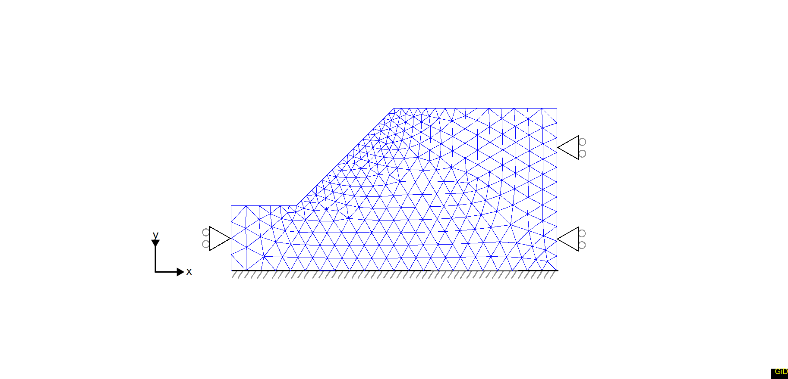

# c-$\phi$ reduction process

c-$\phi$ reduction process is tested here. This test allows one to perform a real 2D computation. 
However, the end time is decreased and tollerances are increased to perform just a few steps. 
This is done to have enough data to verify the implemented process and do not over-spend CPU resources. 

## Setup
This test consists of 553 6-noded elements (using the UPwSmallStrainElement2D6N class). A
schematic representation can be found in the figure below:

The computation is done in two stages. The first stage is a settlement due to gravitation when all nodes except the bootom nodes are allowed to move in the vertical direction. 
The second stage is

All nodes on the sides have fixed horizontal displacements. The bottom nodes have fixed displacement in both the horizontal and the vertical
direction. At the top of the column a vertical compressive line load with a magnitude of $q=1.0 \mathrm{[N/m]}$ is applied. This load is kept constant during the whole analysis time. Note that gravity is absent in this computation, the top load generates the excess pore pressure. In the first stage no Dirichlet boundaries for the water pressure D.O.F. are given, such that all water is contained within the column. In all later stages, the water pressure (p) on the top of the column is specified to be 0.0 [Pa]. This creates an outflow boundary at the top.

The material is described using:

-  Young’s modulus 14.0 $MPa$
-  Poisson’s ratio 0.3
-  Unit weight 20 $kN/m^3$
-  Cohesion 10 $kPa$
-  Friction angle 35.0 deg

