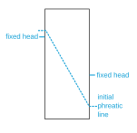
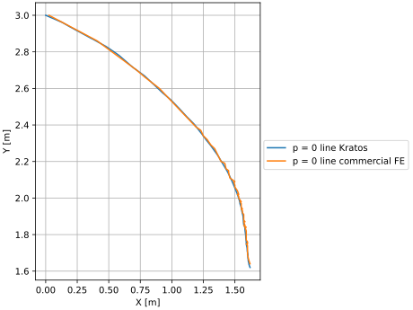
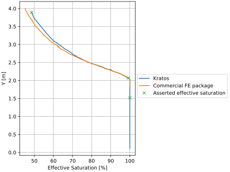
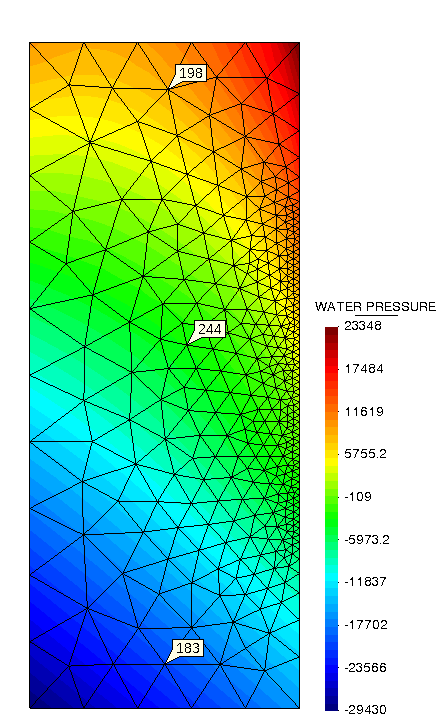

# Semi-Muskat problem

This test is based on the Muskat problem, but instead of a seepage boundary on the right side of the model, a fixed hydrostatic pressure is applied to the right boundary. The test performs a steady state water pressure calculation (using SteadyStatePwElement2D6N elements) using a Van Genuchten retention law to describe the permeability and (effective) saturation behavior depending on the water pressures.

## Setup

The test is performed in a single stage, with the following constraints and condition:
- The initial condition for the water pressure is a phreatic line with the profile as depicted in the schematic below. The coordinates of the phreatic line are (-0.05, 3.22), (0.25, 3.22), (1.6, 0.48), (1.7, 0.48).
- For the left boundary, the water pressure is prescribed using a hydrostatic profile with reference coordinate of 3.0m
- For the right boundary, the water pressure is prescribed using a hydrostatic profile with reference coordinate of 1.62m. Using this fixed boundary instead of a seepage boundary is the main difference with the traditional Muskat problem.

A schematic of this  can be found in the figure below:

## Results

The following outputs are used as first-reference results for this test, computed using a commercial FEM package:
- Phreatic line evolution (reference: `expected_phreatic_line.csv`).
- Hydrostatic response values (reference: `expected_saturation_at_x_1_52.csv`).

The phreatic line profile is visualized below. The profile is an estimation of the p=0 line. For the commercial package, the nodes with the lowest absolute pressures (close to zero) are plotted. For the Kratos result, Delaunay triangulation is used to find the p=0 isoline.

The saturation profile at x = 1.52 (10 cm from the right boundary) is visualized below:

## Assertions
As seen in the results, the water pressures and effective saturations still show significant differences between Kratos and the commercial package. Therefore, regression values are checked for now. When changes are made to the model/implementation, the (autogenerated) profiles shown in the previous section can be used to assess whether the changes are an improvement.

The following assertions are done on the model:
- At three representative nodes (see figure at the bottom of the file), the water pressures are checked for regressions.
- At three representative nodes (see also the effective saturation plot), the effective saturation is checked for regressions.

The representative water pressure nodes are shown in the picture below

