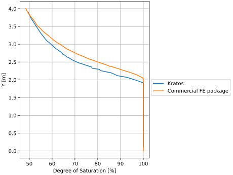

# Semi-Muskat problem

This test is based on the Muskat problem, but instead of a seepage boundary on the right side of the model, a fixed hydrostatic pressure is applied to the right boundary. The test performs a steady state water pressure calculation (using SteadyStatePwElement2D6N elements) using a Van Genuchten retention law to describe the permeability and (effective) saturation behavior depending on the water pressures.

## Setup

The test is performed in a single stage, with the following constraints and condition:
- The initial condition for the water pressure is a phreatic line with the profile as depicted in the schematic below. The coordinates of the phreatic line are (-0.05, 1.62), (0.25, 1.62), (1.6, 0.48), (1.7, 0.48).
- For the left boundary, the water pressure is prescribed using a hydrostatic profile with reference coordinate of 3.0m
- For the right boundary, the water pressure is prescribed using a hydrostatic profile with reference coordinate of 1.62m. Using this fixed boundary instead of a seepage boundary is the main difference with the traditional Muskat problem.

A schematic of this  can be found in the figure below:

## Results

The following outputs are used as first-reference results for this test, computed using a commercial FEM package:
- Phreatic line evolution (reference: `expected_phreatic_line.csv`).
- Hydrostatic response values (reference: `expected_saturation_at_x_1_52.csv`).

The phreatic line profile is visualized below:

The saturation profile on the right boundary is visualized below:

## Assertions
To be added
