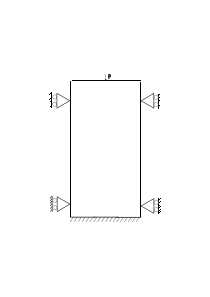

# UDSM serialization

This set contains compact 2D column benchmarks for validating UDSM serialization.

The test performs three stages computation and saves dump files after each stage. Then the third stage is repeated starting from the second stage dumpp file. Solutions obtained for the third stage are compared. 

Diff-order elements `SmallStrainUPwDiffOrderElement2D6N` (4 triangles with midside nodes) are used. The figure below shows the column and constraints. 

## Geometry and boundary conditions

- Column size: $1 \times 2\ \mathrm{[m]}$
- Bottom: fixed in both directions.
- Left and right sides: fixed in the horizontal direction.
- Stage 1: gravity loading + K0 initialization
- Stages 2 and 3:
    - UDSM model,
    - prescribed top vertical displacement (table to $-0.001\ \mathrm{[m]}$),
    - prescribed top water pressure of $10000\ \mathrm{[Pa]}$.

## Material models

### Soil (`PorousDomain.Soil`)

- Constitutive law: `GeoLinearElasticPlaneStrain2DLaw`
- $E = 1.0e9\ \mathrm{[Pa]}$, 
- $\nu = 0.2$
- $\rho_s = 2000\ \mathrm{[kg/m^3]}$, $\rho_w = 1000\ \mathrm{[kg/m^3]}$
- $n = 0.3$, $K_s = 1.0e12\ \mathrm{[Pa]}$, $K_w = 2.2e9\ \mathrm{[Pa]}$
- $k_{xx}=k_{yy}=4.5e-10\ \mathrm{[m^2]}$, 
- $\mu=1.0e-3\ \mathrm{[Pa\cdot s]}$

## Assertions

Displacement and water pressure values obtained for the third stage.
