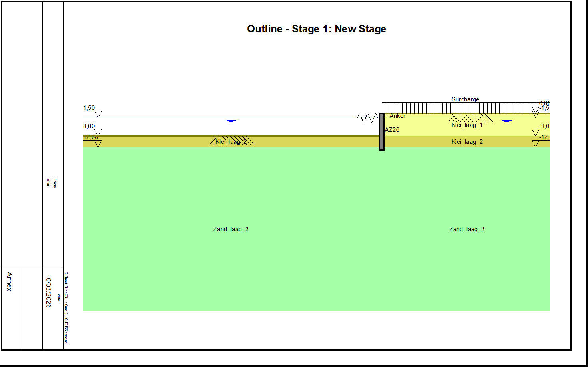

# CROW Validation with Excavation Stages

This document describes the validation of the CROW case with excavation stages. The case is based on the following work:

Directory: CROW\CROW-case\CC3-nieuwbouw-50jaar_beta=4,3_met_modelonzekerheid_CoV-Qlast=0,13\Case 2 - CUR166 case

## Soil parameters

This section documents the derivation of the Kratos input values for the **clay** and **sand** layers.

### Given data

From D-Sheet Piling, the following soil properties are given for the clay and sand layers:

| Property                               | Clay                 | Sand                 | Unit                       |
|:---------------------------------------|:---------------------|:---------------------|:---------------------------|
| Unsaturated total unit weight          | 18                   | 20                   | $\mathrm{kN}/\mathrm{m}^3$ |
| Saturated total unit weight            | 18                   | 20                   | $\mathrm{kg}/\mathrm{m}^3$ |
| Cohesion                               | 3.0                  | 0.0                  | $\mathrm{kg}/\mathrm{m}^2$ |
| Friction angle                         | 22.5                 | 32.5                 | $degree$                   |
| Delta friction angle                   | 11.25                | 20                   | $degree$                   |
| OCR                                    | 1.0                  | 1.0                  | $-$                        |
| Earth pressure coefficient             | 0.62                 | 0.46                 | $-$                        |
| Modulus of subgrade reaction-Secant k1 | $1.0 \times 10^{3}$  | $1.0 \times 10^{4}$  | $\mathrm{kN}/\mathrm{m}^3$ |
| Modulus of subgrade reaction-Secant k2 | $1.0 \times 10^{3}$  | $1.0 \times 10^{4}$  | $\mathrm{kN}/\mathrm{m}^3$ |
| Modulus of subgrade reaction-Secant k3 | $1.0 \times 10^{3}$  | $1.0 \times 10^{4}$  | $\mathrm{kN}/\mathrm{m}^3$ |
| Horizontal permeability                | $1.0 \times 10^{-4}$ | $1.0 \times 10^{-4}$ | $\mathrm{m}/\mathrm{s}$    |

### Solid density

The bulk density is obtained from the unit weight:

$$ \rho_{\mathrm{bulk}} = \frac{\gamma}{g} $$

with:

$$ g = 9.81 ,\mathrm{m}/\mathrm{s}^2 $$

#### Clay

$$ \rho_{\mathrm{bulk,clay}} = \frac{18000}{9.81} = 1834.86,\mathrm{kg}/\mathrm{m}^3 $$

#### Sand

$$ \rho_{\mathrm{bulk,sand}} = \frac{20000}{9.81} = 2038.74,\mathrm{kg}/\mathrm{m}^3 $$

Solving for the solid density:

$$ \rho_{\mathrm{s}} = \frac{\rho_{\mathrm{bulk}} - n\rho_{\mathrm{w}}}{1-n} $$

#### Clay

$$ \rho_{\mathrm{s,clay}} = \frac{1834.86 - 0.50 \cdot 1019.37}{1 - 0.50} $$

$$ \rho_{\mathrm{s,clay}} = 2650.35,\mathrm{kg}/\mathrm{m}^3 $$

#### Sand

$$ \rho_{\mathrm{s,sand}} = \frac{2038.74 - 0.30 \cdot 1019.37}{1 - 0.30} $$

$$ \rho_{\mathrm{s,sand}} = 2475.61,\mathrm{kg}/\mathrm{m}^3 $$

### Conversion to intrinsic permeability

From D-Sheet Piling, the permeability is given as **hydraulic conductivity** for both soils:

$$ K = 1.0 \times 10^{-4},\mathrm{m}/\mathrm{s} $$

Kratos requires **intrinsic permeability**:

$$ k ,[\mathrm{m}^2] $$

The relation between hydraulic conductivity and intrinsic permeability is:

$$ k = \frac{K \mu}{\rho_{\mathrm{w}} g} $$

where:

* $K$ is the hydraulic conductivity
* $\mu$ is the dynamic viscosity
* $\rho_{\mathrm{w}}$ is the water density
* $g$ is the gravitational acceleration

The adopted values are:

$$ \mu = 1.0 \times 10^{-3} ,\mathrm{Pa}\cdot\mathrm{s} $$

$$ \rho_{\mathrm{w}} = 1019.37,\mathrm{kg}/\mathrm{m}^3 $$

$$ g = 9.81 ,\mathrm{m}/\mathrm{s}^2 $$

Substituting:

$$ k = \frac{1.0 \times 10^{-4} \cdot 1.0 \times 10^{-3}}{1019.37 \cdot 9.81} $$

$$ k = 9.999 \times 10^{-12} ,\mathrm{m}^2 $$

This is rounded to:

$$ k \approx 1.0 \times 10^{-11},\mathrm{m}^2 $$

### Final values
Because the Kratos model requires additional parameters, the table below summarizes the final material properties for the soil layers, including both the calculated values and the assumed values adopted for use in the model.

| Property                     | Kratos input parameter |                   Clay |                   Sand | Unit                       |
|------------------------------|------------------------|-----------------------:|-----------------------:|----------------------------|
| Solid density                | `DENSITY_SOLID`        |                2650.35 |                2475.61 | $\mathrm{kg}/\mathrm{m}^3$ |
| Water density                | `DENSITY_WATER`        |                1019.37 |                1019.37 | $\mathrm{kg}/\mathrm{m}^3$ |
| Porosity                     | `POROSITY`             |                   0.50 |                   0.30 | $-$                        |
| Young's modulus              | `YOUNG_MODULUS`        |      $1.2 \times 10^7$ |      $3.0 \times 10^7$ | $\mathrm{Pa}$              |
| Poisson's ratio              | `POISSON_RATIO`        |                   0.30 |                   0.30 | $-$                        |
| Intrinsic permeability in xx | `PERMEABILITY_XX`      | $1.02 \times 10^{-11}$ | $1.02 \times 10^{-11}$ | $\mathrm{m}^2$             |
| Intrinsic permeability in yy | `PERMEABILITY_YY`      | $1.02 \times 10^{-11}$ | $1.02 \times 10^{-11}$ | $\mathrm{m}^2$             |
| Intrinsic permeability in xy | `PERMEABILITY_XY`      |                      0 |                      0 | $\mathrm{m}^2$             |
| Saturated saturation         | `SATURATED_SATURATION` |                    1.0 |                    1.0 | $-$                        |
| Residual saturation          | `RESIDUAL_SATURATION`  |  $1.0 \times 10^{-10}$ |  $1.0 \times 10^{-10}$ | $-$                        |
| Earth pressure coefficient   | `K0_NC`                |                   0.62 |                   0.46 | $-$                        |

## Interface parameters

This section documents the derivation of the Kratos input values for the interfaces adjacent to **clay** and **sand**.

### Given data

The interface stiffnesses are based on the adjacent soil shear modulus and a characteristic element size normal to the interface.

The following values were adopted:

| Property                         | Clay-side interface | Sand-side interface | Unit          |
|----------------------------------|--------------------:|--------------------:|---------------|
| Young's modulus of adjacent soil |   $1.2 \times 10^7$ |   $3.0 \times 10^7$ | $\mathrm{Pa}$ |
| Poisson's ratio of adjacent soil |                0.30 |                0.30 | $-$           |
| Element size normal to interface |                 1.0 |                 1.0 | $\mathrm{m}$  |

### Shear modulus of the adjacent soil

The soil shear modulus is calculated as:

$$ G = \frac{E}{2(1+\nu)} $$

#### Clay

$$ G_{\mathrm{clay}} = \frac{1.2 \times 10^7}{2(1+0.30)} $$

$$ G_{\mathrm{clay}} = \frac{1.2 \times 10^7}{2.6} = 4.615 \times 10^6 ,\mathrm{Pa} $$

#### Sand

$$ G_{\mathrm{sand}} = \frac{3.0 \times 10^7}{2(1+0.30)} $$

$$ G_{\mathrm{sand}} = \frac{3.0 \times 10^7}{2.6} = 1.1538 \times 10^7 ,\mathrm{Pa} $$

### Interface stiffness formulation

The interface shear stiffness is taken as:

$$ k_{\mathrm{s}} = \frac{G}{h} $$

The interface normal stiffness is taken as:

$$ k_{\mathrm{n}} = 10 , k_{\mathrm{s}} $$

with:

* $G$ = shear modulus of the adjacent soil
* $h$ = element size normal to the interface

### Clay-side interface

Using:

$$ G_{\mathrm{clay}} = 4.615 \times 10^6 ,\mathrm{Pa} $$

and

$$ h = 1.0 ,\mathrm{m} $$

the shear stiffness becomes:

$$ k_{\mathrm{s,clay}} = \frac{4.615 \times 10^6}{1.0} = 4.615 \times 10^6 $$

and the normal stiffness becomes:

$$ k_{\mathrm{n,clay}} = 10 \cdot 4.615 \times 10^6 = 4.615 \times 10^7 $$

### Sand-side interface

Using:

$$ G_{\mathrm{sand}} = 1.1538 \times 10^7 ,\mathrm{Pa} $$

and

$$ h = 1.0 ,\mathrm{m} $$

the shear stiffness becomes:

$$ k_{\mathrm{s,sand}} = \frac{1.1538 \times 10^7}{1.0} = 1.1538 \times 10^7 $$

and the normal stiffness becomes:

$$ k_{\mathrm{n,sand}} = 10 \cdot 1.1538 \times 10^7 = 1.1538 \times 10^8 $$

### Final values

| Property                          | Kratos input parameter       | Clay-side interface |  Sand-side interface | Unit                     |
| --------------------------------- | ---------------------------- | ------------------: | -------------------: | ------------------------ |
| Normal stiffness $k_{\mathrm{n}}$ | `INTERFACE_NORMAL_STIFFNESS` | $4.615 \times 10^7$ | $1.1538 \times 10^8$ | $\mathrm{Pa}/\mathrm{m}$ |
| Shear stiffness $k_{\mathrm{s}}$  | `INTERFACE_SHEAR_STIFFNESS`  | $4.615 \times 10^6$ | $1.1538 \times 10^7$ | $\mathrm{Pa}/\mathrm{m}$ |

Note that only the clay interface values are used in the current model as the separation of the small sand layer from the clay layer part in the interface is not modeled yet.

## Sheet pile parameters

This section documents the parameters for the sheet pile, which is represented as a Timoshenko beam in the Kratos model.

### Given data

From the section data for **AZ26** in D-Sheet Piling, the following properties are given for the sheet pile:

| Property                    |                 Value | Unit                         |
|-----------------------------|----------------------:|------------------------------|
| Elastic stiffness           |    $8.40 \times 10^4$ | $\mathrm{kN,m}^2/\mathrm{m}$ |
| Section area per meter wall |                   198 | $\mathrm{cm}^2/\mathrm{m}$   |
| Elastic section modulus     |                  2600 | $\mathrm{cm}^3/\mathrm{m}$   |
| Height                      |                   427 | $\mathrm{mm}$                |
| Width of sheet piles        |                  0.63 | $\mathrm{m}$                 |

### Note

These values are apparently based on the **D-Sheet Piling** section properties for AZ26. Found this for AZ26: https://sheetpiling.arcelormittal.com/products/az-sections/az-700-and-az-770/az-26-700

### Equivalent second moment of area

The Young’s modulus of steel sheet piles is generally considered to be 200 GPa. This is the standard modulus of elasticity for structural steel.
Therefore, the Young's modulus is taken as:
$$ E = 2.10 \times 10^{11},\mathrm{Pa} $$

The section area is converted as:

$$ A = 198,\mathrm{cm}^2 = 198 \times 10^{-4} = 0.0198,\mathrm{m}^2 $$

The bending stiffness is converted as:

$$ EI = 8.40000 \times 10^4 ,\mathrm{kN,m}^2/\mathrm{m} $$

$$ EI = 8.40000 \times 10^4 \times 10^3 = 8.40 \times 10^7 ,\mathrm{N,m}^2 $$

The equivalent second moment of area is:

$$ I = \frac{EI}{E} $$

Substituting:

$$ I = \frac{8.40 \times 10^7}{2.10 \times 10^{11}} $$

$$ I = 4.00 \times 10^{-4} ,\mathrm{m}^4 $$

## TODO: To represent the sheet pile with a Timoshenko beam constitutive law
### Calculation of equivalent thickness
Marjan: I'm not sure how to calculate the equivalent thickness for the beam representation of the sheet pile. The section area is 0.0198 m^2, and the width of the sheet pile is 0.63 m. Should I use these values to calculate the thickness?
I kept some of the previous values from the building pit model.

### Final values

| Property                           | Kratos input parameter  |                 Value | Unit                       |
|------------------------------------|-------------------------|----------------------:|----------------------------|
| Young's modulus                    | `YOUNG_MODULUS`         | $2.10 \times 10^{11}$ | $\mathrm{Pa}$              |
| Poisson's ratio                    | `POISSON_RATIO`         |                   0.0 | $-$                        |
| Thickness                          | `THICKNESS`             |                 1.265 | $\mathrm{m}$               |
| Effective thickness in y-direction | `THICKNESS_EFFECTIVE_Y` |                10.025 | $\mathrm{m}$               |
| Density                            | `DENSITY`               |                805.82 | $\mathrm{kg}/\mathrm{m}^3$ |

## Spring support / anchor parameters

This section documents the derivation of the Kratos input values for the **spring support (anchor)** represented with a **truss element**.

### Given data

From **D-Sheet Piling**:

| Property                |              Value | Unit                                   |
|-------------------------|-------------------:|----------------------------------------|
| Spring support level    |              -1.50 | $\mathrm{m}$                           |
| Rotational stiffness    |                  0 | $\mathrm{kNm}/\mathrm{rad}/\mathrm{m}$ |
| Translational stiffness | $1.00 \times 10^4$ | $\mathrm{kN}/\mathrm{m}/\mathrm{m}$    |

Adopted for the truss material:

| Property        | Kratos input parameter |               Value | Unit                       |
|-----------------|------------------------|--------------------:|----------------------------|
| Young's modulus | `YOUNG_MODULUS`        | $2.0 \times 10^{9}$ | $\mathrm{Pa}$              |
| Density         | `DENSITY`              |                 0.0 | $\mathrm{kg}/\mathrm{m}^3$ |
| Prestress       | `TRUSS_PRESTRESS_PK2`  |                 0.0 | $\mathrm{Pa}$              |

### Axial stiffness relation

For a truss element, the axial stiffness is:

$$ k = \frac{EA}{L} $$

where:

* $k$ is the axial spring stiffness
* $E$ is the Young's modulus
* $A$ is the cross-sectional area
* $L$ is the truss length

Rearranging:

$$ A = \frac{kL}{E} $$

### Conversion of translational stiffness

Converting the D-Sheet translational stiffness to SI units:

$$ k = 1.00000 \times 10^4 ,\mathrm{kN}/\mathrm{m} $$
$$ k = 1.00000 \times 10^4 \times 10^3 = 1.0 \times 10^7,\mathrm{N}/\mathrm{m} $$

### Assumed anchor length

Since the spring support in D-Sheet provides only the translational stiffness, an anchor length must be assumed for the truss representation.

The assumed value is:

$$ L = 1.0 ,\mathrm{m} $$

### Calculation of cross-sectional area

Substituting into

$$ A = \frac{kL}{E} $$

gives:

$$ A = \frac{1.0 \times 10^7 \cdot 1.0}{2.0 \times 10^{9}} $$

$$ A = 4.76 \times 10^{-3} ,\mathrm{m}^2 $$

### Adopted Kratos interpretation

The spring support is represented by a truss element such that:

* the axial stiffness matches the D-Sheet translational spring stiffness
* the material is assumed to be steel
* no prestress is applied

### Final values

| Property             | Kratos input parameter |                 Value | Unit                       |
|----------------------|------------------------|----------------------:|----------------------------|
| Young's modulus      | `YOUNG_MODULUS`        |   $2.0 \times 10^{9}$ | $\mathrm{Pa}$              |
| Density              | `DENSITY`              |                   0.0 | $\mathrm{kg}/\mathrm{m}^3$ |
| Cross-sectional area | `CROSS_AREA`           | $4.76 \times 10^{-3}$ | $\mathrm{m}^2$             |
| Prestress            | `TRUSS_PRESTRESS_PK2`  |                   0.0 | $\mathrm{Pa}$              |

