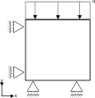

# Dirichlet release test in 2 stages

This test is a displacements test of a single UPwSmallStrainElement2D4N element of 1[m] x 1[m].
It checks whether the degree of freedom, fixed by an applied displacement Dirichlet condition, is released after the stage in a staged analysis. The mesh is a single element, which is displayed in the figure below:

## Setup

The test is performed in two stages, with the following common conditions for both stages:

- Constraints:
    - Displacements on the bottom are fixed in all directions.
    - Displacements on the left side are fixed in the X direction.
    - Displacements on the top are prescribed in time in the Y direction in stage 1 and released in stage 2. The prescribed displacement for stage 1 is a fixed 0.1 [m]
    - The water pressure is fixed at $-100 \mathrm{[Pa]}$ in the entire element

- Material:
    - The material is elastic according to the GeoLinearElasticPlaneStrain2DLaw with a Young's modulus $E = 1.0E3 \mathrm{[Pa]}$ with Poisson's ratio $\nu = 0.2 \mathrm{[-]}$

## Assertions

The calculated displacements, total displacements, strains and effective stresses from the Kratos Geomechanics calculations for stage 1 and 2 are compared to the expected solutions:

- During stage 1: The vertical displacement in the top node is asserted to be the prescribed -0.1 [m], identical to the total vertical displacement and strain. The expected vertical stress was hand-calculated using the strains, resulting from the forced compression and the Poisson effects of the strain in the x-direction (partially induced by the water pressure). 
- During stage 2: Since the prescribed displacement is released, the total vertical displacement as well as the vertical stress are asserted to be 0.0. The vertical strain and displacement are asserted to be 0.1 (note the sign is opposite to the displacement in stage 1).
