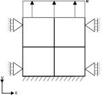

# Prescribed displacement test in 2 stages of 2 steps.

This test is a displacements test of 4 SmallStrainUPwDiffOrderElement2D8N elements.
It checks whether displacement Dirichlet conditions work in staged analysis.
The mesh is a uniform 2 x 2 element grid, which is displayed in the figure below:

## Setup

The test is performed in two stages, with the following common conditions for both stages:

- Constraints:
    - Displacements on the bottom are fixed in all directions.
    - Displacements on the sides are fixed in the X direction.
    - Displacements on the top are prescribed in time in the Y direction. These increase linear in time during each stage. See the sawtooth like figure below, the prescribed displacement for stage 1 is repeated in stage 2:

- Material:
    - The material is elastic according to the GeoLinearElasticPlaneStrain2DLaw.

## Stage 1 - Apply a top vertical displacement of 0.05 [m] time interval \[0, 1\] [s]

The result is a uniform strain and stress field that linearly increases with time.

## Stage 2 - Again apply a top vertical displacement of 0.05 [m], time interval \[1, 2\]

Displacement and strain should restart from 0, vertical total displacement and vertical stress continue to increase starting from the end values of stage 1.
## Assertions

The calculated displacements, incremental displacements, total displacements, strains and effective stresses from the Kratos Geomechanics calculations for stage 1 and 2 are compared to the expected solutions:

- During stage 1: Vertical displacements are linear in both the vertical coordinate and in time. Incremental displacements are linear in the vertical coordinate, but the same for every step. The total displacements equal the displacements. Vertical strains and stresses are uniform over the entire spatial domain and linearly increase in time.

- During stage 2: Vertical displacements start from 0 again and from there are linear in both the vertical coordinate and in time. Incremental displacements are linear in the vertical coordinate, but the same for every step. The total displacement equals the sum of the displacement at the end of stage 1 and the displacement during stage 2. Vertical strains follow from the vertical displacements, so they start from 0 again and from there increase linearly with time. Stresses are continuous at the stage transition, so the vertical stress starts from the end value of stage 1 and from there continues to increase linearly with time.
