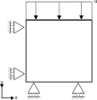

# Prescribed displacement test with incremental and total displacement output.

This test is a displacements test of 1 UPwSmallStrainElement2D4N element.
It checks whether output of incremental and total displacements works correctly in combination with non-zero Dirichlet conditions.
The mesh is a single element as shown in the figure below:

## Setup
The test is performed in 3 stages of 2 steps, with the following conditions:

- Constraints:
    - Displacements on the bottom are fixed in Y direction.
    - Displacements on the left side are fixed in the X direction.
    - Displacements on the top are prescribed in the Y direction. These appear at the start time and remain constant.
- Material:
    - The material behaves elastically following the GeoLinearElasticPlaneStrain2DLaw.
- Load:
  - In stage 1 a vertical displacement of -0.1 [m] is instantly applied at the top
  - In stage 2 a vertical displacement of +0.2 [m] is instantly applied at the top
  - In stage 3 a vertical displacement of -0.1 [m] is instantly applied at the top, whilst reset_displacement = true

The result is a uniform strain and stress field.
- In the first stage step 1 total, incremental and stage displacement are equal -0.1 [m].
- In the first stage step 2, total and stage displacement remain constant, whilst the incremental displacement is zero.
- In the second stage step 1, total displacement is +0.1 [m], incremental and stage displacment are equal 0.2 [m]
- In the second stage step 2, total displacement is +0.1 [m], stage displacment is 0.2 [m] and incremental displacement is zero.
- In the third stage step 1, total, incremental and stage displacement are equal -0.1 [m]
- In the third stage step 2, total and stage displacement remain constant, whilst the incremental displacement is zero.

## Assertions
The calculated displacements, incremental displacements, total displacements, strains and effective stresses from the Kratos Geomechanics calculations for steps 1 and 2 reflect the expected behavior described above.

