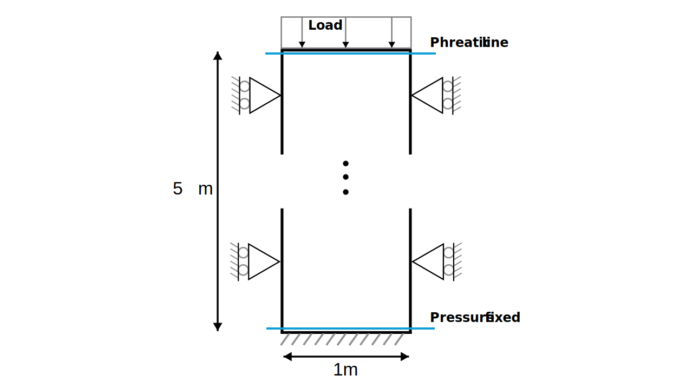

# Consolidation on a fully saturated column with uniform load
This test consists of a rectangular soil domain, 1.0m wide and 5.0m deep. The mesh consists of SmallStrainUPwDiffOrderElement2D6N elements. The phreatic line is kept at the top of the column, namely at $y = 5$ [m], resulting in a column with hydrostatic pressure. Here, the meterial property "USE_HENCKY_STRAIN" is set to false, in combination with "MOVE_MESH_FLAG" as false, it leads to a NEN-Bjerrum formulation.

A phreatic line is assumed at the top of the column, making the column fully saturated. Hydrostatic pressure is applied, and under this assumption, the pressure boundary at the bottom is fixed at 50 [kPa].

A schematic is shown in the figure below. This case is simulated on both a coarse mesh and a fine mesh.

## Setup

The test is performed in 3 stages:
1. A K0 stage with a linear elastic model, with a Young's modulus of 1 [GPa] and a Poisson's ratio of 0.2. Phreatic line is set at the top of the colomn. The bottom pressure is fixed as Dirichlet condition and its value is based on the hydrostatic pressure inserted at the bed. 
2. A consolidation stage with abc model (8.64 [s]). An uniform load of 10 [kN] is applied at the top of the column, in the negative Y direction. The keyword "reset_displacement" is set to true here, such that the total displacements start counting from the start of this stage. The time-step is 8.64 [s], such that there is horizontal stress distribution by the abc model. 
3. Another settlement stage (100 days), the same uniform load and also the same material as previous stage is applied. The time-step is > 8.64 [s], such that there is no horizontal stress distribution by the abc model.

The following common conditions hold for all stages:
  - Displacements on the bottom are fixed in all directions.
  - Displacements on the sides are fixed in the X direction.
  - A uniform load is used to apply the load on the top of the model. Moreover, the LineNormalLoadDiffOrderCondition2D3N condition is used for the phreatic line.
  - Gravity is applied to the entire domain (-9.81 $\mathrm{[m/s^2]}$ in the negative Y direction).

## Assertions
The results for pore water pressure and stresses at locations Y = 0, -1, -2, -3, -4, -5 are selected and they are compared by regression. 
