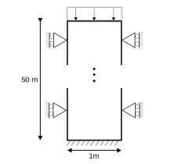

# Settlement on a dry column with uniform load
This test consists of a rectangular soil domain, 1.0m wide and 50.0m deep. The mesh consists of SmallStrainUPwDiffOrderElement2D6N elements. The water pressure is kept at 0.0 [Pa] in the entire domain, resulting in a dry column. A schematic can be found in the figure below:

## Setup

The test is performed in 5 stages:
1. A K0 stage with a linear elastic model, with a Young's modulus of 1e9 [Pa] and a Poisson ratio of 0.2.
2. A second linear elastic stage (same material properties) with a uniform line-load of 20 [kN] applied in the negative Y direction to the top of the model.
3. In this settlement stage (100 days or 8640000 seconds), the same uniform load is applied, but the material is switched to the abc model. The time-step is > 0.001, such that there is no horizontal stress distribution by the abc model. Note: reset_displacement is set to true here, such that the total displacements start counting from the start of this stage.
4. A second load stage, where the uniform load is increased to 25 [kN] in the negative Y direction. The time-step is small 0.001 [s] to make sure the abc model distributes stresses horizontally.
5. A second settlement stage, such that the total time reaches 10000 days (or 864000000 seconds). The same uniform load of 25 [kN] is applied in the negative Y direction, but the time-step is > 0.001, such that there is no horizontal stress distribution by the abc model.

The following common conditions hold for all stages:
  - Displacements on the bottom are fixed in all directions.
  - Displacements on the sides are fixed in the X direction.
  - The uniform loads follow the values described above, the LineLoadDiffOrderCondition2D3N condition is used to apply the load on the top of the model.
  - Water pressure is kept at 0.0 [Pa] in the entire domain.
  - Gravity is applied to the entire domain (-9.81 [m/s^2] in the negative Y direction).

## Assertions
The following assertions are made in this test:
1. The total vertical displacement at the top of the column is expected to be -1.75393 after 100 days (stage 3).
2. The total vertical displacement at the top of the column is expected to be -6.4576 after 10000 days (stage 5).

The expected values are based on the analytical solution of a dry column with uniform load.

