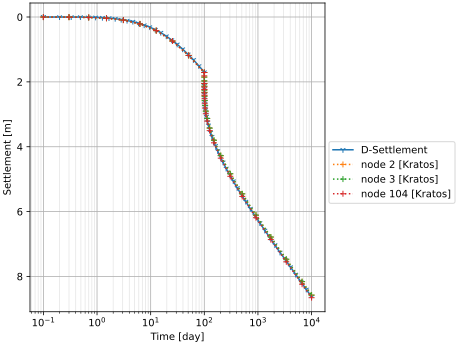
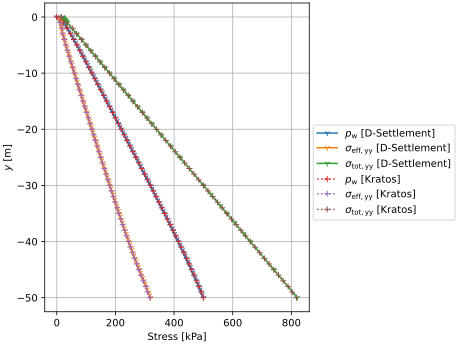
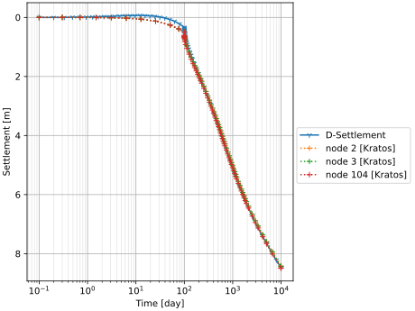
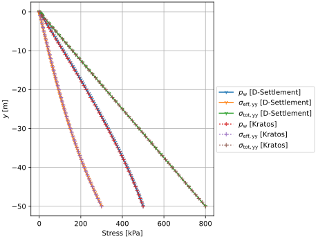

# Settlement on a fully saturated column with uniform load
This test consists of a rectangular soil domain, 1.0 [m] wide and 50.0 [m] deep. The mesh consists of SmallStrainUPwDiffOrderElement2D6N elements. The phreatic line is kept at the top of the column, namely at $y = 50$ [m], resulting in a column with hydrostatic pressure. Here, the material property "USE_HENCKY_STRAIN" is set to false, in combination with "MOVE_MESH_FLAG" as false, it leads to a NEN-Bjerrum formulation. The test is done with both high intrinsic permeability (1.504633E-12 $\mathrm{[m^2]}$) and a lower value (1.5041E-14 $\mathrm{[m^2]}$).

A phreatic line is assumed at the top of the column, making the column fully saturated. Hydrostatic pressure is applied, and under this assumption, the pressure boundary at the bottom is fixed at 50 [kPa].

A schematic can be found in the figure below:

## Setup

The test is performed in 5 stages:
1. A K0 stage with a linear elastic model, with a Young's modulus of 1 [GPa] and a Poisson's ratio of 0.2.
2. A conversion stage to the abc model (Time step 1 second such that there is horizontal stress redistribution by the abc model). Keyword `IGNORE_UNDRAINED` remains `true`, such that water pressures remain hydrostatic.
3. A settlement stage (100 days or 8640000 seconds), the abc is applied, but the keyword `IGNORE_UNDRAINED` is set to `false` such that settlement may influence water pressures. The keyword `reset_displacement` is set to `true` here, such that the total displacements start counting from the start of this stage.
4. A loading stage (1 second) with a uniform surface load of 20 [kPa] applied in the negative Y direction to the top of the model. Horizontal stress redistribution takes place.
5. A second settlement stage, such that the total time reaches 10000 days (or 864000000 seconds). The uniform surface load of 20 [kPa] in the negative Y direction remains active. The time-step is > 0.001 days, such that there is no horizontal stress redistribution by the abc model.

The following common conditions hold for all stages:
  - Displacements on the bottom are fixed in all directions.
  - Displacements on the sides are fixed in the X direction.
  - The uniform loads is used to apply the load on the top of the model. Moreover, the LineNormalLoadDiffOrderCondition2D3N condition is used for the phreatic line.
  - Gravity is applied to the entire domain (-9.81 [m/s^2] in the negative Y direction).

## Assertions
For the high-permeability case, the following assertions are made in this test:
1. The total vertical displacement at the top of the column is expected to be -1.71094 [m] after 100 days (stage 2).
2. The total vertical displacement at the top of the column is expected to be -8.63753 [m] after 10000 days (stage 5).

The expected values are based on the analytical solution of a fully saturated column with uniform load.

For the low-permeability case, the following assertions are made in this test:
1. The total vertical displacement at the top of the column is expected to be -0.496382 [m] after 100 days (stage 2). This is based on a regression value.
2. The total vertical displacement at the top of the column is expected to be -8.48 [m] after 10000 days (stage 5). This is based on an analytical value.

## Results

The plots in this section compare results obtained with Kratos and D-Settlement 23.2.1.  The plots show settlement over time as well as the water pressure distribution ($`p_{\mathrm{w}}`$), the vertical effective stress distribution ($`\sigma_{\mathrm{eff, yy}}`$), and the vertical total stress distribution ($`\sigma_{\mathrm{tot, yy}}`$) along the left edge of the soil column at certain times. 

### High permeability

Settlement over time, where nodes 2, 3, and 104 are located at the top edge of the soil column:

Stresses at the start of the analysis (after 0 days):

Stresses after 100 days of settlement under self weight:

Stresses at 100.1 days after applying the uniform surface load of $`20 [\mathrm{kPa}]`$ at 100 days:

Stresses after 10,000 days of settlement:

### Low permeability

Settlement over time, where nodes 2, 3, and 104 are located at the top edge of the soil column:

Stresses at the start of the analysis (after 0 days):

Stresses after 100 days of settlement under self weight:

Stresses at 100.1 days after applying the uniform surface load of $`20 [\mathrm{kPa}]`$ at 100 days:

Stresses after 10,000 days of settlement:

