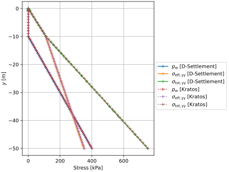
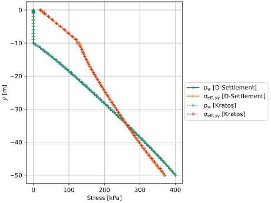
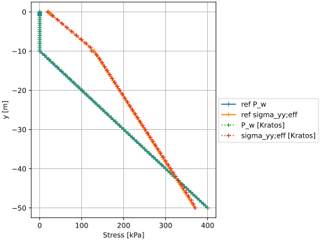

# Settlement of a soil column with the phreatic line below the soil surface

This test is based on Test Case 3.  The model consists of a rectangular soil domain, $`1 [\mathrm{m}]`$ wide and $`50 [\mathrm{m}]`$ deep.  The mesh consists of `SmallStrainUPwDiffOrderElement2D6N` elements.  The phreatic line is located $`10 [\mathrm{m}]`$ below the soil surface, namely at $y = 40 [\mathrm{m}]$. Assuming a hydrostatic pressure distribution, the pressure boundary at the bottom is fixed at $`400 [\mathrm{kPa}]`$. Using the `fix_model_part_above_phreatic_line_process`, the pressure above the phreatic line is fixed at $`0 [\mathrm{kPa}]`$. Here, the material property `"USE_HENCKY_STRAIN"` is set to `false`. In combination with `"MOVE_MESH_FLAG"` as `false`, it leads to a NEN-Bjerrum formulation. The test is done with high intrinsic permeability ($`1.5041E-12 [\mathrm{m^2}]`$).

A schematic can be found in the figure below:

## Setup

The test is performed in 5 stages:
1. A $`K_0`$ stage with a linear elastic model, with a Young's modulus of $`1 [\mathrm{GPa}]`$ and a Poisson's ratio of 0.2.
2. A stage with the abc model (with a duration of $`1 [\mathrm{s}]`$). The time step is $`1 [\mathrm{s}]`$, such that there is horizontal stress redistribution by the abc model. The load stepping scheme is used, to apply external forces gradually (starting with steps of 10% of the initial external forces and automatically adjusting the step size according to the number of iterations and convergence behavior).
3. A settlement under self weight stage ($`8640000 [\mathrm{s}]`$ or $`100 [\mathrm{d}]`$). The option `"reset_displacement"` is set to `true` here, such that the total displacements start counting from the start of this stage.
4. A loading stage (with a duration of $`1 [\mathrm{s}]`$) with a uniform surface load of $`20 [\mathrm{kPa}]`$ applied in the negative $`Y`$ direction to the top of the model. The time step is $`1 [\mathrm{s}]`$, such that there is horizontal stress redistribution by the abc model.
5. A second settlement stage, such that the total time reaches $`10000 [\mathrm{d}]`$ (or $`864000000 [\mathrm{s}]`$). The same uniform surface load of $`20 [\mathrm{kPa}]`$ is applied in the negative $`Y`$ direction. The time step is > $`0.001 [\mathrm{d}]`$, such that there is no horizontal stress redistribution by the abc model.

The following common conditions hold for all stages:
- Displacements on the bottom are fixed in all directions.
- Displacements on the sides are fixed in the $`X`$ direction.
- Gravity is applied to the entire domain ($`-9.81 [\mathrm{m}/\mathrm{s}^2]`$ in the negative $`Y`$ direction).
- Water pressures at the bottom are fixed at $`400 [\mathrm{kPa}]`$.
- Water pressures above the phreatic line are fixed at $`0 [\mathrm{kPa}]`$.

From stage 4 onwards:
- A $`20 [\mathrm{kPa}]`$ uniform load is applied on the top of the model.

## Results

The following plots show some results obtained with Kratos, and compares them with results from D-Settlement 23.2.1.

Settlement over time, where nodes 2, 3, and 104 are located at the top edge of the soil column:

The following plots show the water pressure distribution ($`p_{\mathrm{w}}`$), the vertical effective stress distribution ($`\sigma_{\mathrm{eff, yy}}`$), and the vertical total stress distribution ($`\sigma_{\mathrm{tot, yy}}`$) along the left edge of the soil column at certain times.

At the start of the analysis (after 0 days):

After 100 days of settlement under self weight:

At 100.1 days after applying the uniform surface load of $`20 [\mathrm{kPa}]`$ at 100 days:

After 10,000 days of settlement:

## Assertions

The following assertions are made in this test (assuming the results from D-Settlement):
1. The total vertical displacement at the top of the column is expected to be $`0 [\mathrm{m}]`$ after about $`0.1 [\mathrm{d}]`$ (stage 3).
2. The total vertical displacement at the top of the column is expected to be $`-1.75 [\mathrm{m}]`$ after $`100 [\mathrm{d}]`$ (stage 3).
3. The total vertical displacement at the top of the column is expected to be $`-7.90 [\mathrm{m}]`$ after $`10000 [\mathrm{d}]`$ (stage 5).

In addition, several regression values have been added, to ensure that the shape of the settlement curve is sufficiently covered.
