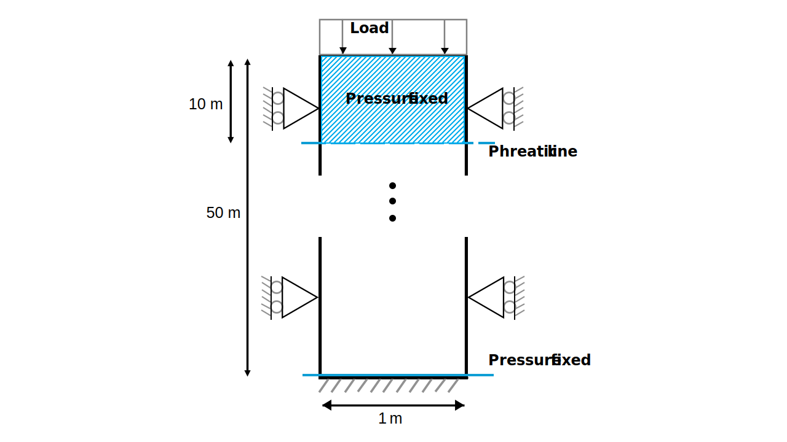
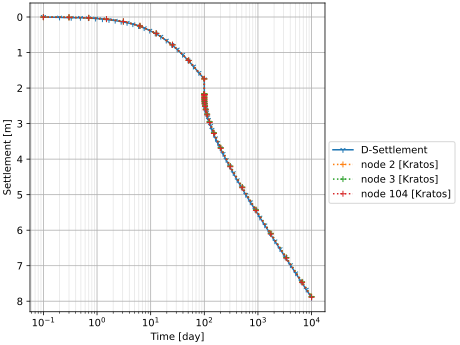
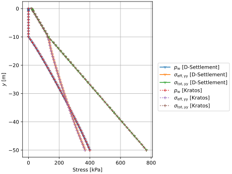
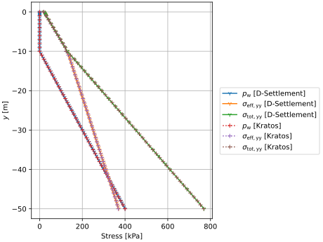

# Settlement of a soil column with the phreatic line below the soil surface

This test is based on Test Case 3.  The model consists of a rectangular soil domain, 1.0 m wide and 50.0 m deep.  The mesh consists of `SmallStrainUPwDiffOrderElement2D6N` elements.  The phreatic line is located 10.0 m below the soil surface, namely at $y = 40$ [m]. Under this assumption, the pressure boundary at the bottom is fixed at 40 [kPa]. Using the fix_model_part_above_phreatic_line_process, the pressure above the phreatic line is fixed at 0 [kPa]. Here, the material property "USE_HENCKY_STRAIN" is set to false, in combination with "MOVE_MESH_FLAG" as false, it leads to a NEN-Bjerrum formulation. The test is done with high intrinsic permeability (1.5041E-12 $\mathrm{[m^2]}$).

A schematic can be found in the figure below:

## Setup

The test is performed in 5 stages:
1. A K0 stage with a linear elastic model, with a Young's modulus of 1 [GPa] and a Poisson's ratio of 0.2.
2. A stage with abc model (1 second ). The time-step is 1 seconds, such that there is horizontal stress distribution by the abc model.
3. A settlement under self weight stage (8640000 seconds or 100 days). The keywords "reset_displacement" is set to true here, such that the total displacements start counting from the start of this stage.
4. A loading stage (1 second) with a uniform line-load of 20 [kN] applied in the negative Y direction to the top of the model. The time-step is 1 seconds, such that there is horizontal stress distribution by the abc model.
5. A second settlement stage, such that the total time reaches 10000 days (or 864000000 seconds). The same uniform load of 20 [kN] is applied in the negative Y direction. The time-step is > 0.001 days, such that there is no horizontal stress distribution by the abc model.

The following common conditions hold for all stages:
- Displacements on the bottom are fixed in all directions.
- Displacements on the sides are fixed in the X direction.
- Gravity is applied to the entire domain (-9.81 [m/s^2] in the negative Y direction).
- Water pressures at the bottom are fixed at 40 [kPa]
- Water pressures above the phreatic line are fixed at 0 [kPa]

From state 4 onwards:
- A 20 [kPa] uniform load is applied on the top of the model.

## Results
Settlement over time

Stresses and water pressures after 100 days of settlement under self weight

Stresses and water pressures at 100.1 days after loading 20 [kPa] at 100 days

Stresses and water pressures after 10000 days of settlement

## Assertions
The following assertions are made in this test:
1. The total vertical displacement at the top of the column is expected to be -1.75 [m] after 100 days (stage 3).
2. The total vertical displacement at the top of the column is expected to be -7.90 [m] after 10000 days (stage 5).
