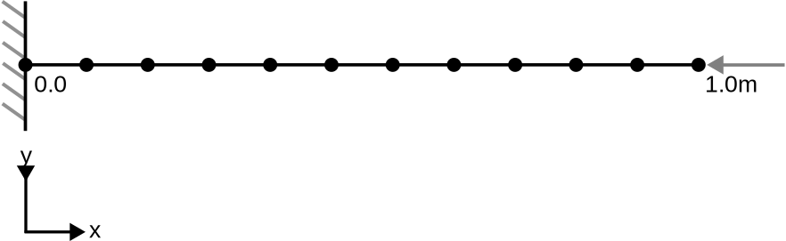

# Staged analysis on a truss with reset displacement option

This test asserts the 'reset_displacement' option of the GeoLinearTrussElement2D2N element works as expected. It exists of 4 stages, with different settings for 'reset_displacement' and applied load.

## Setup
The test describes a beam with a length of 1m, consisting of 11 equidistant nodes (0.0, 0.1, ... , 0.9, 1.0). The displacement and rotation of node 1 is fixed for all directions. In stage 1-3, a load in the negative x direction is applied to the right node (11), which is removed in stage 4. See the figure below for a schematic representation of the problem. 

The material is described using:
-   Young's modulus equal to 2069.0e8 N/m2 and Poisson's ratio is 0.29
-   The TrussConstitutiveLaw from the structural mechanics application
-   A cross area of 1.0 m2

The following stages can be distinguished:
1.  A point load of 1e10 N is applied to node 11 in the negative x-direction. The 'reset_displacement' option is set to true. The beam is expected to contract.
2.  Essentially the same as stage 1: however, due to the 'reset_displacement' option, the displacement is expected to be 0.0 after this stage.
3.  The 'reset_displacement' option is set to false. The load is still the same.
4.  The load is removed and 'reset_displacement' is kept on false. The beam is expected to expand again to its original shape.

## Assertions
In stage 1, the displacement for any node can be approximated using the following expression:
$$u_y = \frac{F}{EA}x$$
, where $F$ is the applied force, $E$ is Young's Modulus, $A$ is the cross-sectional area and $x$ is the x-coordinate of the node.

Due to the reset_displacement option in stage 1 and 2, the internal force from stage 1 is retained. Since this internal force is in equilibrium with the applied external force, the displacement in stage 2 and 3 is expected to be 0.0 for all nodes. In stage 4, the load is removed, meaning that the displacement is expected to be the opposite of the displacement in stage 1 (bringing the beam back to its original position).
