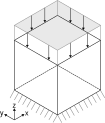

# Normal load on a hexahedron with 8 nodes

This is a single-element test, using a `UPwSmallStrainElement3D8N` element (dimensions 5[m] $\times$ 5[m]), with a normal load applied on the top face using an `ApplyNormalLoadTableProcess` and a  `UpwNormalFaceLoadCondition3D4N`.

## Setup

A schematic depiction of the test case is shown below:

-   Constraints:
    -   The X, Y and Z displacements in the bottom four nodes (1, 2, 3 and 4) are fixed.
-   Material:
    -   The material is described using a linear elastic material with a `GeoIncrementalLinearElastic3DLaw`, a Young's modulus
        of 3.0e7 [kPa] and a Poisson ratio of 0.0.
-   Conditions:
    -   A UpwNormalFaceLoadCondition3D4N is added to the top of the cube (nodes 5, 6, 7 and 8).
-   Loads:
    -   Using the `ApplyNormalLoadTableProcess`, a positive NORMAL_CONTACT_STRESS of 1000 [kPa] is applied to the top of the cube. By convention, this is a compressive load, resulting in an inward-facing load.

## Assertions
The following two assertions are made in this test:
1. The total stress in the entire cube is -1000 [kPa] in the Z direction and 0.0 in the other directions, due to the Poisson ratio being 0.0.
2. The displacement of the z-direction is asserted to be equal to the analytical result: $d_z = (\epsilon A) / (EA / L)$, where $\epsilon = -1000 [\text{kPa}]$, $E = 3.0e7 [\text{kPa}]$, $A = 25 [\text{m}^2]$ and $L = 5 [\text{m}]$. 

