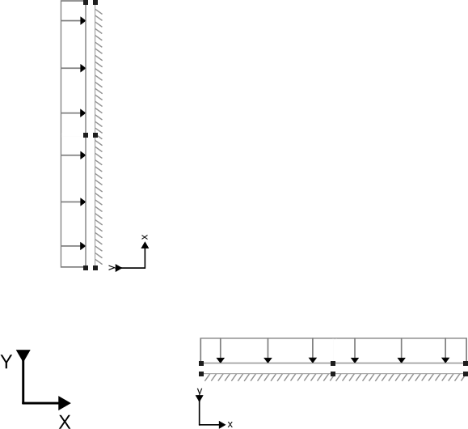

# Line interface element tests with 3 + 3 nodes

This folder contains integration tests for the line interface elements with Neumann and Dirichlet boundary conditions. 

## Setup
For these specific test cases, two non-connected line interface elements with different orientations and 3 + 3 nodes are used, as seen in the schematic below. Note that the node pairs are actually at the same location, but have been separated for clarity. For more information on interface geometries, see the [geometry documentation](../../custom_geometries/README.md). The single stage tests use both elements, whereas the multi-stage tests are limited to the horizontal element only.

Two test cases (`Dirichlet_single_stage` and `Neumann_single_stage`) are performed in a single stage and a single time step. The Neumann test case applies a normal and shear traction to one side of the interfaces, while the Dirichlet test case applies a fixed displacement. The other side of the interface is kept fixed.

There are two more test cases (`Dirichlet_multi_stage` and `Neumann_multi_stage`), which involve two stages each. Per stage, two time steps are carried out.

The traction applied in the Neumann test case results in the same displacement field as the Dirichlet test case for the interfaces, which are described using a linear elastic material model.

## Assertions
For all tests, the displacements, relative displacements and tractions are compared to the known linear elastic behavior:

$$\Delta \tau = C \Delta u$$,

where $\Delta \tau$ is the traction increment, $C$ is the constitutive tensor, $\Delta u$ is the relative displacement between the two sides of the interfaces.

Since the load applied in the Neumann tests result in the same displacement field as the prescribed displacement field for the Dirichlet tests, all sets of assertions are identical.
