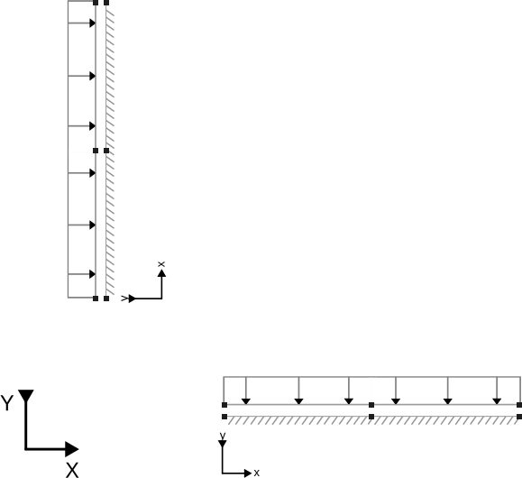

# Line interface element tests with 3 + 3 nodes

This folder contains integration tests for the line interface elements with Neumann and Dirichlet boundary conditions. 

## Setup
For these specific tests, two non-connected line interface elements with different orientations and 3 + 3 nodes are used, as seen in the schematic below. Note that every dot in the schematic depicts a node pair of the line interface element. For more information on interface geometries, see the [geometry documentation](../../custom_geometries/README.md).

The two tests (Dirichlet_single_stage and Neumann_single_stage) are performed in a single stage and a single time step. The Neumann test applies a normal + shear load to one side of the interfaces, while the Dirichlet test applies a fixed displacement.

The load applied in the Neumann test results in the same displacement field as the Dirichlet test for the interfaces, which are described using a linear elastic material model.

## Assertions
For both tests, the displacements, relative displacements and tractions are compared to the known linear elastic behavior:

$ F_{n, t} = k_{n, t} \Delta u_{n, t}$,

where $F$ is the traction, $k$ is the stiffness, $\Delta u$ is the relative displacement between the two sides of the interfaces, and the subscripts $n$ and $t$ denote the normal and tangential directions, respectively.

Since the load applied in the Neumann test results in the same displacement field as the prescribed displacement field for the Dirichlet test, both sets of assertions are identical.
