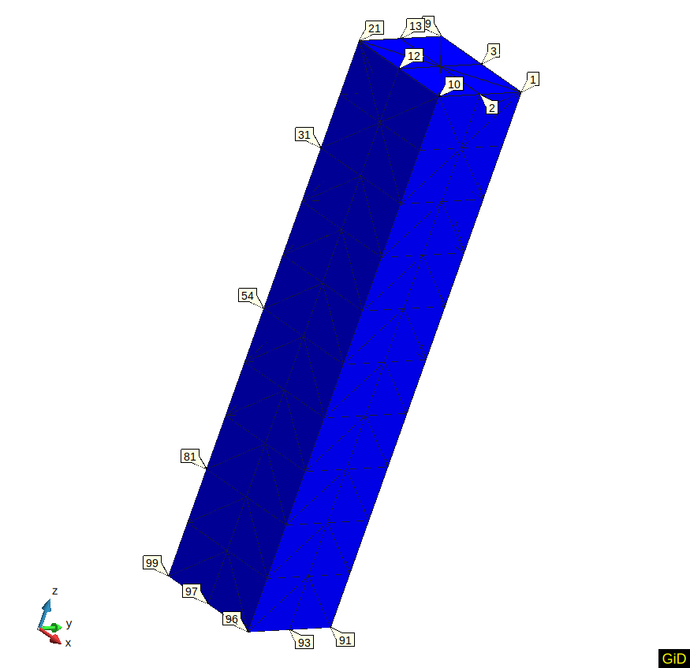
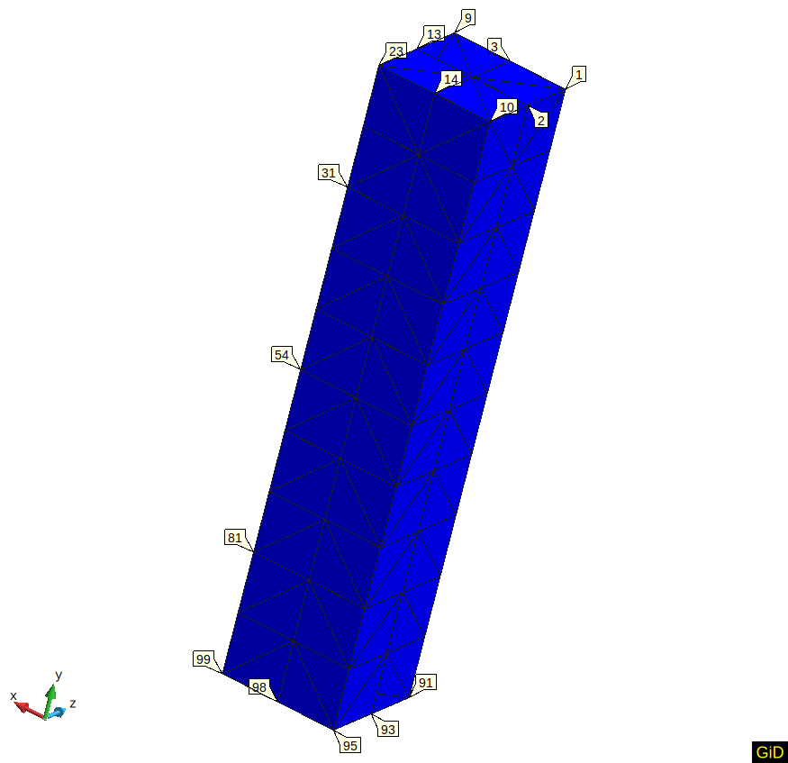

# Lysmer absorbing boundary conditions on a column made of 3D elements

The test verifies the P-wave propagation through 1D column.  

## Setup

3D elements are tested for an 1D column. It means the only motion along the column axis (height) is allowed. The column height and width/depth are 10 $[m]$ and 1 $[m]$, respectively. A
schematic representation can be found in the figure below:

All Nodes except the column bottom are allowed to move only in the column axis direction. The column bottom is fixed in all directions. The absorbing boundary conditions are applied at the bottom and the unity absorbing factors are used there. An instant load $q$ of 10 $[N/m^2]$ is applied at the top of the column towards the bottom.

Two kinds of 3D elements are used to generate a mesh:

-   tetra elements: folders **tetra_mesh_in_Z** and **tetra_mesh_in_Y**
-   hexa elements: folder **hexa_mesh_in_Z**

The mesh with tetra elements is presented below for both cases. Note, the column is aligned along Z axis for **tetra_mesh_in_Z** 

 

and Y axis for **tetra_mesh_in_Y**.

The mesh with hexa elements is given in the following figure.

The material is described using:

-   A linear elastic 3D model (LinearElastic3DLaw),
-   Young's modulus is $E$=10 $[MPa]$
-   Poisson's ratio is $\nu$=0.2,
-   Density of solid is $\rho$=2.65 $[ton/m^3]$,
-   Porosity is $n$=0.3.

P-wave velocity is $v=\sqrt{\frac{E \frac{1 - \nu}{(1 + \nu) (1 - 2 \nu)}}{\rho (1 - n)}}$

Node velocity is $q / (v \rho (1 - n))$

## Assertions

The instant load generates a P-wave. The test 

-   calculates the time when the P-wave arrives at Nodes 31, 54, and 81 and
-   checks the velocity of these nodes at those time moments. 
