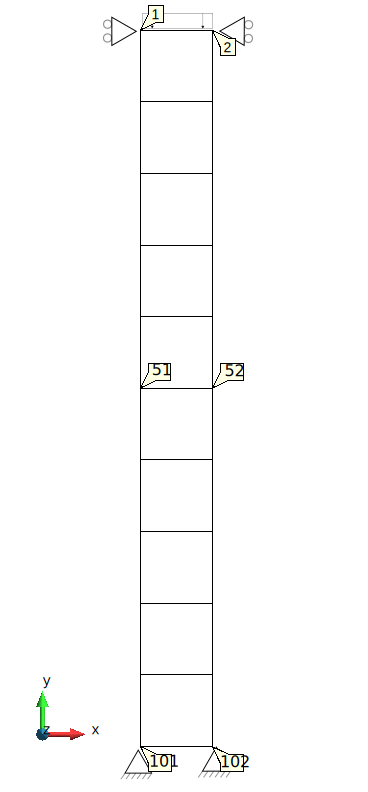

# Lysmer absorbing boundary conditions on a column made of rectangulars

This test verifies the implementation of the Lysmer absorbing boundary conditions. 

## Setup

The test is performed for an 1D column that is made with 2D rectangular elements. The column height and width are 10,000 mm and 1,000 m, respectively.
The column consists of 50 4-noded elements (using the UPwSmallStrainElement2D4N class) of 1,000mm x 0,200 mm. A
schematic representation can be found in the figure below:

All Nodes have fixed displacement in the X direction. 

An instant load of -10 N is applied in the Y direction at the column top that is defined by Nodes 1 and 2. 

The absorbing boundary conditions are applied on a line created by Nodes 101 and 102. The unity absorbing factors are used there.

The material is described using:

-   A linear elastic plane stress model (LinearElasticPlaneStrain2DLaw),
-   Young's modulus is 10,000 N/mm2
-   Poisson's ratio is 0.2,
-   A thickness of 1 mm,
-   Density of solid is 2.65 kg/mm3,
-   Porosity of 0.3.

## Assertions

The instant load generates a P-wave. The test checks the velocity at Node 51 (in the middle of the column) and compares it with the expected P-wave velocity at five time moments. 
