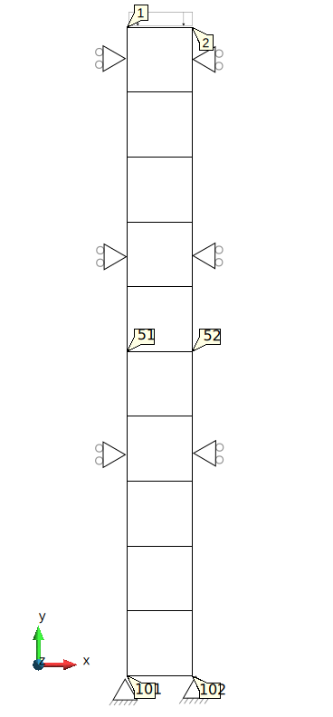

# Lysmer absorbing boundary conditions on a column made of quadrilaterals

This test verifies the implementation of the Lysmer absorbing boundary conditions. 

## Setup

The test is performed for an 1D column that is made with 2D quadrilaterals. The column height and width are 10 $m$ and 1 $m$, respectively.
The column consists of 50 4-noded elements (using the UPwSmallStrainElement2D4N class) of 1 $m$ x 0.2 $m$. A
schematic representation can be found in the figure below:

All Nodes have fixed displacement in the X direction. 

An instant load $L$ of -10 $N/m^2$ is applied in the Y direction at the column top that is defined by Nodes 1 and 2. 

The absorbing boundary conditions are applied on a line created by Nodes 101 and 102. The unity absorbing factors are used there.

The material is described using:

-   A linear elastic plane strain model (LinearElasticPlaneStrain2DLaw),
-   Young's modulus is $E$=10000 $kN/m^2$
-   Poisson's ratio is $\nu$=0.2,
-   Density of solid is $\rho$=2.65 $ton/m^3$,
-   Porosity of $\Phi$=0.3.

P-wave velocity is $v=\sqrt{\frac{E \frac{1 - \nu}{(1 + \nu) (1 - 2 \nu)}}{\rho (1 - \Phi)}}$

Node velocity is $L / (v \rho (1 - \Phi))$

## Assertions

The instant load generates a P-wave that propages through the column and reflects from the column bottom. 
The test checks the velocity at Node 51 (in the middle of the column) and compares it with the expected Node velocity at the following time moments. 

-   The initial state.
-   Time when the P-wave arrived at the Node.
-   Time when the wave passed the Node. 
-   Time when the P-wave reflected from the column bottom arrived at the Node.
-   Time when the reflected wave passed the Node.
