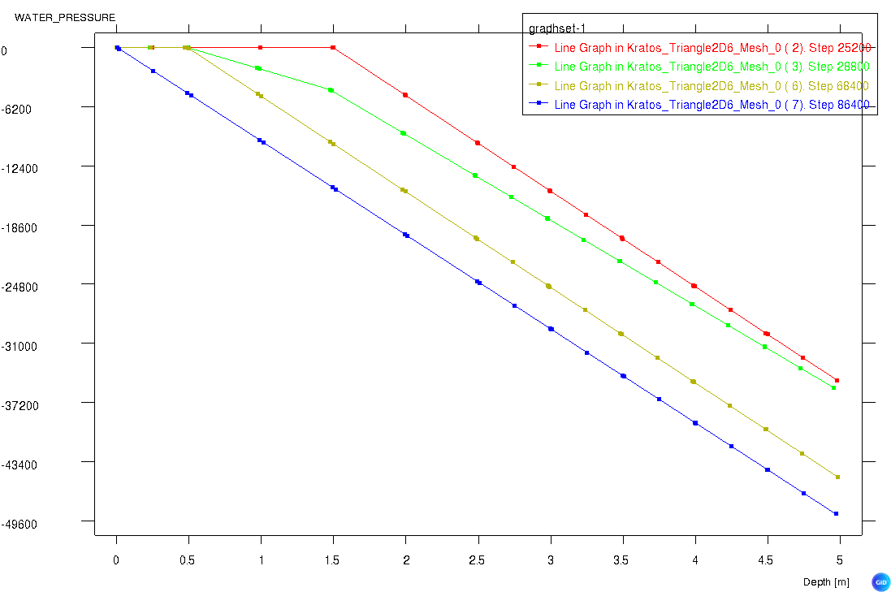

# Fixing water pressure above the phreatic line

This test uses a moving column to check whether water pressures are correctly fixed to zero above the phreatic line,
using the `FixWaterPressuresAbovePhreaticLineProcess`. The column is 1x5 [m] and the phreatic line is situated 2 [m]
below the top of the column. The column is uniformly moving with a speed of 2.0m/day, first downwards (until the
phreatic line is situated at the top of the column) and then upwards to the starting position.

It is checked that node 27 (see the mesh structure below) is fixed to zero, or freed respectively at the expected times.

This is validated both for a model where move_mesh is set to true, as well as false.

## Setup

The test is performed in a single stage, with the following conditions:

- Constraints:
    - All displacements are fixed and follow the constant velocity of the column.
    - The water pressure is described using a phreatic line (i.e. hydrostatic with reference y-coordinate = -2.0 [m]). To make sure the pressure is calculated every time-step (since it's dependent on the displacement of the column), a table is attached to the hydraulic head variable. Since the hydrostatic pressure is applied using the current position of the nodes, the table is not used to calculate the pressure (the head is kept at a constant 0 value), but only to ensure that the pressure is calculated every time-step when **move_mesh = true**. In the case where **move_mesh = false**, the table is needed to ensure the hydraulic head profile follows the moving column (i.e. when the column moves 2.0m downwards, the head increases with 2.0m).

- Material:
    - The material is elastic according to the GeoLinearElasticPlaneStrain2DLaw.

## Assertions

It is asserted that the water pressure DoF at node 27 (y = -1.5 [m]) is free just before the phreatic line is crossed
and fixed to zero after. Due to a velocity of 2.0m/day (or 2.0m/86400s) the phreatic line is crossed after the column has
moved 0.5 [m] downwards,
which is after 21600 seconds (or 6 hours). The next crossing is when the column moved up again. By that time, the column
has moved 3.5 [m] in total (2 down and 1.5 up again), meaning the crossing point is at 3.5 / (2.0/81600) = 151200
seconds (or 42 hours). However, since the DoF are fixed/freed based on the `TOTAL_DISPLACEMENT` variable (which is
calculated at the end of a time step), the crossover happens one time-step later. 

The values of the water pressures when the DoF is free at node 27 is verified by visual inspection of the following depth profiles at different times:

The different lines represent the water pressure in the middle of the column at different times: just before the phreatic line crosses node 27 (red), just after the phreatic line crosses node 27 (green), the time just before the phreatic line crosses 0.5 m below the top of the column (olive/dark yellow) and the time when the phreatic line is at the top of the column (blue).

The pressures are expected to have the same slope (determined by the specific weight). The reason the green line exhibits a different slope is because the column does not have any storage capacity, meaning a straight line is created between two prescribed pressures. Since the pressures can only be prescribed on the nodes, but not in between the nodes, the slope is not constant.