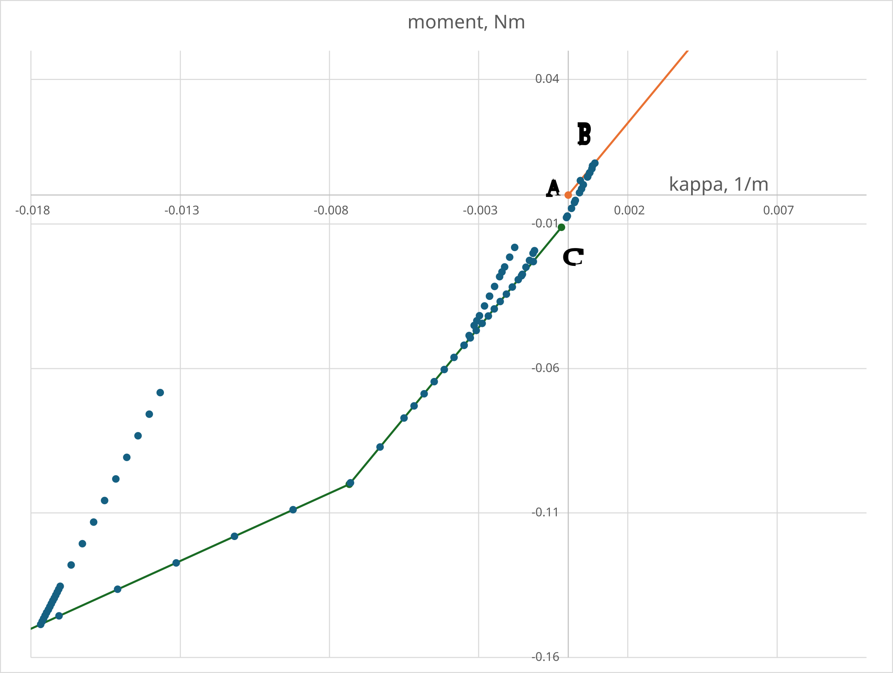

# Piecewise Linear Moment Capacity

This test setup verifies `PiecewiseLinearMomentCapacityPlaneStrainConstitutiveLaw` used with
`LinearTimoshenkoBeamElement2D2N`.

## Setup

The model is a single 1 m, 2-node beam element:

- Node 1 at x=0.0 (fully fixed displacement and rotation)
- Node 2 at x=1.0 (prescribed vertical displacement from table)
- Element: one `LinearTimoshenkoBeamElement2D2N`

## Material properties

The tests use `MaterialParameters.json` in this folder. Current baseline values are:

- `YOUNG_MODULUS`: 200.0 [Pa]
- `POISSON_RATIO`: 0.3 [-]
- `THICKNESS`: 0.1 [m]
- `THICKNESS_EFFECTIVE_Y`: 0.1 [m]
- "GEO_PIECEWISE_LINEAR_MOMENT_LAW": [[8.0e-03, 0.1],[ 4.0e-02, 0.25], [8.0e-02, 0.5],[ 0.1, 0.8],[ 0.2, 1.1]] [1/m, N/m]

Note: `GEO_UNLOADING_RELOADING_MODULUS` is not in the baseline material file; it is injected only in the dedicated unload/reload test.

## Tests (cases)

There are two Python tests:

- `test_piecewise_linear_moment_capacity`: backbone-only response (no `GEO_UNLOADING_RELOADING_MODULUS`).
- `test_piecewise_linear_moment_capacity_with_unreload`: same input files, but adds `GEO_UNLOADING_RELOADING_MODULUS` in-flight before running.

The following picture shows a moment-curvature behaviour for the second test.

Circles represent values at each time steps. The red line shows the backbone curve and the green line shows the mirrored backbone curve.

Both tests compare results at times:

- 0.05, 0.10, 0.15, 0.20, 0.25, 0.30, 0.35, 0.50

## Assertions

- Y displacement at node 2 (`DISPLACEMENT` y-component)
- Bending moment at element 1, first integration point (`BENDING_MOMENT`)

