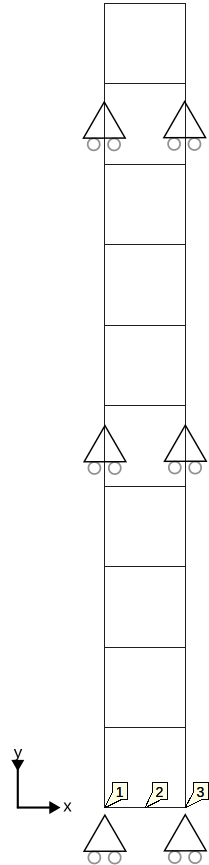

# Prescribed derivatives

The following tests are an adaptation of a model provided by [Muhammed Furkan](https://github.com/muhammedfurkanyilmaz). 

The tests in this folder assert that prescribed derivatives are applied correctly to the models and are not overwritten.
The
three derivatives that are prescribed in these tests are acceleration, velocity and dt_water_pressure (the time
derivative of the water
pressure). After running the simulation, it is checked that on the nodes to which the prescribed derivatives are
applied, the actual derivatives match the prescribed ones.

## Setup

The setup for the test case is a 10-element 2D mesh with a 2D linear elastic material. The schematic depiction of the
mesh is shown below:

The derivatives (acceleration, velocity and dt_water_pressure) are prescribed to node 1, 2 and 3, using the following
table:

| TIME | VALUE  |
|------|--------|
| 0.05 | -0.01  |
| 0.1  | -0.005 |
| 0.15 | -0.003 |
| 0.2  | 0.01   |

- Constraints:
    - The Y displacements at the sides and bottom are fixed, meaning the column is restricted to react as a shear column.
- Material:
    - The material is described using a linear elastic material with a GeoLinearElasticPlaneStrain2DLaw, a Young's
      modulus
      of 150000 kPa and a Poisson ratio of 0.3.
  - Loads:
    - The prescribed derivatives (velocity, acceleration and dt_water_pressure) are applied to nodes 1, 2 and 3. 

## Assertions

The tests assert that the actual derivatives of the nodes at the time steps match the prescribed ones in node 1, 2 and 3 (for the prescribed values, see the table in the setup description). 

