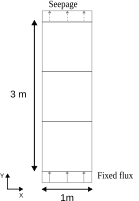

# Seepage tests
This directory contains several tests related to seepage.

## Common setup
For each test case, the domain consists of a column of three linear steady-state Pw elements.  Each element is quadrilateral in shape and has dimensions of $`1\ {\mathrm{m}} \times 1\ {\mathrm{m}}`$.  At the top of the domain, a seepage boundary condition is applied.  At the left and right sides of the domain, no explicit boundary conditions are applied, which means that groundwater cannot freely flow out (or in).  Per test case, the applied boundary condition at the bottom of the domain varies.  The first two test cases apply a fixed water pressure at the bottom, as shown below.


The third test case applies a fixed water in-flux at the bottom as shown below.



For the water pressure, an initial field is applied that corresponds to a hydrostatic pressure with the phreatic surface located at the top of the domain.

For the material properties, the following table lists the adopted values.

| Property                                     | Value                                       |
|----------------------------------------------|---------------------------------------------|
| Intrinsic permeability $`\kappa`$            | $`7.08 \times 10^{-13}\ \mathrm{m^2}`$      |
| Dynamic viscosity $`\mu`$                    | $`1.0 \times 10^{-3}\ \mathrm{Pa \cdot s}`$ |
| Unit weight of water $`\gamma_{\mathrm{w}}`$ | $`1.0 \times 10^4\ \mathrm{N/m^3}`$         |

Note that $`\gamma_{\mathrm{w}}`$ equals $`\rho_{\mathrm{w}} \cdot g`$, where $`\rho_{\mathrm{w}}`$ is water density and $`g`$ is gravity acceleration.

To check the numerical solutions, we can calculate the volumetric flow rate $`Q`$ through a porous medium using Darcy's law:

```math
Q = \frac{\kappa \cdot A \cdot \rho_{\mathrm{w}} \cdot g \cdot \Delta h}{\mu \cdot L}
```
where $`\kappa`$ is intrinsic permeability, $`A`$ is cross-sectional area, $`\rho_{\mathrm{w}}`$ is water density, $`g`$ is gravity acceleration, $`\Delta h`$ is hydraulic head difference, and $`L`$ is length.

## Test cases
### Test case 1: Prescribed overpressure at the bottom
In this test case, the water pressure at the bottom of the domain is fixed at $`40\ \mathrm{kPa}`$, which is **greater than** the hydrostatic pressure of the initial field (which equals $`30\ \mathrm{kPa}`$ at the bottom).  Consequently, groundwater will flow out of the seepage boundary.

This test case asserts the following at the seepage boundary:
- The water pressure equals $`0\ \mathrm{kPa}`$ (since water will flow out).
- The water out-flow per top node equals $`Q = \frac{\kappa \cdot A \cdot \Delta P}{\mu \cdot L} = \frac{7.08 \times 10^{-13}\ \mathrm{m^2} \cdot 0.5\ \mathrm{m^2} \cdot 1.0 \times 10^4\ \mathrm{Pa}}{1.0 \times 10^{-3}\ \mathrm{Pa \cdot s} \cdot 3.0\ \mathrm{m}} = 1.18 \times 10^{-6}\ \mathrm{m^3/s}`$.

At the bottom, the water in-flow per node is asserted to be equal to the negated water out-flow per top node, i.e. $`Q = -1.18 \times 10^{-6}\ \mathrm{m^3/s}`$.  Since the water pressure at the bottom is prescribed, those values are not asserted.

### Test case 2: Prescribed underpressure at the bottom
In this test case, the water pressure at the bottom of the domain is fixed at $`20\ \mathrm{kPa}`$, which is **smaller than** the hydrostatic pressure of the initial field (which equals $`30\ \mathrm{kPa}`$ at the bottom).  Consequently, the seepage boundary will prevent any groundwater flow.

This test case asserts the following at the seepage boundary:
- The nodal water flow equals $`0\ \mathrm{m^3/s}`$.
- The water pressure equals $`-20\ \mathrm{kPa} + 10\ \mathrm{kN/m^3} \cdot 3\ \mathrm{m} = +10\ \mathrm{kPa}`$ (suction).

At the bottom, there shouldn't be any water flow either.  And since the water pressure is prescribed at the bottom, those values are not asserted.

### Test case 3: Prescribed in-flux at the bottom
In this test case, the in-flux at the bottom of the domain is fixed at $`5\ \mathrm{m/s}`$.  Consequently, groundwater will flow out of the seepage boundary.

This test case asserts the following at the seepage boundary:
- The water pressure equals $`0\ \mathrm{kPa}`$ (since water will flow out).
- The water out-flow per top node equals $`Q = 5\ \mathrm{m/s} \cdot 0.5\ \mathrm{m^2} = 2.5\ \mathrm{m^3/s}`$.

At the bottom, the expected water pressure can be calculated from the pressure drop $`\Delta P`$ (using the above formula for the volumetric flow rate $`Q`$):

```math
\Delta P = \frac{Q \cdot \mu \cdot L}{\kappa \cdot A} = \frac{5\ \mathrm{m/s} \cdot 1.0 \times 10^{-3}\ \mathrm{Pa \cdot s} \cdot 3.0\ \mathrm{m}}{7.08 \times 10^{-13}\ \mathrm{m^2} \cdot 1.0\ \mathrm{m^2}} = 2.119 \times 10^{10}\ \mathrm{Pa}
```

and correcting for the fluid body flow:

```math
p_{\mathrm{bottom}} = -(\Delta P - \rho_{\mathrm{w}} \cdot g \cdot \Delta h) = -(2.119 \times 10^{10}\ \mathrm{Pa} - 1.0 \times 10^4\ \mathrm{N/m^3} \cdot 3.0\ \mathrm{m}) = -2.119 \times 10^{10}\ \mathrm{Pa}
```