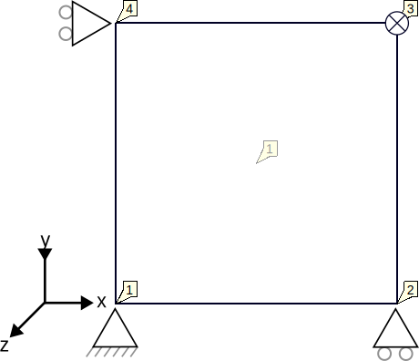

# Shell with reset displacement

This tests verifies that in a shell, the prescribed displacement is not erased by the 'reset_displacement' functionality
when that option is switched on.

## Setup

This test consists of a single 4-noded element (using the ShellThinElementCorotational3D4N class) of 2000mm x 2000mm . A
schematic representation can be found in the figure below:

Nodes 1, 2 and 4 have fixed rotations and displacements in all directions. Node 3 has a fixed displacement in the Z
direction of -20mm. The material is described using:

-   A linear elastic plane stress model (LinearElasticPlaneStress2DLaw)
-   Young's modulus is 4.32e8 N/mm2 and Poisson's ratio is 0.0.
-   A thickness of 1300mm

The essence of this test is that the 'reset_displacement' option is enabled in combination with the prescribed
displacement.

## Assertions

The test asserts that the actual displacement of node 3 matches the prescribed displacement of -20.0 mm. 
