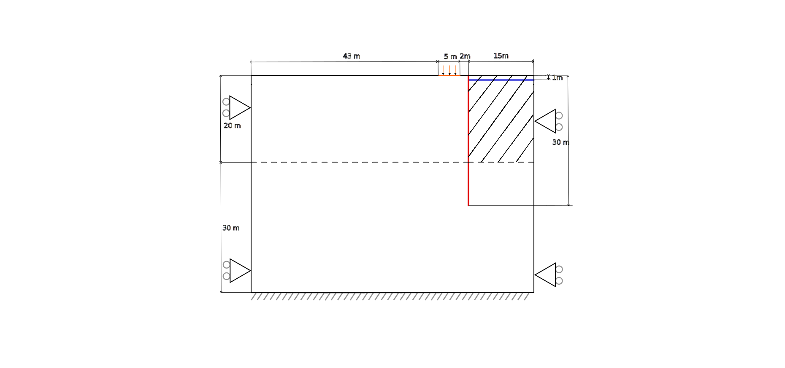
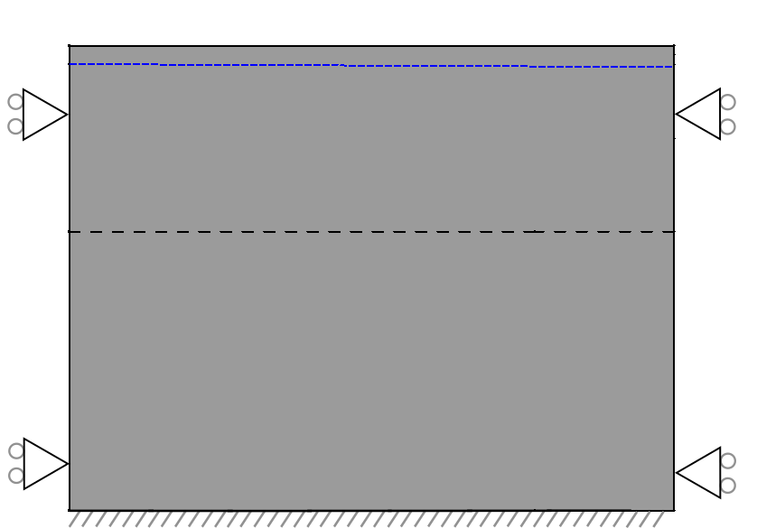
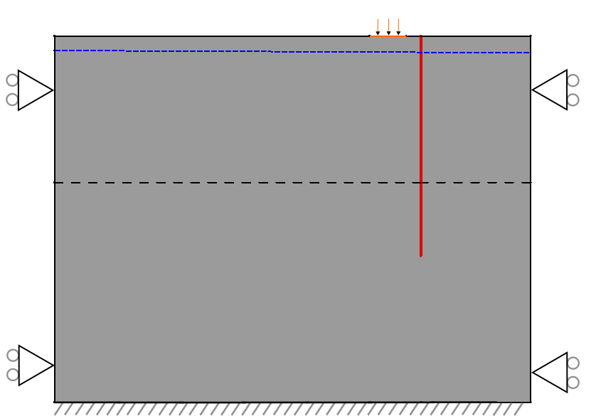
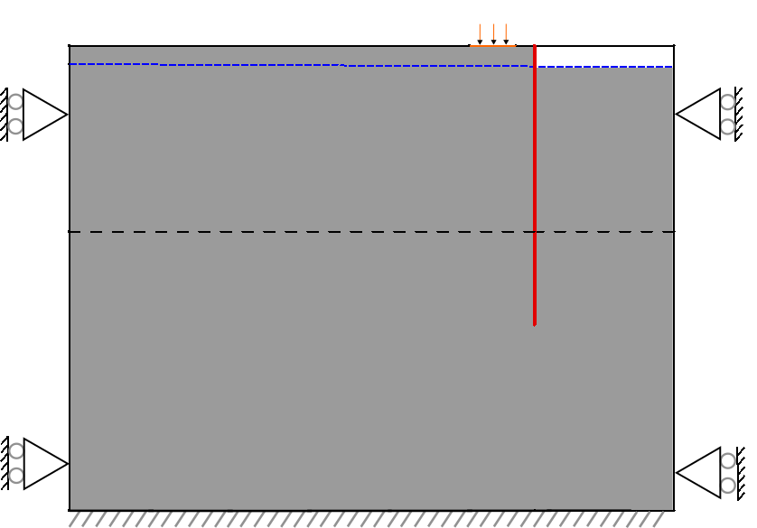
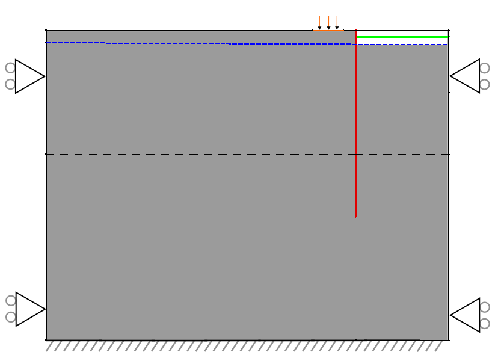
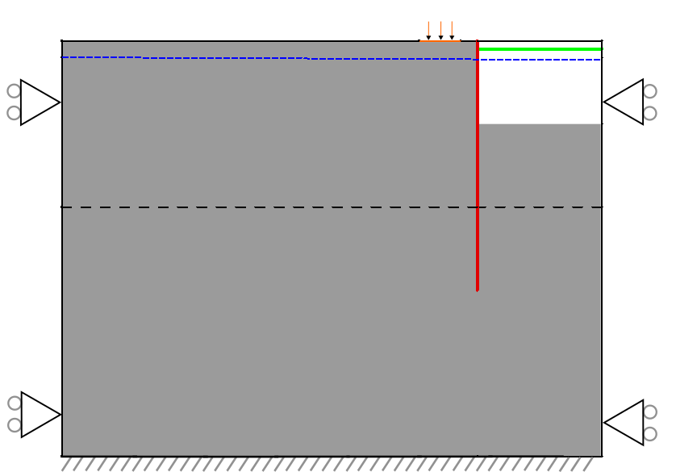
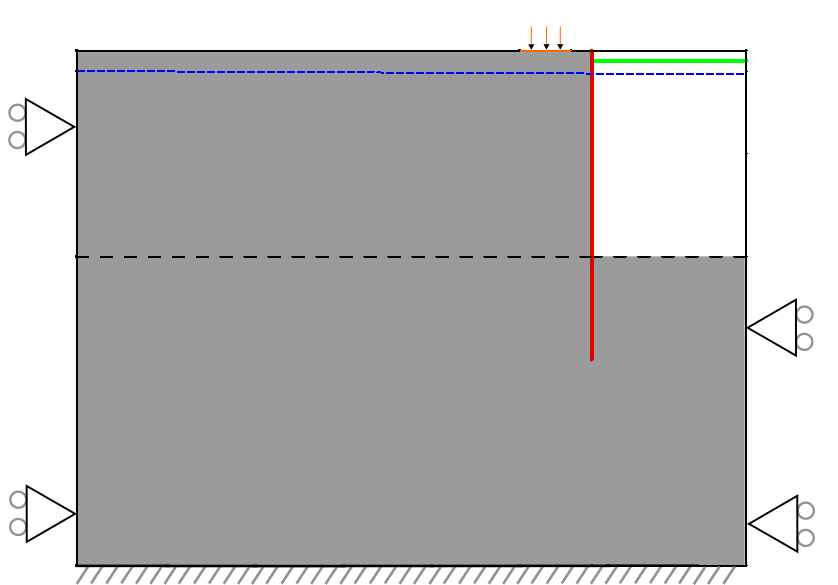

# Submerged construction of an excavation

This document describes excavation modeling test.

## Geometry
The picture shows the modelling set-up.

The geometry is 2D, with a vertical symmetry line at the center of the excavated area, allowing only half of the domain to be modeled. The excavated area is shown as a shaded region.

- Excavation dimensions: total width $`30~m`$, final depth $`20~m`$.
- Structural components: the vertical diaphragm wall extends $`30~m`$ into the ground, with a strut $`1~m`$ below the top. The wall and strut are depicted in red and green, respectively.
- Phreatic line: it is a horizontal line at a distance of $`2~m`$ below the ground surface. It is shown with a blue dashed line in the picture. 
- Constraints: the domain bottom is fully fixed, whereas the domain left and right sides are fixed only in the horizontal direction.
- External load: distributed load of $`5~kPa`$ near the wall (orange in the figure).

The ground consists of two homogeneous layers:
1. Top $`20~m`$: clay
2. Bottom: sand 

Both layers have homogenous properties, which are listed in [Material properties section](#material-properties).

The analysis is performed in seven stages, described in the [Staged analysis section](#staged-analysis).

## Mesh

The mesh is generated in GiD and shown below:

It is refined near the diaphragm wall and the interfaces that connect the wall to the adjacent soil.

## Material properties

Material properties for soil, interfaces, diaphragm walls, and struts are summarized below.

For the initial stage (which uses a $`K_0`$ procedure), linear elastic material properties are defined by a Young's modulus $`E`$ and a Poisson's ratio $`\nu`$. 

The following table lists the material properties of the soil layers that have been adopted by the Kratos model.

| Property                                                  | Kratos input parameter | Clay                             | Sand                             | Unit                           |
|-----------------------------------------------------------|------------------------|----------------------------------|----------------------------------|--------------------------------|
| Grain density $`\rho_{\mathrm{g}}`$                       | `DENSITY_SOLID`        | 2038.74                          | 2475.61                          | $`\mathrm{kg} / \mathrm{m}^3`$ |
| Water density $`\rho_{\mathrm{w}}`$                       | `DENSITY_WATER`        | 1019.37                          | 1019.37                          | $`\mathrm{kg} / \mathrm{m}^3`$ |
| Porosity $`n`$                                            | `POROSITY`             | 0.20                             | 0.30                             | $`[-]`$                        |
| Retention law type                                        | `RETENTION_LAW`        | `SaturatedBelowPhreaticLevelLaw` | `SaturatedBelowPhreaticLevelLaw` | N/A                            |
| Residual saturation $`S_{\mathrm{res}}`$                  | `RESIDUAL_SATURATION`  | $`1 \cdot 10^{-10}`$             | $`1 \cdot 10^{-10}`$             | $`[-]`$                        |
| Saturated saturation $`S_{\mathrm{sat}}`$                 | `SATURATED_SATURATION` | 1.0                              | 1.0                              | $`[-]`$                        |
| Young's modulus $`E`$                                     | `YOUNG_MODULUS`        | $`12 \cdot 10^3`$                | $`120 \cdot 10^3`$               | $`\mathrm{kN} / \mathrm{m}^2`$ |
| Poisson's ratio $`\nu`$                                   | `POISSON_RATIO`        | 0.15                             | 0.20                             | $`[-]`$                        |
| K0-value for normal consolidation $`K_{\mathrm{0}}^{nc}`$ | `K0_NC`                | 0.5774                           | 0.4701                           | $`[-]`$                        |

The following table lists the material properties of the interfaces that have been adopted by the Kratos model.

| Property                                 | Kratos input parameter | Clay      | Sand    | Unit                           |
|------------------------------------------|------------------------|-----------|---------|--------------------------------|
| Normal stiffness $`k_{\mathrm{n}}`$      | `NORMAL_STIFFNESS`     | 48000     | 480000  | $`\mathrm{kN} / \mathrm{m}^3`$ |
| Shear stiffness $`k_{\mathrm{s}}`$       | `SHEAR_STIFFNESS`      | 20869.565 | 200000  | $`\mathrm{kN} / \mathrm{m}^3`$ |

The following table lists the material properties of the diaphragm wall that have been adopted by the Kratos model.

| Property                                       | Kratos input parameter  | Diaphragm wall      | Unit                           |
|------------------------------------------------|-------------------------|---------------------|--------------------------------|
| Young's modulus $`E`$                          | `YOUNG_MODULUS`         | $`5.93 \cdot 10^6`$ | $`\mathrm{kN} / \mathrm{m}^2`$ |
| Poisson's ratio $`\nu`$                        | `POISSON_RATIO`         | 0.0                 | $`[-]`$                        |
| Thickness $`t`$                                | `THICKNESS`             | 1.265               | $`[m]`$                        |
| Effective shear thickness y $`t_{\mathrm{y}}`$ | `THICKNESS_EFFECTIVE_Y` | 0.025               | $`[m]`$                        |
| Density $`\rho`$                               | `DENSITY`               | 805.82              | $`\mathrm{kg} / \mathrm{m}^3`$ |

The following table lists the material properties of the strut that have been adopted by the Kratos model.

| Property                   | Kratos input parameter | Strut              | Unit                           |
|----------------------------|------------------------|--------------------|--------------------------------|
| Young's modulus $`E`$      | `YOUNG_MODULUS`        | $`2.0 \cdot 10^6`$ | $`\mathrm{kN} / \mathrm{m}^2`$ |
| Density $`\rho`$           | `DENSITY`              | 0.0                | $`\mathrm{kg} / \mathrm{m}^3`$ |
| Cross-sectional area $`A`$ | `CROSS_SECTIONAL_AREA` | $`0.2`$            | $`[m^2]`$                      |
| Truss pre-stress PK2       | `TRUSS_PRESTRESS_PK2`  | 0.0                | $`\mathrm{kN} / \mathrm{m}^3`$ |

## Staged analysis

The excavation is modeled in seven stages:

1. **Initial stage:**

- Entire soil domain is active, the strut, the diaphragm wall as well the interfaces at both sides of it are inactive.
- Master-slave constraints are applied where the soil will later be separated by the diaphragm wall. This ensures continuity of the displacement field in this early stage of analysis.  
- The only load that is being applied is self-weight.  
- At the end of the stage, a $`K_0`$ procedure is performed to initialize the horizontal stress field.  **Note**, the $`K_0`$ procedure requires the use of linear elastic materials for all soil parts.

2. **Null step:**

- This stage is reserved for future test cases, when material models change from linear elastic to, for example, Mohr-Coulomb model. This triggers a stiffness redistribution, and hence a stress redistribution. Currently, the linear elastic model is used for all stages. 

3. **Diaphragm wall installation and applying the external load:**

- Activation of the diaphragm wall and the interfaces that are attached to its left and right sides.
- Deactivate the master-slave constraints, since there is no need in the continuous displacement field across the entire domain.
- Apply a surface load to a part of the top of the soil on the left hand side.

4. **First excavation stage:**

- Excavate the top part of the clay to the right of the diaphragm wall (deactivate corresponding model part, marked in white color in the picture below).
- Deactivate the interface elements that connect the now excavated clay layer to the diaphragm wall.

5. **Installation of a strut:**

- Activate the strut.

6. **Second excavation stage:**

- Excavate the next top portion of clay to the right of the wall.
- Deactivate corresponding model parts and interface elements.
- Apply a normal contact stress to the exposed part of the diaphragm wall as well as the bottom of the excavation pit.

7. **Third excavation stage:**

- Excavate the final top portion of clay to the right of the wall.
- Deactivate corresponding model parts and interface elements.
- Apply a normal contact stress to the exposed part of the diaphragm wall as well as the bottom of the excavation pit.

