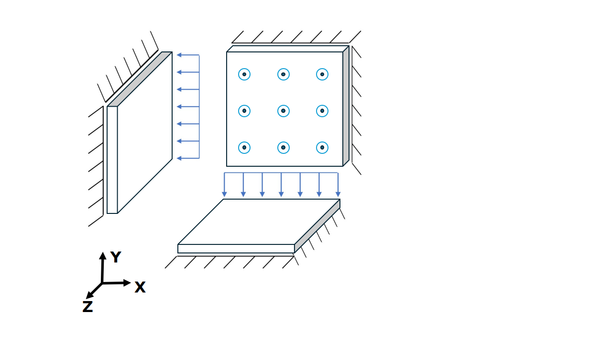

# Surface interface element tests with 3 + 3, 4 + 4, 6 + 6 and 8 + 8 nodes

This folder contains integration tests for the surface interface elements with Neumann and Dirichlet boundary conditions. 

## Setup
For these specific test cases, three non-connected surface interface elements with different orientations are used. These interfaces are embedded in triangular and quadrilateral meshes with node configurations of 3 + 3, 4 + 4, 6 + 6, and 8 + 8 nodes, as illustrated in the schematic below. Note that the node pairs are co-located—i.e., they occupy the same spatial positions. The single-stage tests utilize all three elements, whereas the multi-stage tests are limited to the horizontally aligned element only.

Two types of test cases—Dirichlet_single_stage and Neumann_single_stage—are performed in a single stage and consist of a single time step. In the Neumann test cases, a normal and shear traction is applied to one side of the interface, while the other side is fixed. In the Dirichlet test cases, a prescribed displacement is applied to one side of the interface, with the opposite side similarly constrained.

Additional test cases—Dirichlet_multi_stage and Neumann_multi_stage—involve two stages, with two time steps per stage.

The applied tractions in the Neumann test cases are selected such that they produce the same displacement field as the corresponding Dirichlet cases. All interfaces are modeled using a linear elastic material law. A subset of the tests are done with a linear elastic user defined dll (UMAT) to validate that workflow.

## Assertions
For all tests, the displacements, relative displacements and tractions are compared to the known linear elastic behavior:

$$\Delta \tau = C \Delta u$$,

where $\Delta \tau$ is the traction increment, $C$ is the constitutive tensor, $\Delta u$ is the relative displacement between the two sides of the interfaces.

Since the load applied in the Neumann tests result in the same displacement field as the prescribed displacement field for the Dirichlet tests, all sets of assertions are identical.
