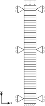

# 1D wave propagation in a drained soil column

This tests verifies that in a column of quadrilateral plane strain elements, the wave induced by fast application of a line load on top of the column reflects on the bottom and returns.

## Setup

This test consists of a 40 4-noded elements (using the UPwSmallStrainElement2D4N class) of 1x10 meter. A
schematic representation can be found in the figure below:

All nodes on the sides (due to the single element width effectively all nodes) have fixed horizontal displacements. The bottom nodes 81 and 82 also have fixed displacement in the vertical
direction. At the top of the column a vertical compressive lineload with a magnitude of 1 kN/m is applied. During a period of 0.0025 s. the load increases from 0 kN/m to 1 kN/m After that period the load is kept constant. See the figure below:

The material is described using:
-   A linear elastic plane stress model (LinearElasticPlaneStress2DLaw)
-   A Young's modulus of 50.0 [MPa] with a 0.3 Poisson's ratio.
-   The non porous soil density is 2700 $\mathrm{[kg/m^3]}$ and the porosity is 0.3
These material properties of the dry soil give a compression modulus $K = E / (3(1-2\nu)) = 41.667 \mathrm{[MPa]}$ and a shear modulus $G = E / (2( 1 + \nu )) = 19.23 \mathrm{[MPa]}$ so a compressive wave speed of $c = \sqrt{( K + 4/3 G ) / \rho} = 188.71 \mathrm{[m/s]}$.

Upon hitting the bottom, the wave is reflected and travels back up the column. This gives interference of the wave travelling down and the wave travelling up.

## Assertions

The test asserts that the vertical speed of node 41 ( at half the height of the column ) matches the predicted value at specified times.
