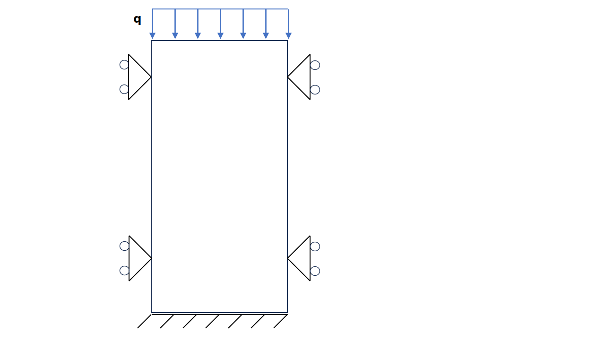

# Load conditions

This test verifies the integrity of the load and fluid flux conditions for low and high order elements.
The following conditions are tested.

- AxisymmetricUPwNormalFaceLoadCondition2D2N
- AxisymmetricUPwNormalFaceLoadCondition2D3N
- AxisymmetricUPwNormalFaceLoadCondition2D4N
- AxisymmetricUPwNormalFaceLoadCondition2D5N
- LineLoadDiffOrderCondition2D3N
- LineLoadDiffOrderCondition2D4N
- LineLoadDiffOrderCondition2D5N
- LineNormalLoadDiffOrderCondition2D3N
- LineNormalLoadDiffOrderCondition2D4N
- LineNormalLoadDiffOrderCondition2D5N
- UPwFaceLoadCondition2D2N
- UPwFaceLoadCondition2D3N
- UPwFaceLoadCondition2D4N
- UPwFaceLoadCondition2D5N
- UPwNormalFaceLoadCondition2D2N
- UPwNormalFaceLoadCondition2D3N
- UPwNormalFaceLoadCondition2D4N
- UPwNormalFaceLoadCondition2D5N
- LineNormalFluidFluxDiffOrderCondition2D3N
- PwNormalFluxCondition2D2N
- PwNormalFluxCondition2D3N
- PwNormalFluxCondition2D4N
- PwNormalFluxCondition2D5N
- UPwNormalFluxCondition2D2N
- UPwNormalFluxCondition2D3N
- UPwNormalFluxCondition2D4N
- UPwNormalFluxCondition2D5N

## Setup

This tests consist of 3, 6, 10 and 15-noded elements with 2, 3, 4, 5 noded line conditions, respectively. For all cases, a rectangular domain of $1 \mathrm{m} \times 2 \mathrm{m}$, with 8 triangular elements is used. A schematic representation can be found in the figure below:

All nodes on the sides have fixed horizontal displacements. The bottom nodes have fixed displacement in both the horizontal and the vertical
direction. At the top of the column a vertical compressive line load with a magnitude of 1000.0 N/m (or a flux of $10^{-4} \mathrm{[m^3/s]}$ for pressure test cases) is applied. This load is kept constant during the whole analysis time. Note that gravity is absent in this computation. For cases with load conditions, the pressure is kept constant, and for cases with top fluid flux conditions, the deformation is kept constant.

The material is described using:
-   A linear elastic plane strain model (LinearElasticPlaneStrain2DLaw)
-   A Young's modulus $E = 2 \times 10^{6} \mathrm{[Pa]}$ with Poisson's ratio $\nu = 0.0 \mathrm{[-]}$.
-   The soil and water density are specified, but irrelevant due to the absence of gravity. The porosity is 0.
-   The dynamic viscosity of water is given as $\mu = 10^{-3} \mathrm{[Pa \cdot s]}$ and the intrinsic permeability of the soil as $\kappa = 1.157 \times 10^{-12} \mathrm{[m^2]}$
-   The bulk modulus of water $K_w = 2 \times 10^6 \mathrm{[Pa]}$
