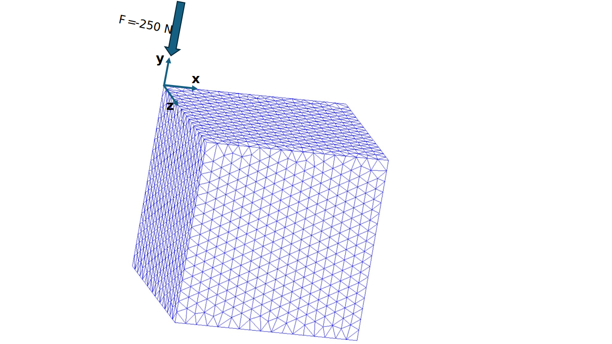

# Test Cases for Dynamic solution in 3D

**Author:** [Mohamed Nabi](https://github.com/mnabideltares)

**Source files:** [Dynamic solution in 3D](https://github.com/KratosMultiphysics/Kratos/tree/master/applications/GeoMechanicsApplication/tests/test_dynamic/test_constant_point_load_3d)

## Case Specification
In this test case, a three-dimensional soil block with dimensions of 10 m x 10 m x 10 m is considered. This is a quarter of the full domain, as this case is axisymmetric. The pressure is fixed at 0 Pa throughout the entire simulation to eliminate the effect of water pressure. This is done to allow comparison of our results with published semi-analytical solutions. A sudden force of -250 N is then applied in the vertical direction at the top surface of the block. The simulation spans 1 second. This test is conducted on a mesh with tetrahedral elements of type 3D4N. The deformation at the surface is then compared with semi-analytical results.

The geometry and boundary conditions are shown below:



The shear wave velocity $c_s$ and compression wave velocity $c_p$ can be calculated as:

$$ c_s = \sqrt{\frac{G}{\rho}} $$

$$ c_p = \sqrt{\frac{M}{\rho}} $$

where $G$ and $M$ are shear modulus and bulk modulus, respectively. They are defined as:

$$ G = \frac{E}{2  \left(1 + \nu \right)} $$

$$ M = \frac{E \left(1 - \nu \right)}{\left( 1 + \nu \right) \left(1 - 2 \nu \right)} $$

- $G$		= Shear modulus $\mathrm{[Pa]}$
- $M$		= Bulk modulus  $\mathrm{[Pa]}$
- $E$		= Young's modulus  $\mathrm{[Pa]}$
- $\nu$		= Poisson's ratio  $\mathrm{[-]}$
- $\rho$	= Mass density $\mathrm{[kg/m^3]}$

In this test case, $E = 91800 \mathrm{Pa}$ and $\nu = 0.25$. This leads to shear and compression wave velocities of $6 \mathrm{m/s}$ and $10.39 \mathrm{m/s}$, respectively. Hence, in order to avoid the effects of reflecting waves from the boundaries, considering a domain of $10 \mathrm{m} × 10 \mathrm{m} × 10 \mathrm{m}$ with a simulation time of 1 second is sufficient.

The Rayleigh stiffness- and mass-proportional damping coefficients are defined as:
   ```json
    "rayleigh_m"                       : 0.0001,
    "rayleigh_k"                       : 0.0001,
   ```
   
## Results

The picture below illustrates the variation in vertical displacement over time for node 9307, which is 2.94 meters away from the loading point (at coordinate of $x = 2.94$, $y = 0$ and $z = 0$). The results are compared with the semi-analytical solution. The semi-analytical solution is based on the following publication:

<em> An Introduction to Soil Dynamics , Verruijt A., 2009, Delft University of Technology, Chapter 13.2 </em>


In the semi-analytical solution, there is a singulair point around $\tau = 1.1$. However, this behavior, which is caused by the arrival of the Rayleigh wave, is captured by a smoother peak in the numerical solution. 

Note: To avoid numerical oscillations, the force is gradually applied over a time span of 0.1 seconds.


