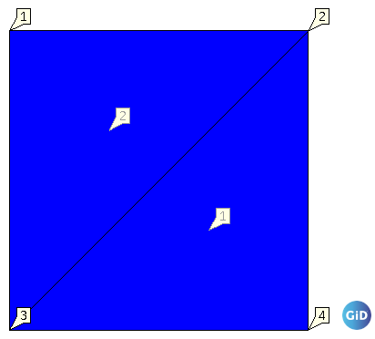

# Oedometer ULFEM test
This test simulates an oedometer lab test. The UPwUpdatedLagrangianElement2D3N element is used to simulate the soil sample in a very simple 4-noded mesh, as displayed in the following figure:

## Setup
The test is performed in a single stage, with the following conditions:
- Constraints:
  - The X and Y displacement in the bottom two nodes (3 and 4) are fixed to 0.0.
  - The X displacement in all nodes is fixed to 0.0.
- Material:
    - The material is described using a linear elastic material with a GeoLinearElasticPlaneStrain2DLaw.
- Conditions:
  - A UPwFaceLoadCondition2D2N is added to the top side of the cube (nodes 1 and 2).
- Loads: 
  - A line load in the y direction is applied to the top side of the cube (nodes 1 and 2), linearly ramping up from 0 to -1000000 kPa (?) in the time interval \[0, 1\].

## Assertions
In this test, there are two results checks:
1. It is asserted that the effective stress is -1000000 kPa (?) in the integration points of both elements in the y direction and 0 in the other directions.
2. It is asserted that the displacement of one of the top nodes (1) is close to -0.0909090909516868 as a result of the applied line load.
