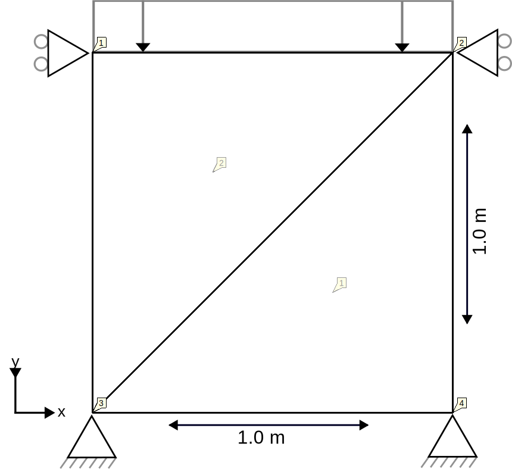

# Oedometer ULFEM test

This test simulates an oedometer lab test. The UPwUpdatedLagrangianElement2D3N element is used to simulate the soil
sample in a very simple 4-noded mesh, as displayed in the following figure:

## Setup

The test is performed in a single stage, with the following conditions:

-   Constraints:
    -   The X and Y displacement in the bottom two nodes (3 and 4) are fixed.
    -   The X displacement in all nodes is fixed.
-   Material:
    -   The material is described using a linear elastic material with a GeoLinearElasticPlaneStrain2DLaw, a Young's modulus
        of 1e7 kPa and a Poisson ratio of 0.0.
-   Conditions:
    -   A UPwFaceLoadCondition2D2N is added to the top of the cube (nodes 1 and 2).
-   Loads:
    -   A line load in the Y direction is applied to the top of the cube (nodes 1 and 2), linearly ramping up from 0 to
      -1000000 kPa in the time interval \[0, 1\].

## Assertions

In this test, there are two results checks:

1. It is asserted that the effective stress is -1000000 kPa in the integration points of both elements in the Y
   direction and 0.0 in the other directions, due to the Poisson ration being 0.0.
2. It is asserted that the displacement of one of the top nodes (1) is close to -0.0909090909516868 at time 1.0, as a result of the
   applied line load. The expected displacement for a linear elastic material would be $FA/E = -1e6 / 1e7 = 0.1$.
   However, due to the non-linear behavior of the Updated Lagrangian Element, the stiffness increases with load yielding
   a smaller displacement then this theoretical value. This non-linear behavior is also seen in the other asserts: At t = 0.1 (meaning load = -100000 kPa), the displacement is roughly 0.01 and at t = 0.7 (meaning load = -700000 kPa), the displacement is roughly 0.065.
