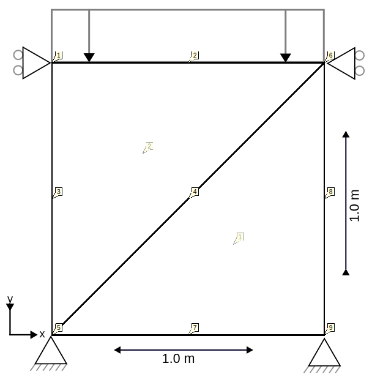

# Oedometer ULFEM test

This test simulates an oedometer lab test. An UpdatedLagrangianUPwDiffOrderElement2D6N element is used to simulate the
soil sample in a very simple 9-noded mesh, as displayed in the following figure:

## Setup

The test is performed in a single stage, with the following conditions:

- Constraints:
    - The X and Y displacement in the bottom nodes (5, 7, 9) are fixed.
    - The X displacement on the left and right boundary nodes (1, 3, 5 and 6, 8, 9) are fixed.
- Material:
    - The material is described using a linear elastic material with a GeoLinearElasticPlaneStrain2DLaw, a Young's modulus
      of 1e7 kPa and a Poisson ratio of 0.0.
- Conditions:
    - A LineLoadDiffOrderCondition2D3N is added to the top of the cube (nodes 6, 1 and 2).
- Loads:
    - A line load in the Y direction is applied to the top of the cube (nodes 1, 2 and 6), linearly ramping up from 0 to
      -1000 kPa in the time interval \[0, 1\].

## Assertions

In this test, there are two results checks:

1. It is asserted that the effective stress is -1000 kPa in the integration points of both elements in the Y direction
   and 0.0 in the other directions, due to the Poisson ration being 0.0.
2. It is asserted that the displacement of one of the top nodes (1) is close to $FA/E = -1000 / 1e7 = -1e\text{-}4$ as a result of
   the applied line load and linear elastic behavior.
